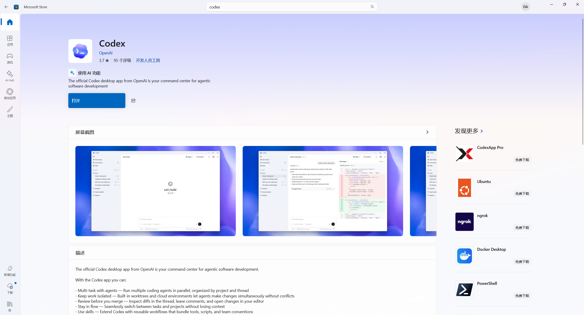
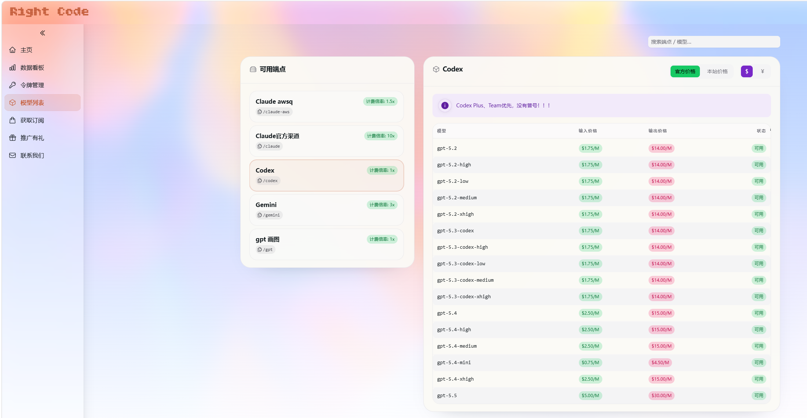
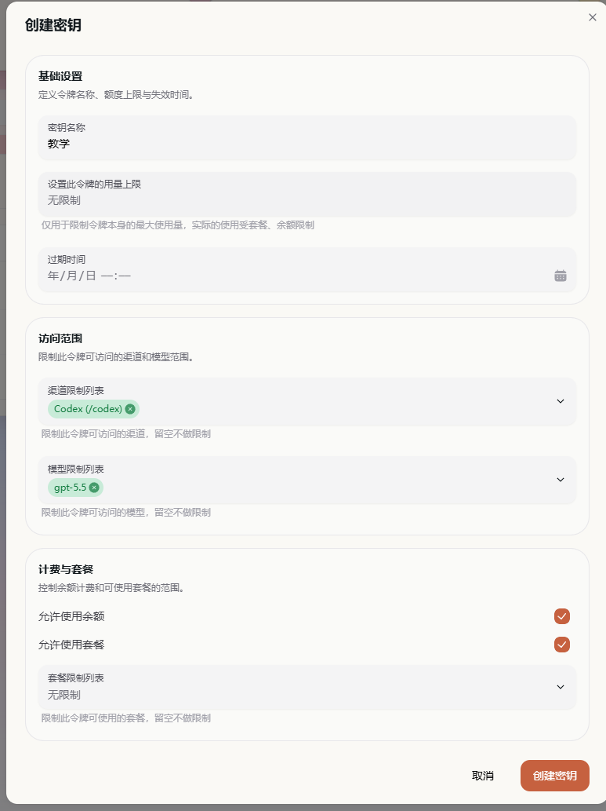
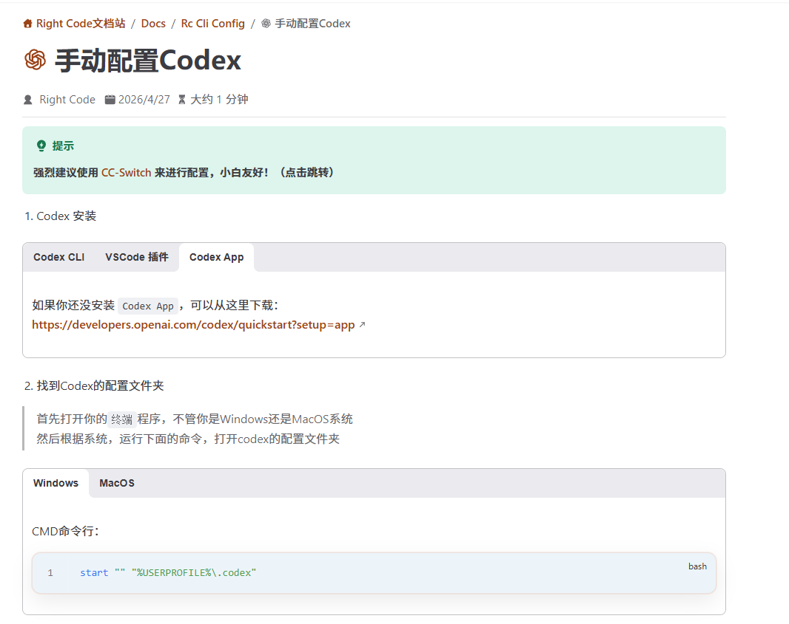
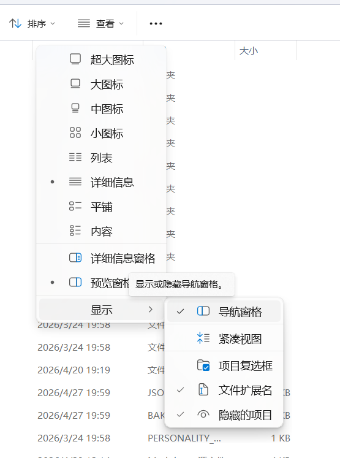
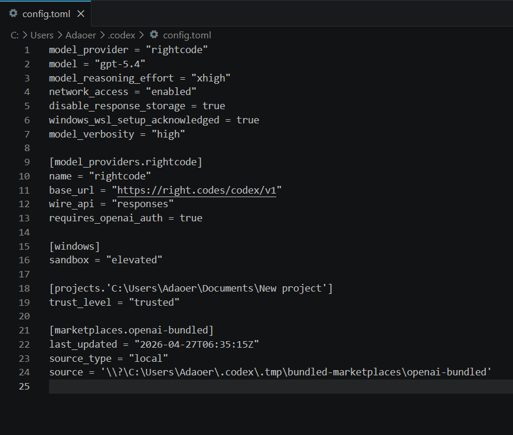
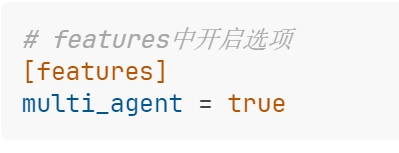
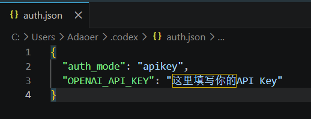
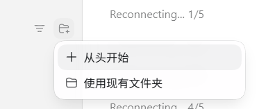
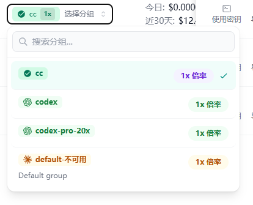

## 请通读全文再进行操作

本文将以ChatGPT、Codex Desktop(Windows 11)、第三方站点Right Code为例讲解如何深入使用AI辅助工作

## 1. Codex下载及安装

`Windows 11`用户打开`Microsoft Store`搜索`Codex`即可

## 2. Codex配置

## 2.1. 使用官方账号

**需要`科学上网`**

### 2.1.1. 登录官方账号

最简单的使用codex的方法，仅需在`特殊网络环境`下登录自己的GPT账号即可，免费账号无使用权限，需要Plus、Team、Pro等账号

### 2.1.2. 使用官方API Key

许多企业或者组织会提供OpenAI官方的API Key（形式为`sk-aaaaabbbbcccdd`），此时需要在登录界面选择`使用API Key`选项

## 2.2. 使用第三方

由于Plus账号的额度稀少，并且需要`科学上网`等原因导致许多人使用不便的缘故，接入第三方站点使用成为了大家的主流，此处以`Right Code`为例

Right Code：[https://right.codes](https://right.codes/)

### 2.2.1. 获取第三方API Key和Url

API Key和Url是使用第三方站点的核心

Url：一串网址，作用是让软件明白去链接哪个网站；

API Key：起到账号+密码功能，作用是让第三方站点知道是谁在用和能不能使用。

比如此处我需要从Right Code导入进Codex，我就需要选择Codex分组，点击Codex下方复制符号即可获得基础URL：[https://right.codes/codex](https://right.codes/codex)

当然实际上这只是简短的url，完整的url形如：[https://right.codes/codex/v1/chat/completions](https://right.codes/codex/v1/chat/completions)，不过大部分软件会自动补全。

接下来切换到令牌管理窗口，通过如下窗口创建：

之后创建完毕，复制密钥即可

### 2.2.2. 导入Url和API Key

Right Code官方文档：[https://docs.right.codes/docs/rc_cli_config/codex.html](https://docs.right.codes/docs/rc_cli_config/codex.html)

使用第三方站点需要修改配置文件实现。在文件路径`C:\Users\Adaoer\.codex`下有两个文件`config.toml`和`auth.json`，如果看不见后面的文件类型请如下操作：

#### Config.toml配置

该文件用途是存储Codex的配置，这里我们需要修改的是有关站点的内容

1\~13行为第三方站点的配置，主要内容为如下：

- 第2行：model模型名称，必须为`gpt-x.x`的形式，x为数字
- 第3行：model_reasoning_effort智能程度，其实是思考的等级，分为mini低、medium中、high高、xhigh超高，其中xhigh是Codex工作的最好状态，完成大型任务最好使用xhigh
- 第11行：base_url此处填入我们看看说的简要Url即可
- 第12行：无需在意，自行了解，一般默认`responses`即可

补充：

以下内容可以添加到1\~13行区域内

- 1M上下文：model_context_window = 1000000，实际最高为1,048,575但是有可能会报错
- 多Agent协作：multi_agent = tru,= true，但是需要添加`[features]`，可以固定在1\~13行这些基础设置的后面，也就是在14行位置插入类似下图的写法

- 快速模式：service_tier="fast"，快速模式正常情况下仅在官方模式下开启，但是通过自主添加也能调用，额度消耗速度**翻倍**

#### auth.json配置

## 3. Codex等Agent助手使用基础

在主界面左上角进入

## 3.1. Agent能力扩展

### 3.1.1. Skills与MCP简述

#### 3.1.1.1. Skills

定义：Skills 本质上是大模型的程序性知识（Procedural Knowledge）或标准作业程序（SOP）。它不是单纯的代码，而是告诉模型“在遇到特定任务时，应该按照什么步骤、使用什么策略去解决问题”的说明书。

Skills通常是一组**Prompt（提示词）模板**、**编排逻辑**或者**轻量级的脚本**

简而言之，skills是用来让AI通过一定流程完成某种工作，就像是对着菜谱做菜。

##### 创建你自己的Skills

这几乎是Skills使用中最重要的能力，市面上的Skills收录网站比如Clawhub、SkillHub等等，最有价值的是诸如使用Office三件套、生成特定风格网页或者PPT之类的Skills，这些Skills对你的工作来说就像是基座。

在Codex软件中，内置了一个特殊的Skill，叫做`Skill Creator`，其功能简单概括即为创建或者修改Skills。

启用这个Skill之后，只需要通过对话便能让Agent创建自己的Skill。

接下来以我的Skill：`工科实验报告`为例简述一下创建、调试Skill的过程：

1. 写出基本的提示词内容，包括但不限于`内容格式`、`语言风格`、`基础背景`等等基础信息，这部分如果不知道怎么写的话，最简单的方式就是向AI描述简要的需求，并让其输出大纲，按照大纲填写必要的内容后再简要让AI进行完善；
2. 接下来重要的就是不断的根据Agent的输出结果，调试你的Skill；比如我在调试的时候，提供了学校实验报告模板和论文格式模板供参考，最后AI就能输出完美符合格式要求的实验报告。
3. 最后在使用的过程中，输入Skill名称可以保证百分百触发，除此之外还能够添加额外要求，比如计算一些实验数据写进报告里，这样也有一定灵活性。

#### 3.1.1.2. MCP

定义：MCP 是由 Anthropic 等机构推出的一种开放标准协议（**Model Context Protocol**）。它的核心目的是标准化大模型与外部世界的连接方式。它规定了模型如何“看到”外部数据（Context）以及如何“调用”外部工具（Tools）。

与skills不同的是，MCP是真真切切的提供给Agent访问外部软件、工具的能力，就像是给Agent提供了更多厨具一般。

#### 两者的联系

强大的Agent往往是Skills+MCP的组合，孤立存在的效果是有限的，结合起来才有足够的能力。

### 3.1.2. 插件

官方文档给出的定义很直接：**插件是可安装的 bundle，用来封装可复用的 Codex 工作流。**

你可以把它理解成一个“打包盒子”，里面可以装：

- `Skills`：告诉 Codex 应该怎么完成某类工作流的说明文件。
- `Apps`：可选的应用或连接器映射。
- `MCP servers`：插件需要用到的远程工具或共享上下文。

换句话说，如果你有一套固定流程，比如：

- 读 GitHub issue 后自动整理任务拆分
- 连上 Slack / Notion / Linear 再做跨工具协作
- 调用某个 MCP 服务去查资料、执行操作、补上下文

那么这些东西就不必零散地拼在一起，而是可以做成一个 Codex Plugin，后面重复安装、重复复用。

## 3.2. Codex界面讲解

### 3.2.1. 上下文

上下文是AI的核心性能之一

上下文的长度取决于调用的模型，模型上下文长度是固定的，上图中上下文极限是258k(tokens)

#### 出现爆上下文的解决办法

##### 单Agent模式

就是常规默认情况下的模式

1. 在爆上下文之前必须让AI提炼刚刚的聊天核心要义，并看一遍是否有错漏之处；
2. 将提炼好的核心编辑成`.md`文档放置到工作区即可；
3. 此时可以：

   1. 开一个相同工作区的窗口清空上下文
   2. 继续使用原窗口，系统自动压缩上下文

两者都需要保证核心的全面与详细，不然Agent会跑偏或者无法满足全部需求

##### 多Agent模式

笔者水平有限，挂几个教程

1. [https://blog.csdn.net/alex_yangchuansheng/article/details/159181329](https://blog.csdn.net/alex_yangchuansheng/article/details/159181329)
2. [https://juejin.cn/post/7621066680340381739](https://juejin.cn/post/7621066680340381739)
3. [https://zhuanlan.zhihu.com/p/2019703185938363846](https://zhuanlan.zhihu.com/p/2019703185938363846)

将复杂任务拆成数个子任务交付给子Agent协作完成，可以有效降低其中单一Agent的上下文占用情况

### 3.2.2. 工作区

没什么特别的，只是选定一个文件夹作为Agent工作区，可以先将工作用的文件材料放入其中

### 3.2.3. 权限

默认即可，完全访问权限容易误删东西或者破坏环境，有信心的朋友可以尝试

### 3.2.4. 沙盒

Sandbox 是 Codex 的安全隔离机制，防止意外修改工作区外的文件

> 嵌入表格已整理为 [Codex 沙盒模式速查](codex-sandbox-modes.md)。

## 4. 神秘小技巧

## 薅羊毛

站点：[https://s2a.ii.sb/register?ref=97383DE7](https://s2a.ii.sb/register?ref=97383DE7)

邀请码：[97383DE7](https://s2a.ii.sb/register?ref=97383DE7)

该站点中API Key分组选择`CC分组`，其中可以使用免费的`gpt-4o`

## 嵌入表格导出

- [GNphspGZFhLF8VtTJabcflf6nnh / rOf773](codex-sandbox-modes.md)
