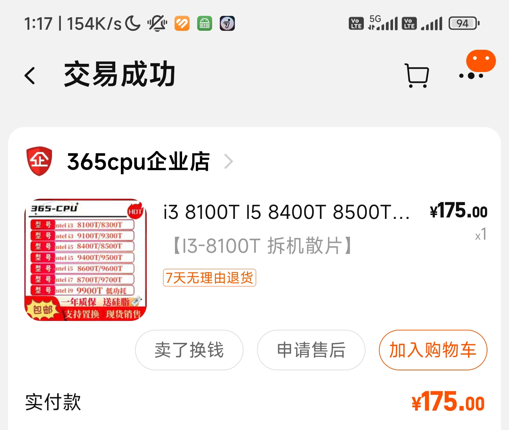
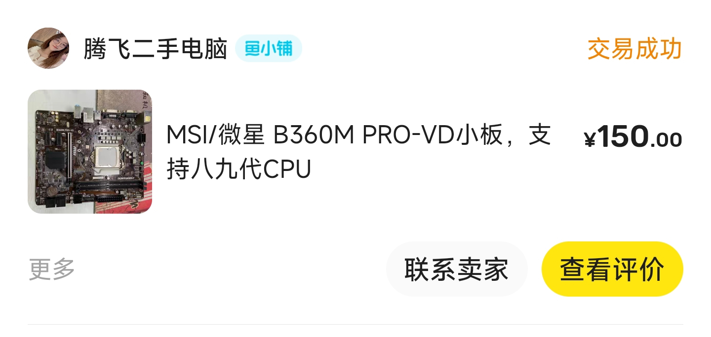
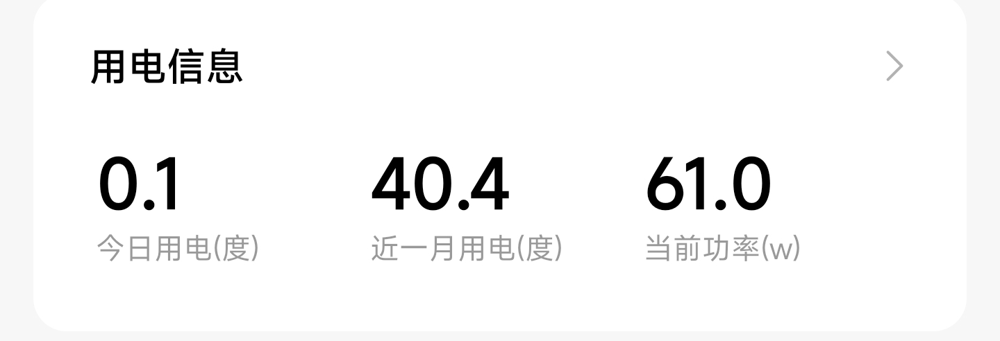
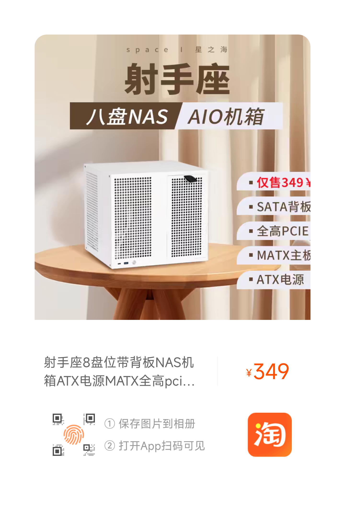

# NAS：垃圾佬的终极归宿

!!! note "👀 提示"
    由于不明势力的催更，本文档开始更新啦！

# 我理解的NAS

> NAS（Network Attached Storage，网络附属存储技术），是一种通过网络连接的存储设备。是整合数据的数据中心，它使用方便，节约成本并且能使数据得到集中化处理。

说是NAS，但我认为和服务器没啥区别，只是侧重点不同。NAS的主业是存储，是文件系统，但除此以外，服务器能干的，它都能干。

所以，我折腾NAS，其实更多的是在搭建各种各样的self-host服务，比如自建影音服务器，自建在线图书馆，自建漫画站等等.....

而大多数self-host都是多平台通用的，群晖上能搭，Windows上能搭，Linux上能搭，TrueNAS上能搭，威联通上能搭，UnRaid上能搭.....

只要一个平台会搭，其他平台也是大同小异的了。

# 搭建NAS

由于本人最近打算搭建基于Windows的All in One平台，于是先写这一部分的教程。

[基于windows的NAS](windows-nas.md)

# 额，没事在手机上随便写点（凌晨一点）

就当随想吧，也没什么格式。就想以最快速度把我这么多天折腾nas的过程，或者说心得记录下来。

先从硬件选购开始讲。我当时就打算预算1000元组一台nas。如果买成品nas的话（指白群晖，威联通，绿脸，联想云这种），首先很少有这个价位的，其次就算有这个价位，那性能也很差（哪怕是白裙，其实白裙的cpu可是很差的）。所以要性价比，还是建议自己组。要说稳定性啥的，自组可能没有大厂的成品nas好吧，但就我个人而言，我还没坏过，所以我觉得不要担心这个。

那么怎么选硬件呢，上面也说了，就把nas当服务器就好了，只不过是硬盘有点多的服务器罢了。所以可能得特殊关注几个点，比如PCIE卡槽数量，SATA口数量（其实无所谓，哪怕不够，也可以用拓展卡），以及是否支持ECC内存之类的。

还有一点，完全可以选二手的（除了电源），要有当垃圾佬的觉悟。至于来源，tb，闲鱼都行。

那么，先从板U开始选。我当时选的8100T+b360m的搭配。这也是比较常见的配置（至少我在nas机箱群，垃圾佬群，网络技术群里都见过有人也是这个u）。就我个人体验而言（我是裸机装黑裙，没虚拟化），NAS+影音服务器是完全够的。8100T自带一个核显，这个核显很赚，能完美硬解4kHDR视频。这个U还支持ECC内存。而8100T淘宝上买，当时是175块（刚查了下，现在涨到198了）。b360m的主板我是闲鱼上150块收的。

不过，这个搭配其实也不算很主流，所以没必要抄我作业。还有很多人用j1900，N5100之类的u。这些U貌似都是ARM架构的，性能也不是很强，所以便宜，功耗也低，不过纯做nas还是够的。视频解码上我不太清楚。还有人嘛用x99之类的服务器板u，也可以。建议多看测评。

对了，顺便想起一个需要关注的点，那就是功耗。nas其实还挺贵的，贵在电费上。所以如果电费要自己付的话（划掉），还得考虑下整机功耗，主要可以查下cpu的TDP功耗。像我的nas放家里，电费不用我出，所以没考虑功耗。

选完板U，接下来就是一些细枝末节的东西了。

内存，其实我也不是太懂，只能讲个大概，希望有懂的人能来指正。总之，内存分为普通内存和ECC内存。后者支持内存纠错。在内存运行过程中，可能发生随机的比特反转，也就是产生错误的数据。这个错误数据的位置，如果正好出现在关键地方，会导致系统重启。而ECC内存会在运行过程中自动纠正这些错误，从而保证系统的长久运行。所以，ECC内存一般用在服务器上，而家用电脑一般用的普通内存。因为家用电脑不需要长期运行。这么看来，ECC内存比普通内存更好。

但是，ECC内存比普通内存便宜。

不必惊讶，我这里说的是二手市场。这是因为服务器上淘汰下来的ECC内存比普通内存要多，所以嘛。还有原因就是，家用主板和cpu不支持ECC内存（8100T和b360m除外，貌似老型号的板U还是支持的）（类似的事情，也发生在SAS硬盘和SATA硬盘上）

关于ECC，还有不同的类型，我也不大搞得清（毕竟我也没用过嘛），具体看这篇吧https://blog.csdn.net/qq_41683863/article/details/106807969

然后关于内存，还有频率与代数的指标。比如2500MHz，DDR3这种。emm，老实说，我也不知道具体性能差距如何，所以也不清楚nas需要什么配置就够了。希望有懂的能来指正下🙏

然后选机箱吧，还是挺重要的。首先要说明，有专门适用于nas的机箱，但比较贵，比普通机箱贵很多。原因是普通机箱都是公模，而nas机箱因为产量小，所以得自己做模具 做一套模具几十万吧。所以得提高售价才能回本。

关于nas机箱，有很多品牌。建议多看测评。有几个要关注的点。第一，机箱尺寸，机箱里放的是ATX主板还是MATX主板，甚至是ITX主板。包括PCIE卡槽是全高还是半高。还有电源是ATX电源还是更小的。都要看清楚，别到时候装不下就搞笑了。第二，背板。nas机箱特殊在有硬盘背板。背板是一块板子，上面是sata数据口和供电口。它的作用是把主板上的（或者拓展卡上的）sata口集中到一起，同时也可以把大4D的供电口转换到sata供电。（所以买电源的时候，其实不需要sata供电，有也用不了，多有几个大4D就行了）。然后就是看清楚背板支不支持SAS协议（看自己需求）

我个人用的机箱链接如下。

【淘宝】https://m.tb.cn/h.g0HkfBa9UbpZQ4b?tk=DF9wWIxwfaa CZ3452 「射手座8盘位带背板NAS机箱ATX电源MATX全高pcie群晖AIO存储UNRAID」  
点击链接直接打开 或者 淘宝搜索直接打开

不一定要抄我作业，根据你自己的预算和喜好来就行。我是找8盘位且便宜的。你就先想好要几个盘位吧。

当然，不用nas机箱也行，那有很多其他方案，比如普通家用机箱，机架之类的。只不过这样的话就得自己装硬盘笼（用来装硬盘的）

风扇，这个好像也有讲究，比如猫扇啥的，我也只是在水群的时候听说，也不了解。我自己就随便买了点风扇。

还有啥，不记得了，已经凌晨两点了。没想到有这么多心得。我本来想重点讲黑群晖和服务搭建的。

然后是硬盘吧。家用级的硬盘，西数里分红盘蓝盘绿盘金盘啥的，具体我也忘了。希捷则是酷狼酷鹰之类的。可以自己查一下区别。还有CMR和SMR(争议较大)，也可以了解下。我目前不买家用级硬盘，所以不太了解。可以买服务器上淘汰下来的硬盘，性价比挺高。而且这些硬盘，不必担心质量和寿命的问题。因为服务器硬盘的设计寿命和稳定性都是超过家用级硬盘的，比如设计寿命一般在30年以上，而tb店上买到的，基本上是五六年淘汰下来的，所以还剩二十多年寿命呢。服务器硬盘的话，根据接口的不同，可以分为SAS硬盘和SATA硬盘。SAS是比SATA更高级的串行接口，服务器一般都用SAS。但神奇的是，SAS硬盘在二手市场上的价格甚至比SATA更便宜，这是因为基本上只有服务器主板才有SAS接口，家用主板想用的话得加一个SAS拓展卡（可以用直通卡或阵列卡，具体报价可以咨询）。根据硬盘内部所充气体，还可以分出一个氦气盘，也就是内部充了氦气。充氦气的好处是，盘片运转时的空气阻力更小，转速更高，使得氦气盘能有较高的速度，以及更大的容量（10T以上的硬盘基本上都是氦气盘了）。但氦气盘有个问题，就是氦气泄漏问题。首先要说明，100%会漏，这是因为氦气分子比较小，就算是热运动都能跑出来。但厂商也是考虑到这一点的，所以一般会给一个使用寿命，用到使用寿命时，氦气漏光的几率很低。同时硬盘内也有检测器，一旦检测到氦气含量迅速下降，就会发出警报。不过在这点上，网上一直有争论，我个人也不是很懂。建议多做下调查。关于服务器硬盘，我这可以推荐一家店铺。

【淘宝】https://m.tb.cn/h.g0Tu7ZwdtI4ekzl?tk=lC2nWIyvlrI MF3543 「国行2026年企业级10T 12T 14T 16T 18T硬盘SATA电脑NAS台式机16TB」  
点击链接直接打开 或者 淘宝搜索直接打开

Ok，想了想硬件部分好像没啥了，如果还有啥疏漏的，群里艾特我咨询就行。

接下来讲讲激动人心的软件设施吧。

先从系统讲起吧，nas系统有一些主流的，我也是基本上看了b站上的所有测评。我个人用过unRAID和黑群晖。两个都会用(毫不夸张地说，比较精通了)，但一句话，黑群晖yyds。其他还有比如TrueNAS之类的，但我个人没接触过，我就不介绍了。感兴趣的可以去b站上看钱韦德和司波图的视频，这俩是讲NAS比较专业的。我就介绍下我用过的两个系统吧。

对了，nas一般会和AIO(All In One)联系在一起。All in One当然是个不错的玩意，我也挺想讲的，但篇幅太长了，而且我也不是专业的，详见的文档。我这里只是提一下，All in One现在主流的裸金属虚拟机是Esxi和PVE。

先讲黑裙晖吧（无脑推荐），这里着重讲下系统安装，而黑群晖的使用交给黑群晖自己的新手引导（）

首先讲下黑群晖的内部原理。黑群晖和普通系统不同。普通的windows安装，我们需要一个PE盘，但安装完成后，就不需要PE盘了，因为引导已经装到硬盘的EFI分区里，系统也装到系统分区里了。但黑群晖不同，它的引导至始至终是在引导U盘里的，只有系统被装进了硬盘里。也就是说，需要一个闲置的U盘，这个U盘将会被长期占用。还有一点不同是，普通系统装在一个系统分区里，即在一块硬盘上。但黑群晖系统是存在于每块硬盘头部的分区里。也就是说，只要有一个硬盘存活，黑群晖就存活。

目前最好用的黑群晖引导（没有之一，没有之一，不支持反驳😎）是RR，这里是其官方频道https://t.me/RR_Org

下载链接在置顶消息里，没条件上网的可以私聊我，这里就不贴出来了。

呃啊，写不动了，这个地方我真没办法保证读者能做对每一步，我只能说让我来装，我会装。怎么说呢，这些东西，开发者也有提供资料文档，网上也有很多教程。都是要根据自己机子和需求的实际情况去查资料的。我一个教程是没办法包罗万象的。

虽然如此，但我还是大致写一下思路吧。首先是把RR写到U盘里，我也忘了推荐哪个刻录程序了，反正Etecher和Rufus应该都行吧。

然后从U盘启动，记得给nas插网线。启动以后，就在你自己的电脑上用浏览器访问。会看到一个菜单。

第一步，先选型号和DSM系统。型号介绍可以去看RR开发者给出的资料（在置顶消息里）。如果你不知道怎么选，或者没法上网。那无脑选918+吧。DSM系统版本直接选最新的。

第二步，就可以编译引导了。正常来说，是的。但得碰一点运气。为什么这么说，先讲下这个过程RR干了什么。首先它会从Synology的CDN上下载对应型号的DSM系统镜像，这个镜像是.pak格式的。然后它会解析这个pak，并进行patch。而目前，可能是因为黑群晖用的人太多了，CDN触发了一定反爬策略。直连的下载速度只有几kb每秒。所以会卡进度。如果你也碰到这个问题，可以开一个代理。具体方法是进入高级选项，里面可以设置代理地址。这需要你在自己电脑上开一个代理服务（代理软件里会提供端口号），然后RR里填你的电脑局域网ip和端口号。

第三步，进入DSM系统，完成后续安装（新手引导真的很友好）这里就不多赘述了，有不懂的上网查就行。

装好系统后，就可以搭建一些服务了。首先声明，我是pt圈的，所以接下来介绍的服务，大多数是和影音相关的。

1. Qbittorrent

没啥好说的，bt客户端

1. Jellyfin

影音服务器

实话说，写到这，一想到较多的配置步骤，注意事项，原理解释，有点写不动了

我还是想说，这些东西写图文教程太麻烦了😫写的人麻烦，看的人也麻烦。我觉得还是手把手教更方便。实在要写的话，恐怕得等下一个全套服务搭建的机会来全程记录（我自己目前已经搭好了）。

所以，欢迎来找我帮忙，熟人就不用报酬了🤣闲鱼上少说得收个60块（闲鱼上真的有人卖这个）

1. MoviePilot

将前两个工具串起来，实现全自动化观影（自动搜索种子，自动下载，自动刮削入库）
