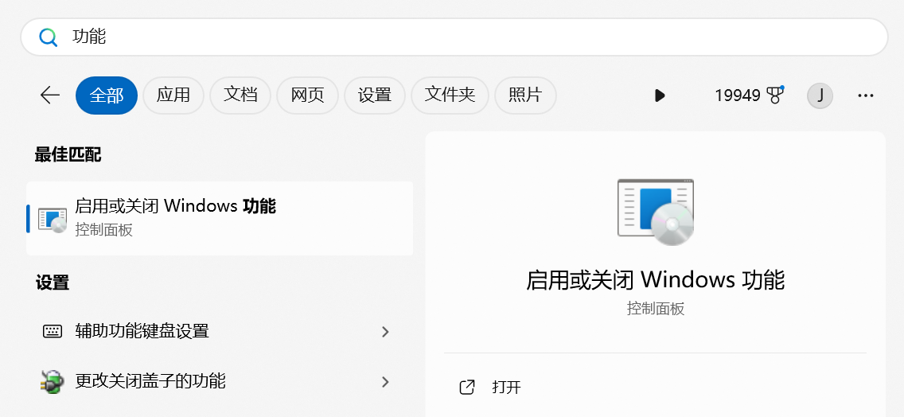

关于本文的所有内容，可以通过搜索“WinNAS”来进一步了解。

!!! note "😎 提示"
    不用鄙视WinNAS，我认为所有NAS系统之间都没啥太大区别（对普通玩家来说），适合自己的就行

另，这篇我是根据我自己的配置来写的，有些服务用不到你们可以跳过。

## 安装windows系统

参见【】，建议选“专业版”或“专业工作站版”

## 启用一些功能

搜索里搜索“功能”



打开如下功能

- Hyper-v
- Windows虚拟机监控程序平台
- 适用于Linux的Windows子系统
- 虚拟机平台

## 安装wsl2

!!! note "💡 提示"
    全程可以不用魔法上网

打开`cmd`，输入（目的是启用`镜像网络`，让外网能直接访问到wsl2）

```Bash
echo [wsl2] > %UserProfile%\.wslconfig && echo networkingMode=mirrored >> %UserProfile%\.wslconfig && echo dnsTunneling=true >> %UserProfile%\.wslconfig && echo autoProxy=false >> %UserProfile%\.wslconfig && echo. >> %UserProfile%\.wslconfig && echo [experimental] >> %UserProfile%\.wslconfig && echo autoMemoryReclaim=gradual >> %UserProfile%\.wslconfig && echo sparseVhd=true >> %UserProfile%\.wslconfig && echo hostAddressLoopback=true >> %UserProfile%\.wslconfig
```

打开`cmd`，输入`wsl --update`

打开`cmd`。输入`wsl --install`

然后按引导完成安装（密码简单点就行，晚点会搞防火墙，没人能入侵的）

## 安装Docker

打开`cmd`，输入`wsl ~`，进入linux命令行

```Bash
export DOWNLOAD_URL="https://mirrors.tuna.tsinghua.edu.cn/docker-ce"
wget -O- https://get.docker.com/ | sudo -E sh
```

安装完成后，执行`sudo usermod -aG docker $USER`，再执行`newgrp docker`

此时，如果能正常执行`docker run hello-world`，就说明安装成功了

## 让wsl2开机自启并保持常驻

按`Win+R`，输入`shell:startup`，在弹出来的文件夹里新建一个vbs文件（文件名随意：如abc.vbs），里面输入

```VBScript
Set ws = CreateObject("Wscript.Shell")
ws.run "wsl -d Ubuntu", vbhide
```

## 更新ubuntu并安装ssh

打开wsl，依次执行

```Bash
sudo apt update
sudo apt upgrade
sudo apt install openssh-server
```
