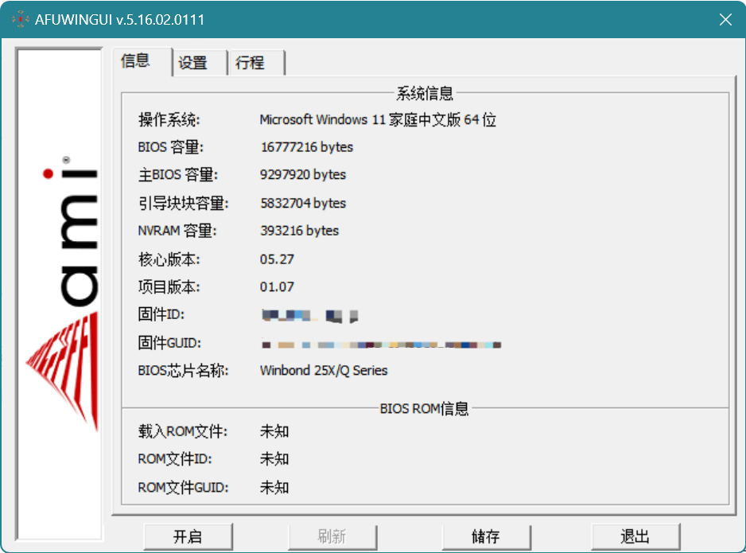
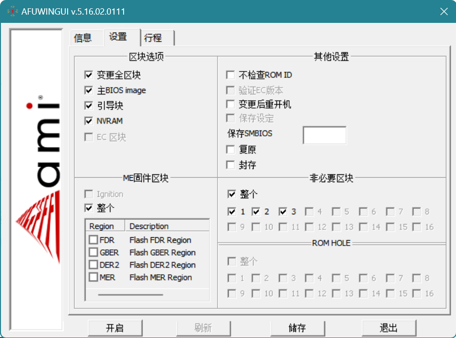
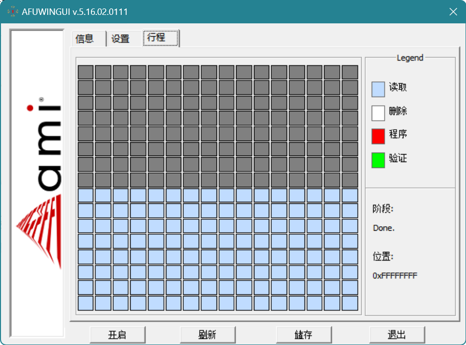
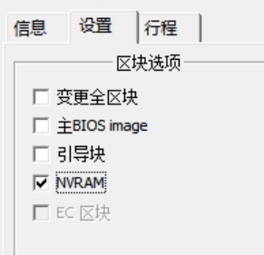
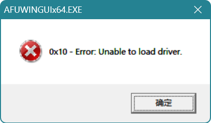

!!! info "历史资料"
    本页来自旧知识库或旧站归档，已做公开发布前的格式清理和去敏处理。其中涉及时间、价格、推荐和组织状态的内容，请按历史资料理解。

##                              注意：本方法仅适用于家庭等场景。

**使用情景：**一日，小明家长将电脑设置系统密码，用户使用必须输入密码才可以进入系统桌面，但小明轻松破解。而后，家长发现之，遂设置**主板BIOS密码**，用户启动引导进入系统须输入密码，小明无从下手，但小明每周末有一定时间可以使用电脑，但其出于贪婪，想寒暑假天天可以使用电脑。遂有如下方法：

## "利用一般非再次接入其他魔法硬件手段来复制主板BIOS信息来达到 ” 我不知道门的密码是什么但我可以把门先拆了再装回去“ 的目的"

---

工具下载：(需科学上网)

https://www.ami.com/bios-uefi-utilities/

---

## 主要操作步骤：(以Windows环境为例）

## 备份

1. 将下载好的文件沿路径 .\Aptio_V_AMI_Firmware_Update_Utility\afu\afuwin\ 打开，根据电脑情况选择32/64文件夹（以64位为例），找到 AfuWin64.zip 压缩包并解压，建议以管理员身份运行 AFUWINGUIx64.EXE

     若无报错等情况，则可以打开以下窗口：

点击“存储”按钮，选择将要保存BIOS所有信息的路径并命名其文件名保存，将得到一个 \*.rom 文件。

## 恢复

1.  点击“开启”按钮，找到并打开创建的 \*.rom 文件。
2.  打开“设置”选项卡，按下方勾选：(注：若有差异，请无视)

1. 点击“存储”按钮，等待以下图走条的区域全部变绿，在此期间请勿断电关机。（鼠标键盘动不了是正常情况）

~~而在这之后依然存在密码，但只要每次开机通电前拔下主板电池等待稍许再安装电池并开机，密码就会被清除，而此“恢复”方法则是给主板打上密码。~~

1. 更多说明

不难发现，一个BIOS文件相对较大，而恢复过程相对时间可能会有些长，每次全部区块刷新可能会带来一些问题。

经过屡次排除，密码存储在 NVRAM 上所以在进行步骤 2.2 时可以只勾选如下选项并进行恢复，但从单次来说，最保险的办法还是全部刷新。

##  可能存在的问题

1. 0x10

答：请进行版本更新

1. 其他问题：

请访问https://www.ami.com/bios-uefi-utilities/来下载官方英文pdf手册

1. 其他说明

确实可以直接在启动盘PE系统上直接运行

类似方法也可在efi或者DOS上进行，详细请参阅官方手册。

---

局限性：须先有一次成功进入系统~~(不然你以为真教你突破硬件七层协议的黑魔法？？？)~~

（王：是设置了bios密码之后要成功进入系统一次吗）—是的

### 相关原理：略

请参考uefi实现方式

\\\\\\---完
