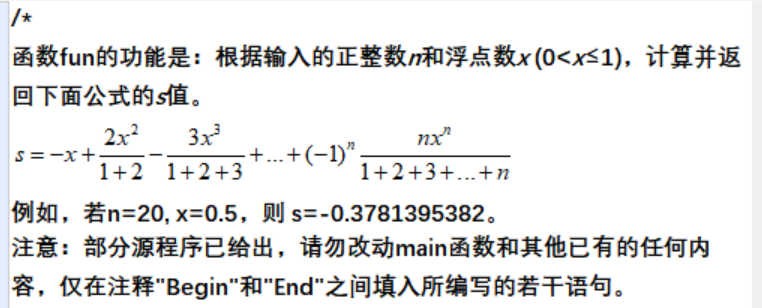
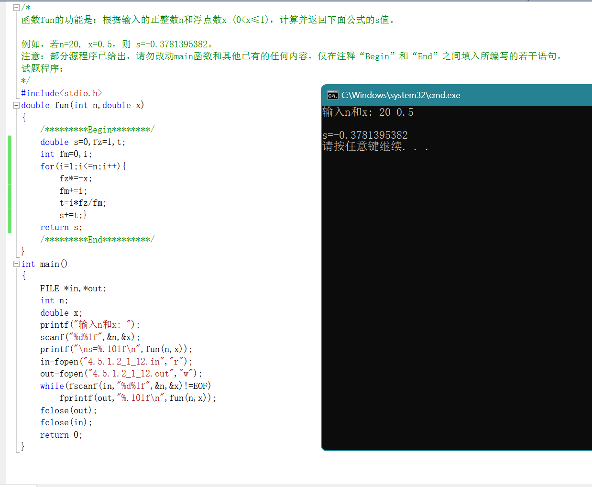
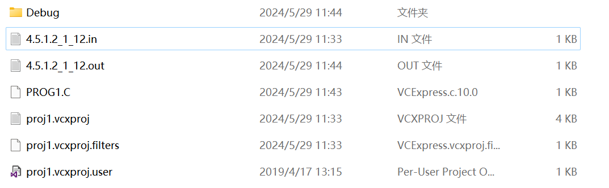
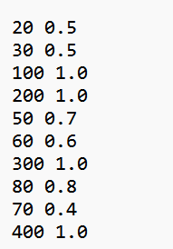
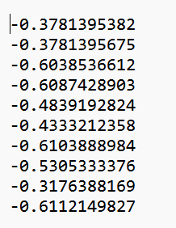
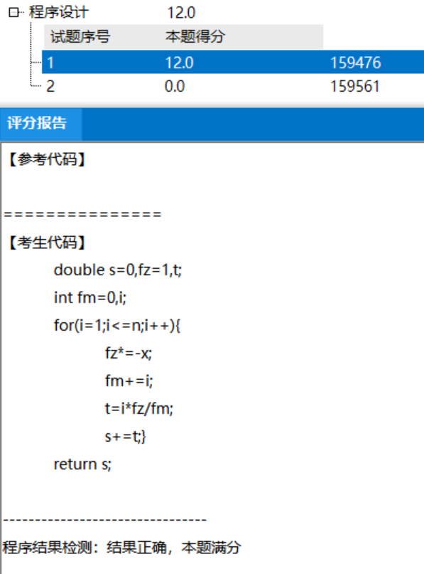
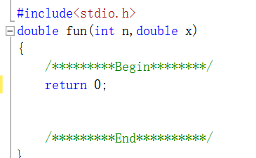
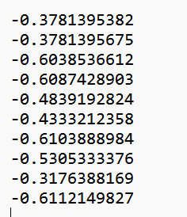
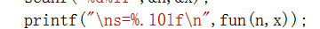
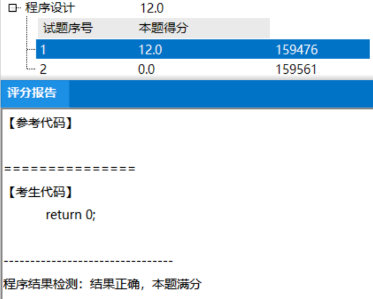

!!! info "历史资料"
    本页来自旧知识库或旧站归档，已做公开发布前的格式清理和去敏处理。其中涉及时间、价格、推荐和组织状态的内容，请按历史资料理解。

## 关于使用“百科园”作为~~C语言考试终端的~~致命漏洞

范围：程序设计

（未排版）

例子：4.5.1.2_1_12

正常做题调试编译后：

正常保存打开本题所在文件夹并打开以下目录:

C:\Exam\\\*\*\*\*\*\*\*\*\*\*\*\*\程序设计\1\proj1

记事本打开 \*.in 文件

可以看到这些为初值，再打开 \*.out 文件

可以看到每一行对应着 \*.in 文件内每一行的初值

若现在复制一份 \*.out 内的数据，直接提交百科园，

可以看到结果正确。

若再次打开本试卷（空白）

直接在本题调用函数写上

让它可以运行不报错，然后继续回到 \*.out 文件，直接粘贴上面的答案，

保存，（可以参考如下代码提供的精确值）

交卷，结果依然是满分。

这就证明，所有的程序设计题均也可以用如计算器，Excel表格运算等递推出结果并复制到 \*.out 文件内，

服务器为了减小消耗，把运算重要数据交给了用户，服务器仅起到数值检验功能，并且把重要数据包保存在本地，

甚至没有加密。
