!!! info "历史资料"
    本页来自旧知识库或旧站归档，已做公开发布前的格式清理和去敏处理。其中涉及时间、价格、推荐和组织状态的内容，请按历史资料理解。

# 图吧工具箱

## 下载

附上下载连接：<https://www.tbtool.cn/>，不要跑到奇怪的网站去下载！

## 基础信息查看

### CPU-Z

cpu-z 一般用于查看 cpu 的一些基础性能。

同时也可以对 cpu 进行跑分比较。

### GPU-Z

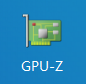

该软件可以看到 GPU 的一些基础信息。

## 烤机工具

### Aida64

Aida64 是我们常用的烤机测温软件，功能十分强大。

#### 查看核心温度

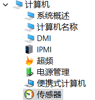

在“计算机 - 传感器”项目中可以看到电脑的温度信息如下：

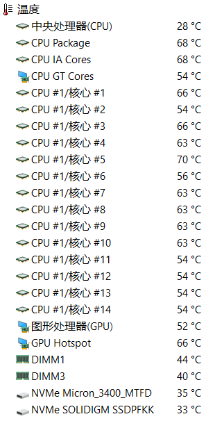

#### 查看温度墙

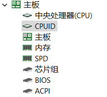

在“主板 - CPUID”下的过热保护温度栏目可以看到设定的温度墙。

#### 查看电池状况

在“计算机 - 电源管理”下可以看到基础的电池信息。

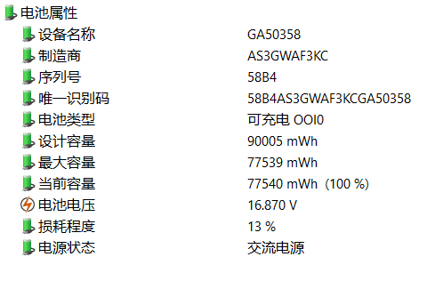

#### 稳定性测试（烤机）

在软件上方工具栏中点击下方按钮：

可以进入稳定性测试界面：

我们一般只需要对 CPU、FPU、GPU 三项进行测试，选择好后点击 Start 即可开始烤机。

### CpuBurner

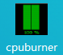

一键跑满 cpu，常用于复现 cpu 降频的问题。

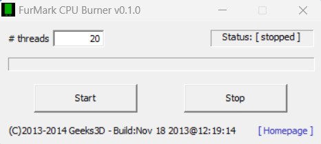

### FurMark

用于单烤显卡，检验温度是否过高。

我们烤机的时候只需调整 Resolution 项的分辨率即可，然后即可烤机。但需要注意的是一般 FurMark 会跑不满 GPU。

## 磁盘工具

### DiskInfo

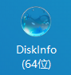

该软件可以看到硬盘的基础信息。

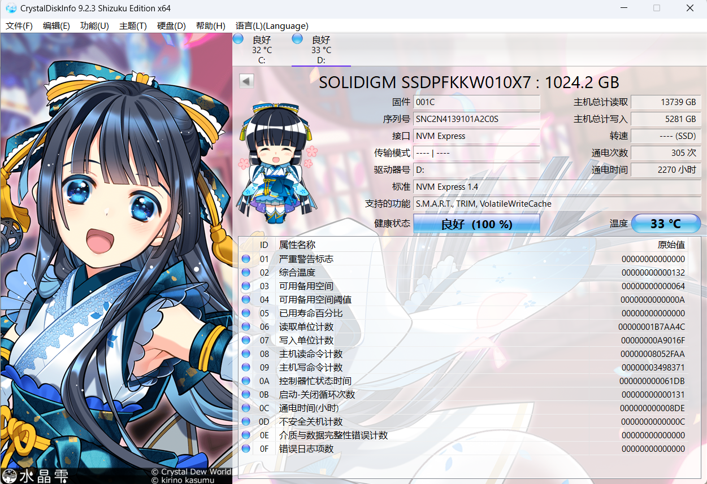

### CrystalDiskMark

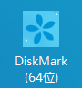

该软件可以一键对硬盘进行测速。

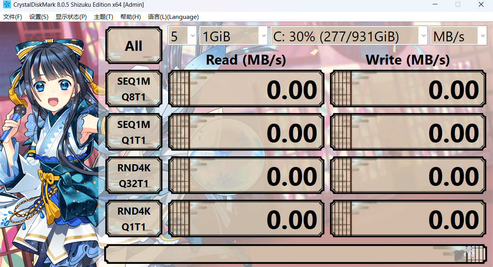

测试项目按顺序分别为：
1. 顺序读写，位深 1024K，1 线程 8 队列的测试速度
2. 顺序读写，位深 1024K，1 线程 1 队列的测试速度
3. 随机读写，位深 1024×4K，1 线程 32 队列的测试速度
4. 随机读写，位深 1024×4K，1 线程 1 队列的测试速度

一般只需要看第一项的测试速度即可，硬盘商家给的一般也是第一项的数据。

### HDTune

HDTune 用来测试机械硬盘的速度。

点击开始即可使用。

## 外设测试

### 键盘按键测试

我们在外设工具中找到 Keyboard Test Utility，打开后将每个键都按一遍即可知道键盘是否正常工作。

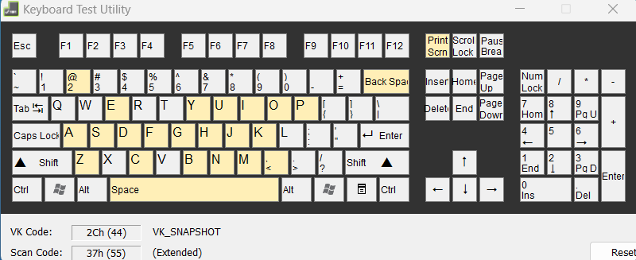

### 屏幕测试

在屏幕工具中的“在线屏幕测试”栏目，点开后可以在网站上自行测试。

而 UFO 测试则可以测试屏幕的刷新率。

## 其他工具

### Geek Uninstaller

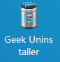

打开即可使用，用于删除软件，可以强制清理某些流氓小强软件。

Geek Uninstaller 是一款专业的 Windows 软件卸载工具，只有 6M 大小，非常轻巧方便。

软件完全免费 & 干净简洁 & 无广告，单文件绿色版，解压即用。

官网：[Geek Uninstaller - the best FREE uninstaller](https://link.zhihu.com/?target=https%3A//geekuninstaller.com/)

下载：[Geek Uninstaller 绿色版](https://link.zhihu.com/?target=https%3A//pan.quark.cn/s/20c81ce7f367)

#### 彻底清除卸载残留

打开 Geek Uninstaller，主界面列出了我们电脑上安装的所有软件列表。最近安装或修改过的，会以橙色突出显示。

右键点击要卸载的软件 → 卸载。软件会自动扫描卸载程序残留的文件和注册表等，一键删除所有残余垃圾，保持电脑清洁！

#### 一键卸载 Windows 商店应用

软件还支持卸载 Windows 商店应用。

点击菜单栏中的「查看 - Windows Store Apps」，即可查看安装的 UWP 应用，同样通过右键菜单进行卸载。

#### 给力的强制删除模式

有些软件本身不带卸载程序（流氓软件不少），比较“固执”，或者程序损坏等，无法通过正常方法卸载。

就可以使用「强制删除」功能，强制删除并清理该软件相关的程序文件。

#### 快捷导航

快捷导航是一个不起眼但很实用的功能。

右键可以直接打开软件的「注册表条目」和「安装文件目录」，进入官网。在查找或者修改软件文件时很方便。

不过普通用户可能不太常用到。

#### 纯绿色，不流氓

Geek Uninstaller 本身就是一款单文件的绿色软件，解压后只有一个 6M 大小的 exe 运行文件。

可以放在电脑上或者 U 盘里使用，不需要了直接删除就行。纯绿色，不流氓！

#### 更多：Geek Uninstaller 专业版？

对于大部分用户来说，免费的 Geek Uninstaller 足够日常使用了。

如果觉得不够用，或者想要更专业更强的卸载工具，再或者就是单纯地想支持下软件。[狗头. jpg]

Geek 确实还有一个专业版——Uninstall Tool。

官网：[Uninstall Tool - Unique and Powerful Uninstaller](https://link.zhihu.com/?target=https%3A//crystalidea.com/uninstall-tool)

正版地址：[Uninstall Tool - 多功能专业级卸载工具 永久版](https://link.zhihu.com/?target=https%3A//store.lizhi.io/site/products/id/63%3Fcid%3D2yj7gln9)

除了常规的卸载清理，还有安装追踪（*这个功能很强！*）、软件自启动管理、分类管理、批量卸载等，功能更强更全面。

Uninstall Tool 与 Geek 相比已经完全是两个软件了。永久版可以终身使用，也确实物有所值，是个在全球都很知名的卸载工具。

*注意：删除残留文件时不要直接点全删，记得先确认下，避免误删。*

#### 结语

Geek Uninstaller 免费干净，小巧易用，卸载效果也不错。想要更多功能可以用它的专业版 Uninstall Tool。

相比于使用软件自带的卸载程序，不仅能释放存储空间，保持电脑环境干净；也有效避免了无用注册表等拖累系统，使电脑高效运行。

---

同步自文档：<https://e0w6uca6qjf.feishu.cn/docx/SbWqdzjvooyDUgx3PqQcxSFcnod#HvOid0IR5s1Ketb1O03ci0OunfJ>
