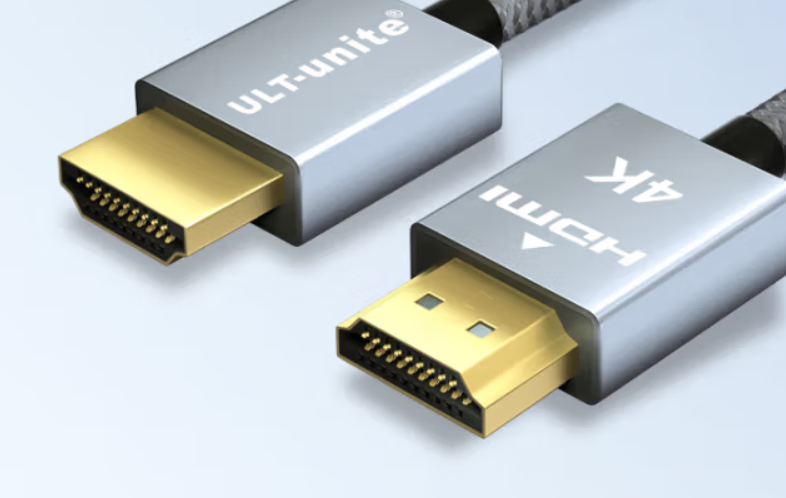
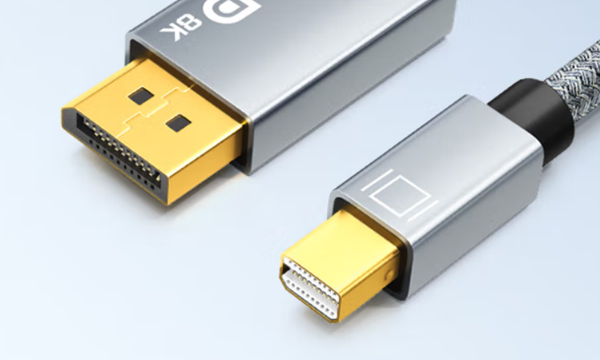
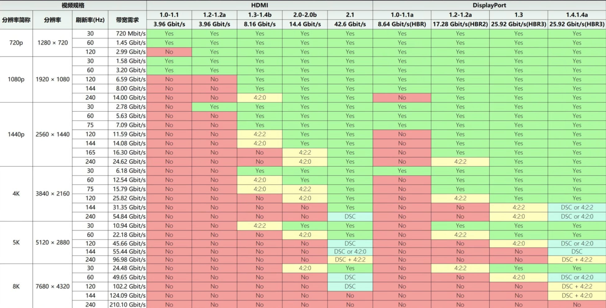
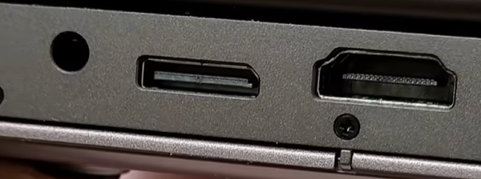
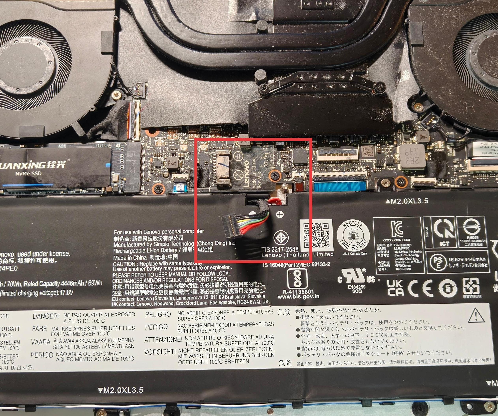
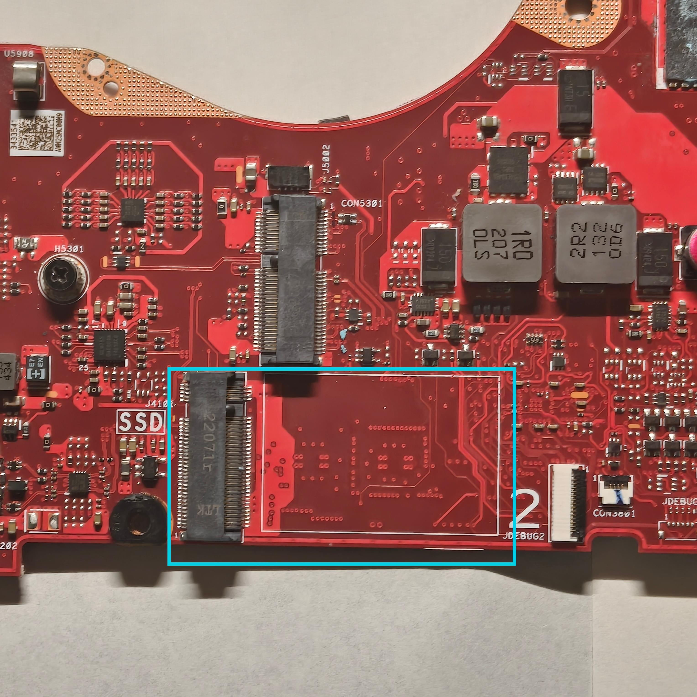
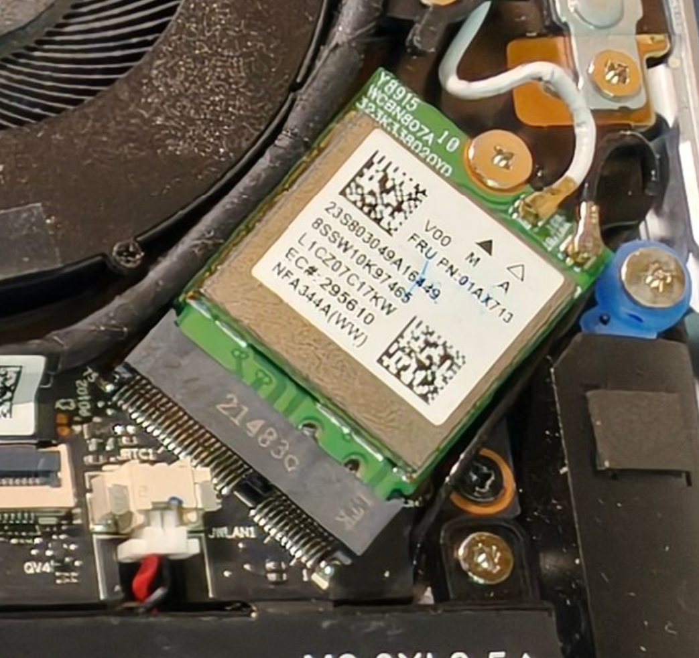

---
tags:
  - 硬件
---

# 笔记本接口

随着个人电脑发展至今，笔记本（Laptop）现在已经成为了个人电脑的主流。本文将简略阐述一下笔记本各类接口，无意过多介绍发展历史与规范，仅为用户和维修者提供基础科普

# 外部接口

对于大部分用户来说，外部接口是最需要了解的。

## 电源接口

毫无疑问对于各类电子产品来说电源接口是最重要的接口之一。

如果是游戏本，请使用大砖头充电器来保持最佳性能输出。

各家PC厂商包括苹果在这方面并不统一，因此主要介绍PD充电协议（物理接口为usb-c）

### PD充电协议（usb-c）

高端笔记本中，usb-c支持pd协议的笔记本不在少数。支持pd协议的笔记本只需要一个c to c的充电线和一个支持pd协议供电的插头即可进行充电。

优点：

显而易见的，使用c口充电器很多时候可以少带一个充电器，减轻旅行重量。

缺点：

大部分c口充电头是双脚插头，没有接地，因此全金属外壳笔记本接电时可能出现外壳带电的情况。

##### 补充

联想有自家魔改充电协议充电头，如果加购充电头时候请仔细查阅说明书查询协议支持情况。

## USB接口

### USB-A/USB Type-A（A口）

毫无疑问，a口依然是PC领域不可缺少的接口。

其支持的主流协议（速率）包括：

USB 1.1;

USB 2.0：480Mbps;

USB 3.x：

3.0/3.1 gen1/3.2 gen1：5Gbps；

3.1 gen2/3.2 gen2：10Gbps

部分a口魔改后会兼容不同充电/供电协议，但a口主要还是用于数据传输。

优点：接口可靠性较高，兼容广泛

缺点：性能比同期C口差，功能少

### USB-C/USB Type-C（C口）

c口是未来PC的重要接口，其功能之全面远超a口。

其支持的主流协议（速率）包括：

#### USB协议

USB 2.0：480Mbps;

USB 3.x：

3.0/3.1 gen1/3.2 gen1：5Gbps；

3.1 gen2/3.2 gen2：10Gbps；

3.2 gen2x2 ：20Gbps

USB 4：40Gbps（Max）

#### 雷电协议

雷电3：40Gbps，100w供电，支持DP1.2视频协议，可外接PCIe设备（PCIe3.0 x4）

雷电4：40Gbps，100w供电，支持DP1.4视频协议，可外接PCIe设备（PCIe3.0 x4）

雷电5：80Gbps，240w供电，支持DP2.x视频协议，可外接PCIe设备（PCIe4.0 x4）

##### 补充

事实上雷电协议需要cpu或者主板上有雷电控制器才行，英特尔h45处理器内置雷电控制器，通过雷电外接显示器是cpu核显从雷电口输出画面，是混合模式而非独显直连，但是hx55系列和amd的cpu都是主板外挂雷电控制器，输出画面是独显直连

#### 全功能USB

在USB数据传输协议上，还支持如下特性

视频传输：支持DP协议；

充电：支持100w PD充电协议。

具体视频传输协议和充电功率请自行查询笔记本主页。

## 视频传输接口

### HDMI接口

HDMI是一种广泛使用的视频协议，在过去十年都是主流视频接口。但是在近年，由于HDMI是付费授权协议，导致PC领域的HDMI占比逐渐走低。

### DP接口

DP协议是一种无需授权费的视频协议，因此应用比HDMI更为广泛，在笔记本上一般不存在标准DP接口，而是通过USB-C实现或者MINI-DP接口实现。

USB-C实现视频输出需要专门的USB-C to DP视频线，其余不多赘述。

MINI-DP同样，其接口本质和标准DP差别不大，需要MINI-DP to DP视频线插上即可实现DP输出

### 补充

1、DP（包括MINI-DP）可以轻松转HDMI输出，但是反过来需要专门添加供电的数据线才行，如果有需求请仔细查阅资料；

2、DP、HDMI子协议带宽及支持规格图（图源：硬件茶谈）

## 音频接口

一般笔记本依然搭载3.5mm音频口兼容音频输出和输入，但是部分机型（比如蓝天公模）会分一个兼有输入输出的和一个输入的，请自行查阅产品说明书或关注机身标识分辨。

## 网口

游戏本一般都有，轻薄本少有。

规格主要为1000Mbps和2.5Gbps。

## 其他

此处收录其余不常见的接口

### OCulink接口/Tgx接口

此类接口用于外接显卡拓展坞，通常为PCIe x4通道。

# 内部接口

## 电池接口

电池连接主板的接口。

华硕的电池排线两端都带接口，拔哪个都可以，拔主板要小心固定铁片触碰主板线路造成击穿。

## 固态硬盘接口

到本文撰写时，2.5寸硬盘接口已经退出了笔记本舞台，此处不提，只写M.2固态硬盘接口。

### M.2固态接口

下文简称m2口，实际上m2接口本质上是一个PCIe x4通道的接口，上文提到的OCulink等接口可以通过修改m2口的方式改装

## 风扇接口

用于给风扇供电的接口

## 网卡接口

网卡接口形态接近M2口但是防呆豁口位置不同

## 其他接口

由于其他排线接口不常见，此处只列举。

### eDP排线接口

### 键盘排线接口

### 触摸板排线接口
