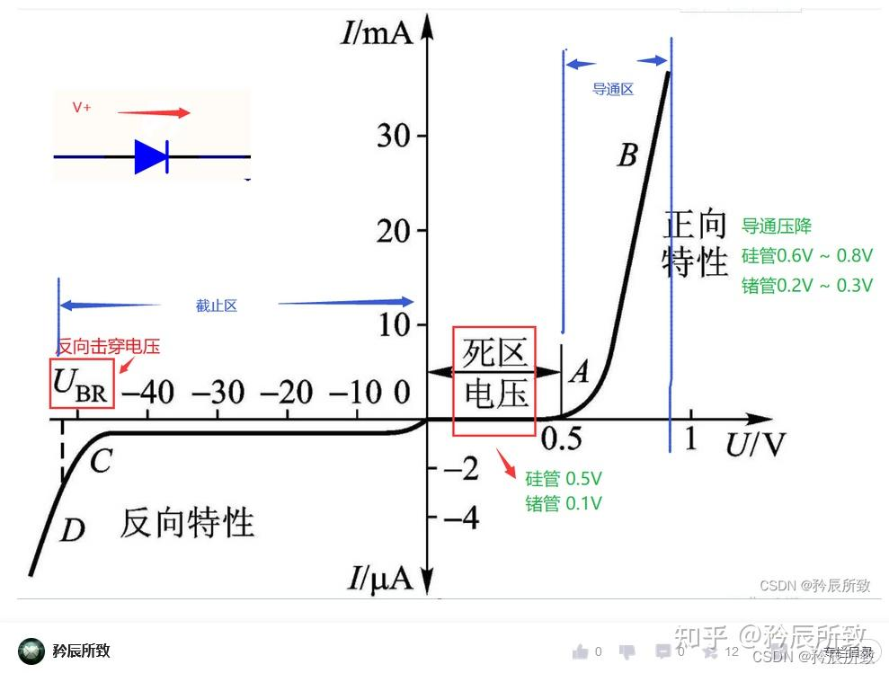

参考：

- [讯修论坛](https://www.chinafix.com/)
- [万用表使用](https://zhuanlan.zhihu.com/p/672837624)
- [跟我学电脑的个人空间-哔哩哔哩](https://b23.tv/sAPap5u)
- [鑫智造官网](http://www.wmdang.com/)
- [万用表二极管档位](https://zhuanlan.zhihu.com/p/33710579)
- [东芝对ESD二极管的介绍](https://toshiba-semicon-storage.com/cn/semiconductor/knowledge/faq/diode_tvs-diodes/how-do-esd-protection-diodes-operate.html)
- [精通维的教程](http://www.gzweix.com/article/sort0247/sort0268/sort0386/info-285047.html)

## 背景

虽然万用表能够检查电路，但是如果想要准确的对电路进行检修，点位图和电路图都是必要的。非常不幸的是，目前维修行业被鑫智造等公司垄断，虽然有电路图但大多都是他们抄板的（所以想要搞到图纸多半只能乖乖交钱，如果哪天我们真的可以在技术上和他们抗衡了，那真就是砸人饭碗了）

万用表本质上是把很多检测表集成在了一块板子上，可以通过切换档位的方式来切换功能。

高中的时候应该都学过怎么用，如果不会可以去看看其他教程或者万用表说明书

## 检查供电电路寻找大致故障位置

~~我不会啊哥~~

一般万用表会有一个二极管档位，他会测量在一定电流下时的电压值。

（比如上面这个是二极管的特性曲线）

虽然上面说的是用一个电流源来测电压，但是显然你的两节干电池是没法干到几十V的，所以被反向测量的二极管会直接显示最大值而不是干穿二极管。

现代的集成电路会使用阳极接地的二极管来防静电（你也不想拔插一下u盘从USB口一路爆到CPU吧）。所以，当用二极管档位测量的时候，**我们会需要红表笔接地，黑表笔接测试点** 。此时测量到的值是地对测试点的压降。当这个值过小时，可能发生了短路，当这个值过大时可能发生了断路（当然这个是非常笼统的说法，有些时候需要经验，当然也可以计算）。

供电电路一般会用电容来将交流引向地，用电感来通过和稳定直流电。在向CPU，GPU，以及其他数字电路元件供电的时候，需要一个相对比较稳定的直流电源，而大电感一般体积也比较大，所以可以非常容易找到元器件供电电路上对应的电感，从而测量这整个一路的情况。

上图是一个比较粗略标记的出供电电感的主板（就是那个银白色的方块），一般功率大的元件需要的电感就越大，所对应的压降也会更大（一整条路上的元件功率都会大）（比如GPU）。

在没有原理图的情况下，我们只能根据元件的摆布进行推断哪些电感对应哪些元件。

## 检查特定元件是否短路、断路

[一个教程](https://zhuanlan.zhihu.com/p/34666035)

### 电阻

一般电阻估计也不会坏），直接用欧姆档测就行了

### 电容

首先，这里说的一般是无极性的电容。如果有电容档的话直接用电容档去测就行了，如果没有的话可以用1K或者10K（电容越小电阻档位越大），跳变过程应该是变小再变到无穷大，如果测到0那就是短路了。

### 电感

电感本质上是很多圈导线，如果用1欧姆档位能测到值一般就是好的，测到无穷大是断了，测到0是短路了

### IC

用上面测整体电路一样的办法，如果IC芯片有保护电路的情况下，二极管档位红色接GND，黑表笔测IO口，正常的话应该是0.7V
