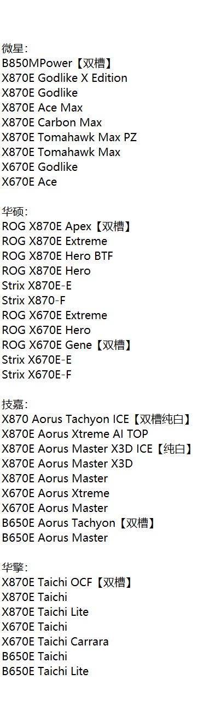

- 超频的本意就是免费提高当前设备的性能
- 注：一切超频都会引起风险，执行超频操作前请三思，自己是否可以承担风险是否需要超频！
- 内存与CPU超频默认面向台式机玩家

## **显卡超频**

## 前期准备

### 在进行超频操作前，请先对你的显卡型号进行了解。

拿n卡举例，900系、10系和20系的超频潜力就远大于30系和40系。这是因为老卡的频率设置较保险，有剩余价值可以压榨，但随着工艺和架构都将到达瓶颈，现在各家厂商只能靠拉高出厂频率来提升算力，尤其是40系由于更换了台积电的新工艺，让老黄可以通过拉高出厂频率来达到算力的提升。这出厂即灰烬的情况导致新卡的超频空间少了很多（只是正常散热的话

a卡也和n卡情况类似，老显卡的超频潜力非常大，比如说三朝元老RX580😋

### 下载MSI Afterburner（微星小飞机）、3D Mark

小飞机去官网下载即可，就是英文的没啥关系的

> https://www.msi.cn/Landing/afterburner/graphics-cards

3D Mark可以去steam下载（¥32）也可以去找wh搞破解版的

## 超频

既然前面都完成了，就来进行精彩又刺激😎超频环节吧！

打开小飞机就可以看到里面的几个参数

## 内存超频

## CPU超频

## AMD用户

### PBO

该选项可以自行选择超频/降频，实现定频定压

### 进阶玩法：外频（不定期更新）

#### 确认你的主板为以下型号之一

#### 进入bios界面恢复默认设置

在cpu电压稳定前，请不要对其他电压进行操作
