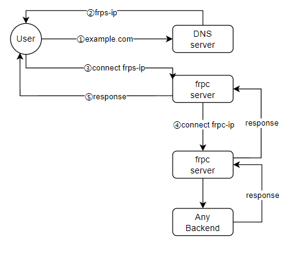

# 【第一期】内网穿透 [施工中]

# 基础理论

# 实现

## Frp - OpenSource

世界树一切的起点, Frp 项目 , 这个是开源的Frp客户端, 好用又方便 , 而且配备有中文文档 , 简直是爽死啦

[github.com](https://github.com/fatedier/frp)

### 部署

这是官方中文文档 [frp](https://gofrp.org/)

我想官方文档说的很明白了, 而且是中文的, 这里就粗略带过如何安装

1. 在GitHub的发布页面选择合适的软体安装 https://github.com/fatedier/frp/releases

   ```Bash
   # 这里以 x86_64 ubuntu22LTS 为例
   curl -sSL "https://github.com/fatedier/frp/releases/download/v0.61.0/frp_0.61.0_darwin_amd64.tar.gz" | tar -xz -C .
   ```
2. 安装完成后, 解压得到两个软件,和两个配置文件 `frpc` 和 `frps`和两个默认配置文件

   ```Bash
   .
   ├── frpc
   ├── frpc.toml
   ├── frps
   ├── frps.toml
   └── LICENSE
   ```
3. 其中, `frpc` 是 `frp-client` , 如果你希望使用别的Frp中转服务器可以使用他, `frps` 是 `frp-server` , 如果你希望提供Frp服务, 可以使用他. 这两个是独立的软件, 如果你只需要作为客户端链接frp服务, 可以不需要frps

然后就安装完成了

## 配置

官网的配置其实写的比较少, 有很多高级特性被隐藏掉了. 不过官网教程已经编写了大量样例

你可以在官网的详细参考里找到一些配置

https://gofrp.org/zh-cn/docs/reference/common/

但比较零碎 , 而且没有告诉你配置的组合方式

### 基本配置

```Bash
# frps.toml
## 基本的FRP server 配置项目
## 监听地址, 这里只接受局域网的frpc隧道通信, 你可以使用公网IP或者虚拟局域网IP或者0.0.0.0
bindAddr = "192.168.1.1"
## 监听端口, server在这个端口监听通信
bindPort = 7001
## 设置认证方式为token
auth.method = "token"
## 设置token值
auth.token = "YourStrongToken"
## 设置HTTP代理的对外端口, 外部访问这个端口会被代理到某一个后端, 也就是穿透端口
vhostHTTPPort = 80
vhostHTTPSPort = 443
VhostHTTPTimeout = 60

## 设置webUI地址, 其实webUI除了一些统计信息没啥用
## 不能在UI上修改配置(准确的说最后还是文本框修改)
webServer.addr = "127.0.0.1"
webServer.port = 8080
webServer.user = "admin"
webServer.password = "examplePassword"

## 日志配置
log.to = "/var/log/frp/frps.log"
log.level = "info"
log.maxDays = 7
```

然后是基于这个服务配置端一些共有的客户端配置, 我们使用 `includes` 来引入一个配置文件夹, 这个官网教程里应该没说, 这样我们可以很方便的让很多配置共用这个公共部分

非常优雅

```Bash
# frpc.toml
## 一些基本配置 , 指定提供穿透服务的IP地址 , 端口号, 鉴权方式和token
serverAddr = "192.168.1.1"
serverPort = 7001
auth.method = "token"
auth.token = "YourStrongToken"
## 客户端名称, 这个是自定的, 方便区分多个客户端
user = "UniqueClientName"
## 也没啥用, webUI 有一些统计信息以及链接上的server
webServer.addr = "127.0.0.1"
webServer.port = 80
webServer.user = "admin"
webServer.password = "ClientPassword"
## 日志配置
log.to = "/var/log/frp/frpc.log"
log.level = "info"
log.maxDays = 7
## NAT检测
natHoleStunServer = "stun.easyvoip.com:3478"
## 指定DNS
dnsServer = "223.6.6.6"
## 如果server链接失败是否退出, 这里配置为一直重试
loginFailExit = false
## 包含的配置文件
includes = ["/opt/frp/sites/*.conf"]
```

### HTTP 隧道

设置一个HTTP隧道, 这个是最简单的

```Bash
# http1.conf
[[proxies]]
name = "web1"
type = "http"
localPort = 80
customeDomains = ["example.com"]

[[proxies]]
name = "web2"
type = "http"
localPort = 8080
customeDomains = ["example2.com"]
```

此时 `frpc` 会前往 `frps` 注册这两个域名以及他们在后端的端口

我们只需要将这两个域名解析到上面提到的 `serverAddr`, 然后使用 `http://<customeDomains>:<serverPort>` 即可访问到后端的服务


