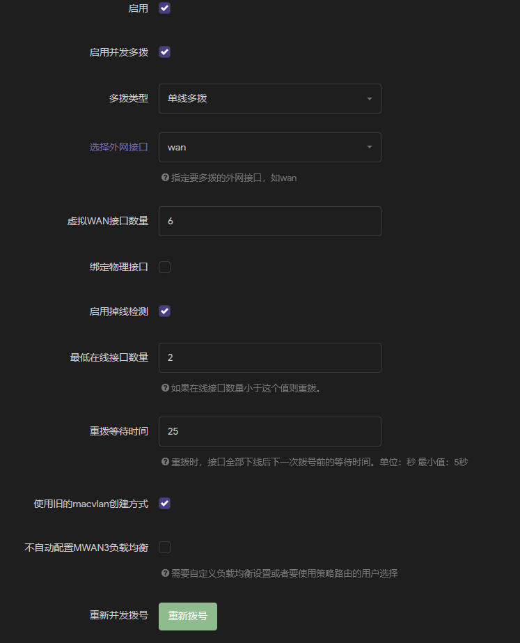
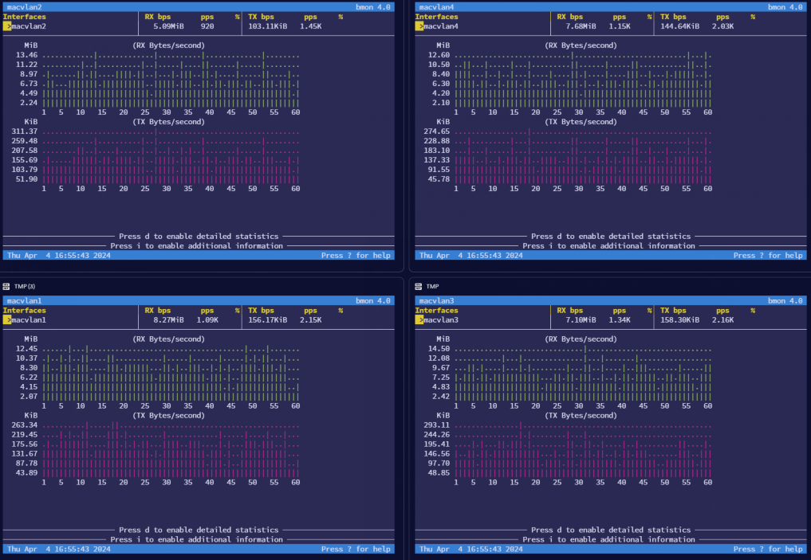
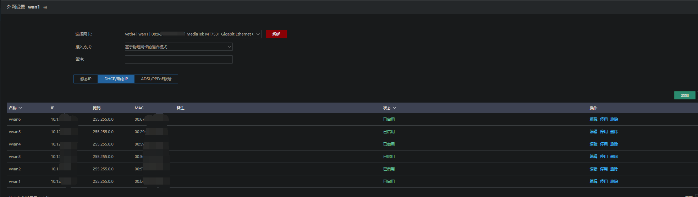
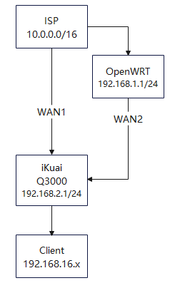

# 【第二期】多拨

# 多拨实现

写在前面：

如果你对技术并不感兴趣，也不喜欢折腾（因为会有一大堆问题而且往往百思不得解）

那么建议直接参照本节的 `基于多物理网口的多拨` ，他的设置更加简单，而且价格竟然意外的便宜！（也就百来块）

其次，如果你想获得更多的可玩性、丰富的功能，可以考虑`iKuai` ，它更贵，但也足够简单（设置会多一些，但难以被玩坏，有专业的客服指导）

最后，才是你应该考虑的OpenWRT软路由方案，它非常自由，有多重架构的固件可供使用，可玩性极高，你可以把他安装在虚拟机里，也可以安装在物理机（嵌入式主机或者你的电脑上），但是它更复杂，而且多样的固件可能暗藏危险！（尽管他作为本节的第一章写在了前面）

祝你玩得开心\~

## OpenWRT

这里介绍基于OpenWRT软路由的**单线多拨**方法，不同的固件有不同的版本，这里以 `nanopiR2S`（含CNC外壳200RMB） 为例

关于软路由的选择，你可以查看我们的其他文章。

建议：刚刷好系统先别配其他东西，直接先尝试设置多拨，因为失败时你可能需要重新刷写固件

建议：一旦多拨成功，建议马上进行固件备份，以便将来进行恢复

1. 首先登录管理页面（自行关注固件的默认管理界面，有的固件是`192.168.1.1` 而有的是`10.0.0.1` ）
2. 安装多线多拨等相关软件（这里使用`高大全` 固件，已经默认配备有）
3. 进入`网线-过线多拨`界面，执行如下设置
4. 进入`网线-接口` 界面，对所有虚拟接口（以`macvlan` 开头）进行修改，`wan | wan6` 不配置协议

   1. 修改协议类型为`DHCP`, 创建后的接口默认协议为 PPOE , 你必须进行修改才能获取IP
   2. 修改`高级设置 - 使用网关跃点` 为该接口数字名称为10倍，如`macvlan1`使用跃点数为`10`
   
      1. 没有什么为什么，一般情况下使用1倍跃点数也行
      2. 可能是某种玄学设置
   3. 保存设置后重新进入接口总览，检查所有的虚拟接口是否拿到了IP地址
   
      1. 没有拿到IP地址，需要检查设置
      2. 必要时重装系统
5. 进入`网络-负载均衡` 界面，已经生成了一些配置，我们手动修改一些

   1. `接口` 
   
      1. 选项卡如果有`mwan` ，请检查接口是否配置了协议，必要时重装系统再进行配置
      2. 修改剩下的接口（`vwan`）的`初始状态` 为`离线` 
      3. 修改接口的`跟踪的主机或IP地址` ，增加一项为`223.5.5.5`
      4. 修改接口的`接口离线`次数为 3，`接口在线` 也为3
   2. `成员` 内如果有`mwan` 绑定的接口是`wan`口，删除之
   3. `策略` 修改`balanced` 策略的`备用成员` 为`不可达`
   4. `规则`选项卡内删除`https` 策略，确保只有`default_rule`

此时所有修改已经完成，现在你需要对每一个接口的IP地址进行登录操作，这里不展示登录脚本，你需要用你的超强大脑想办法找到校园网的登录原理。网上似乎也有`能——用——` 的开源实现。

### 负载均衡检查

这里额外增加一章，检查`负载均衡` 到底均衡没有

先SSH登录OpenWRT，然后执行

```Bash
opkg update && opkg install bnom
```

然后使用

```Bash
ip addr show | grep macvlan
```

看看你都有哪些虚拟接口，然后开启多个SSH界面，执行

```Bash
bmon -p macvlan1
```

显然不同的SSH界面你需要监视的macvlan代号都不一样，这里以4个虚拟接口的监视为例

在你开启监视后运行一个大的下载任务（建议使用steam安装一个游戏，steam能跑到的速度就是你现在的实际网速，一般的测速网站都不怎么准）

你可以看到所有的网卡都有负载，且steam的速度能稳定跑到正确的值（3\~4个接口比较稳定，大概是40MBps，再多不一定能跑上去），那么你成功了



故障 :

1. 网速依然锁在百兆，你可以看到只有一个网卡在满载，其他网卡都没有流量，就是负载均衡出了问题，你需要调整，检查是否登录了其他网卡的IP地址 . 确保其他网卡的IP也可以上网
2. 所有的网卡都有速度，但是速度是百兆的几分之一（例如4个虚拟网卡每个网卡都是四分之一的速度），这可能是你的负载均衡策略没有做好, 也可能是这个OpenWRT固件的问题 , 也可能是你的交换机(如有)本身就是百兆的 , 不是千兆的交换机

以上的两个问题都可能意味着你需要重新安装固件，重新设置，有的固件本身有缺陷，UI界面上看起来是修改了但是系统内设置根本没改，几次都无法成功建议你使用其他的固件再试试

## iKuai

### 硬路由

硬路由因为有硬件加速模块（特化了网络处理），相比于软路由，稳定性更好！

> 但是需要注意, 硬件版本的ikuai 因为是给企业用的 , 阉割了很多功能, 而这些功能可以在社区版镜像里找到, 按需使用

这里以打折时为179RMB的`iKuai Q3000（白色）` 为例

登录管理后台

这里以新增一个WAN口进行多拨为例，如果你希望默认的WAN口进行多拨，直接跳到第四步

1. 进入`网络设置 - 内外网设置` ，点击`内网网口 LAN1` 的图标进入内网接口设置

   1. 在详情页打开`高级设置`
   2. `扩展网卡` 取消勾选任意一个网口，这里以`veth3` 为例
2. 返回`内外网设置` 看到空闲了一个`veth3` ，点击

   1. 在配置页面选择`网卡用途` 为外网，网卡选择应该是默认的`veth3`
3. 绑定完成后你可以看到`外网网卡` 多了一个`WAN2`
4. 点击你希望多拨的外网网口（以`WAN2`为例）

   1. `接入方式` 先选择DHCP，看看能否获取IP地址，确认你的外网网线已经正确插入
   2. `接入方式` 选择`基于物理网卡的混合模式`
   3. 然后选择`DHCP/动态IP` ，点击右侧绿色按钮`添加`
   
      1. `名称` 默认为`vwan` ，如果你需要多拨，请使用数字区分，例如`vwan1`
      2. `线路检测` 你可以依据自己的需要填写别的域名，默认是百度网站
5. 添加多个`vwan` 后，可以看到每一个虚拟网口都获得了IP地址，如图
6. 使用指令进行登录，这里亦不介绍登录方法，跟OpenWRT的登录方法一样
7. 前往`流控分类 - 分流设置 - 多线负载` 进行负载均衡的配置

   1. 点击右侧绿色按钮`添加` 添加一个策略
   2. 由于我们是单个运营商的网线多拨，`运营商`选择全部
   3. `负载模式` 按照需要使用，这里保持默认（效果没那么好）
   4. `负载比例` 先将所有的虚拟网卡添加到这个策略，即点击`开始`
   5. 由于我们希望每一个网卡都跑满，因此不配置权重（默认均为1，数值越大分流比例越多，负载越高）
8. 完成后，测试负载方法见OpenWRT的章节

### 软路由

iKuai的软理由版本只支持`X86` 架构

先前往 [ikuai官网](https://www.ikuai8.com/component/download) 下载对应的 32/64 位 ISO镜像

刷写方式为`一般的Linux系统安装` 方法，可以查看我们的文章，或者自行搜索

多拨方式参考上面的`硬路由` 的方式，异曲同工。

## 基于多物理网口的多拨

这里以TP-Link的企业级路由器（我一开始以为是交换机来着，好大一个，贼重，一股企业风，爽死啦）`TP-Link R478G+`（海鲜市场55\~90RMB） 为例

当然，首先你得有一台`千兆五口交换机` （我们推荐买钢质的，30\~50RMB，虽然塑料的会便宜一些）

进入管理界面，你也可以先行进行向导配置，无所谓

1. 在`WAN设置` 选择 `双WAN口` （双拨，一般我们是四拨，你可以选择4WAN口）
2. 在上方的`WAN*设置` 选项卡查看是否都获得了IP地址
3. 在`流量均衡 - 基本设置` 启用 `智能均衡` ，勾选你的所有WAN口，保存即可
4. 对所有WAN口进行登录操作，这里亦不介绍，参见OpenWRT的登录
5. 对网速进行测试，参见OpenWRT的章节。

## 登录 & 鉴权

你拿到了IP , 还需要登录校园网才能被上游允许访问网络, 否则这个接口只是占用一个IP , 是废的

这里不打算编写如何使用校园网的接口进行鉴权.  因为这篇文档大概是公开的.

如果你需要一些指导, 找一下成员. 


# 多拨进阶

现在我们遇到一种新的情况：

OpenWRT的不稳定性会让你的机器随时面临爆炸的危险，恰巧你的内网又有一些服务器或者远程办公的主机，这可能会给你造成一些影响。

我们能否设想一种网络架构——你的路由器后的服务器不会受到OpenWRT的影响（他可能随时改变DHCP分配的IP地址、突然断网、DNS解析错误等），这样在Op出问题时你只需要即时修复、更换即可，后方的服务器完全不会察觉到IP网关变化或者断网。

下面简单介绍两种可能得架构

## 旁路由

## 双线路由

这是拓扑示意图



使用`ikuai Q3000` 的双WAN口自动灾备功能，平时使用OpenWRT及设置在其内部的多拨程序、`smartDNS` 等网络连接，Op被玩坏后自动切换到WAN1直接使用ISP的网络保证网络连接，也便于远程故障恢复。

且后端的`Client` 由`iKuai` 进行DHCP分配和管理，将Op隔离了出去。

1. 调整Op

   1. 调整`网络 - 接口 - LAN` 的`DHCP` 选择`忽略此接口` ，这为我们后面的设置带来方便
   2. 修改该接口的IP地址为合适的地址，这里使用默认的`192.168.1.1`，记住这个地址
   3. 在`系统 - 管理权 - Dropbear实例`确保你的LAN口可以访问，必要时添加一个实例然后允许`V~P~N` 网段的访问（选做）
2. 调整后端主网关，这里是`iKuai Q3000`

   1. 这里省略了给iKuai添加两个WAN口的流程，我们假设你有
   2. 你可以在上方关于`iKuai 硬路由` 的章节找到相关内容，不是很难
3. 修改WAN2

   1. 在`网络设置 - 内外网设置 - WAN2` 的`接入方式`使用`静态IP` 
   2. 设置静态IP为`Op LAN` 口同网段，这里设置为`192.168.1.254`
   3. 修改网关为`Op LAN` 的地址，这里为`192.168.1.1`
   4. 勾选`默认网关` ，这样`iKuai`就会自动切换两个WAN口

此时双WAN口应该可以正常工作了

### 静态路由设置

现在遇到的问题就是，如何让Op的网络和iKuai的网络相互打通、相互访问？

网络数据包的自动向上转发机制让后端可以自由访问`192.168.1.1` 的Op网关

现在我们需要设置静态路由让Op也能访问到ikuai的网段

- 在Op内的`网络-静态路由` 添加一个`IPv4`路由

  - 接口为`Lan` 
  - `对象IP地址` 为 `192.168.2.0`
  - 子网掩码使用 `255.255.255.0（24）`
  - `网关` 使用 `192.168.2.254`
- iKuai已经自动设置了网关，一般情况下不需要设置，你也可以参照上面的方法设置到Op网段的路由

而后你可以在Client端尝试访问Op，以及使用SSH登录Op尝试访问iKuai内网

这点有点重要，因为后期我们配置内网穿透、虚拟网络时都需要从Op处访问

`iKuai`因为相关法律法规，限制得比较死，而且需要付费

在未来，我们的多线路由甚至可以增加一些基于4G/5G网络的网关，这样即使是WAN1 WAN2在00:00断网也依然可以访问网络，增加容错性

## 多线多拨

ISP在给你开通宽带时会给网口/账号限速，如果一条线路的一个登录账号被锁定在100mbps，那么，自然的，我们是否可以让两条网线的网速叠加在一起？或者说，让我们的网络请求用一种“聪明的”方法交叉的分别使用这两根网线。

于是就出现了多线多拨这个最基本的方法，他就是将多个物理网线（往往是两个ISP的宽带，如移动和联通的入户网线）插在一个路由器上，路由器通过“聪明的”配置，让电脑的网络请求分别走两条线路（尽量让两条网线都利用起来）

进一步的，如果都是移动运营商的网线，显然不大可能给我们分配两条入户线，你的钱包也不再允许你花大价钱再办理一条入户宽带，怎么办？

如果我们追本溯源，我们只要解决，让路由器能够分别出两根网线的区别即可！类似于，给这两根网线标号，而路由器完全可以根据接入的网口不同来标识网线，也就能做到将请求按照网线的负载情况进行分流。

## 单线多拨

更进一步，考虑到交换机的集线、分线特性，我们是否可以将多根网线插在交换机上，将交换机连接到路由器，再进行多拨？

有一些关键字 , 比如 "单臂路由" 之类的. 你可以尝试自己去了解.
