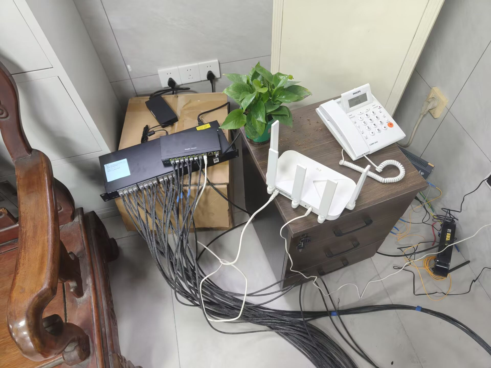
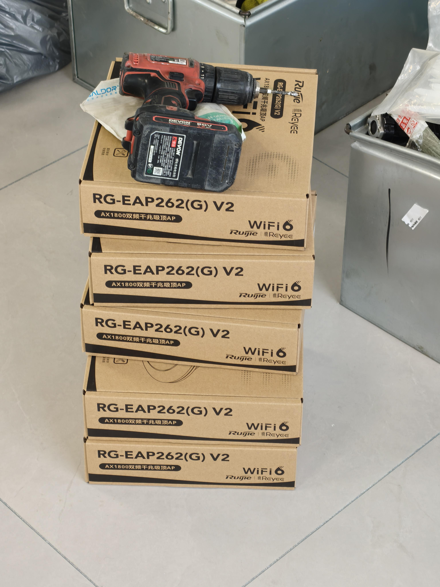

最近折腾完全屋Wifi覆盖，分享一下自己的体会。

全屋Wifi覆盖主流方案为AC+AP和Mesh组网，现在我已经全部折腾过一遍了。

## 都有的优点：可以实现无死角全屋Wifi覆盖以及设备无感漫游

## 方案1、AC+AP全屋覆盖

## 优点：美观

## 缺点：贵、扩展空间弱

最**力大砖飞的、最烧钱**的一集，起步四层600平的空间使用了6个AP+1个主路由器（无Wifi功能）。正常家用的话120平最好主卧次卧书房各一个AP加上客厅一个主路由器以及弱电箱中的一个入门交换机，相比起同等的mesh方案感觉要贵50%。该方案最大的问题就是如果房间内需要连多个有线设备，依然需要外置交换机，影响房间美观性，我觉得只适合超大房型+超多设备的用户考虑使用。

图中为锐捷210GPEv2（白色中兴路由器充当AP功能）+交换机

图中为AP

## 方案2、Mesh路由组网（最推荐）

## 优点：扩展性很强（常规家用路由器本身就能当交换机用）、便宜

## 缺点：丑

很多人觉得路由器摆的到处都是是丑陋的，对此我表示疑问，毕竟AP所在的房间中如果缺少网口拖一个交换机难道不是更丑吗？这个方案的优点就是**便宜**，4个AX3000路由器组网最便宜甚至400+出头就能拿下，而**AP的话相同价格性能和稳定性不如路由器，相同性能、高稳定性价格又起飞**。我使用了**多个中兴AX3000路由器巡天版**，完全傻瓜式操作，**自动识别自动上网**，对新手很友好，也方便后期扩展。

**补充：**但是实际上一个家庭中最大的网络问题来自于设计者有关知识的欠缺。想要实现上述两种组网，最重要的是让各个房间的 AP 或者子路由器能够直接连通到主路由器。最推荐的方法就是：如果主路由器放在客厅电视柜，那么在客厅电视柜的墙壁上一定要有两个网线口：

1. 一根从弱电箱的**光猫**上接**主路由器**（给主路由器提供网络）
2. 一根从**主路由器**上接回弱电箱中的**交换机**上（通过有线方式连接其余房间的 AP 或者路由器）

**当然，如果有朋友问我，家里没有办法做这种设计，**最好的解决方案就是：

**多买一个路由器作为主路由器**直接放在弱电箱里，然后从路由器上引三根线出来：

1. 一根到客厅
2. 剩余两根到对应的房间

缺点就是主路由器在弱电箱中可能会有散热问题，但也确实是解决全屋组网的一个方法。
