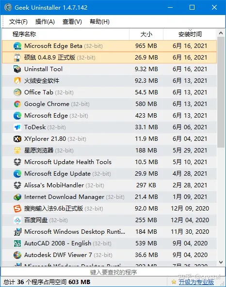
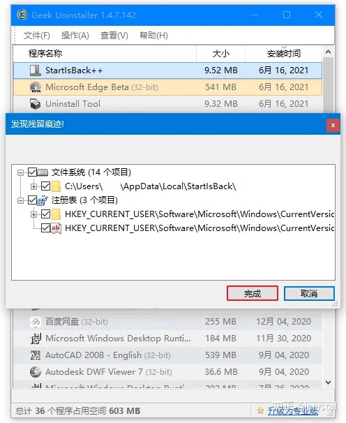
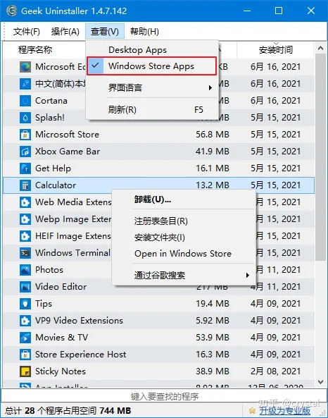
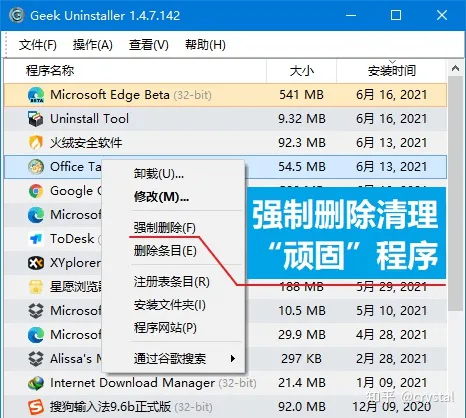
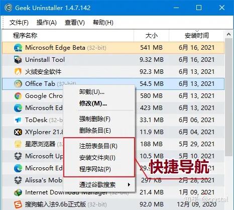
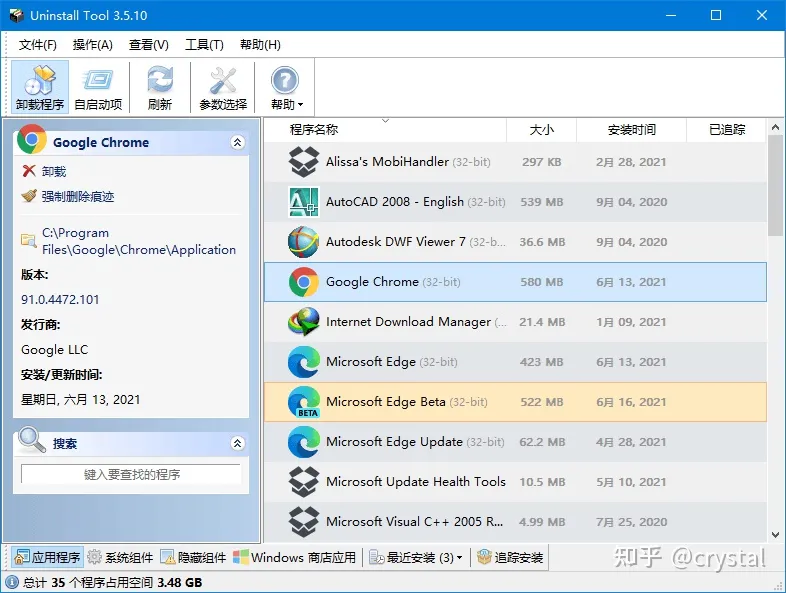

# 清C盘流程

# 工具介绍

!!! note "🌟 提示"
    以下工具在【图吧工具箱】均中有收录，具体参见[图吧工具箱](../../archive/legacy/图吧工具箱.md)

## SpaceSniffer

主要功能如图

<video controls src="../../assets/feishu/media/e53a1548d61b868a917cd14c.mp4"></video>

## Geek Uninstaller

Geek Uninstaller 是一款专业的 Windows 软件卸载工具，只有 6M 大小，非常轻巧方便。

软件完全免费 & 干净简洁 & 无广告，单文件绿色版，解压即用。
<ul><li>官网：<a href="https://link.zhihu.com/?target=https%3A//geekuninstaller.com/">Geek Uninstaller - the best FREE uninstaller</a></li><li>下载：<a href="https://link.zhihu.com/?target=https%3A//pan.quark.cn/s/20c81ce7f367">Geek Uninstaller 绿色版</a></li></ul><h3>彻底清除卸载残留</h3>
打开 Geek Uninstaller，主界面列出了我们电脑上安装的所有软件列表。最近安装或修改过的，会以橙色突出显示。

右键点击要卸载的软件 → 卸载。软件会自动扫描卸载程序残留的文件和注册表等，一键删除所有残余垃圾，保持电脑清洁！
<h3>一键卸载 Windows 商店应用</h3>
软件还支持卸载 Windows 商店应用。

点击菜单栏中的「查看 - Windows Store Apps」，即可查看安装的 UWP 应用，同样通过右键菜单进行卸载。
<h3>给力的强制删除模式</h3>
有些软件本身不带卸载程序（流氓软件不少），比较“固执”，或者程序损坏等，无法通过正常方法卸载。

就可以使用「强制删除」功能，强制删除并清理该软件相关的程序文件。
<h3>快捷导航</h3>
快捷导航是一个不起眼但很实用的功能。

右键可以直接打开软件的「注册表条目」和「安装文件目录」，进入官网。在查找或者修改软件文件时很方便。

不过普通用户可能不太常用到。
<h3>纯绿色，不流氓</h3>
Geek Uninstaller 本身就是一款单文件的绿色软件，解压后只有一个 6M 大小的 exe 运行文件。

可以放在电脑上或者 U 盘里使用，不需要了直接删除就行。纯绿色，不流氓！
<h3>更多：Geek Uninstaller 专业版？</h3>
对于大部分用户来说，免费的 Geek Uninstaller 足够日常使用了。

如果觉得不够用，或者想要更专业更强的卸载工具，再或者就是单纯地想支持下软件。 [狗头. jpg]

Geek 确实还有一个专业版——Uninstall Tool。
<ul><li>官网：<a href="https://link.zhihu.com/?target=https%3A//crystalidea.com/uninstall-tool">Uninstall Tool - Unique and Powerful Uninstaller</a></li><li>正版地址：<a href="https://link.zhihu.com/?target=https%3A//store.lizhi.io/site/products/id/63%3Fcid%3D2yj7gln9">Uninstall Tool - 多功能专业级卸载工具 永久版</a></li></ul>
除了常规的卸载清理，还有安装追踪（<em>这个功能很强！</em>）、软件自启动管理、分类管理、批量卸载等，功能更强更全面。

Uninstall Tool 与 Geek 相比已经完全是两个软件了。永久版可以终身使用，也确实物有所值，是个在全球都很知名的卸载工具。

<em>注意：删除残留文件时不要直接点全删，记得先确认下，避免误删。</em>
<h3>结语</h3>
Geek Uninstaller 免费干净，小巧易用，卸载效果也不错。想要更多功能可以用它的专业版 Uninstall Tool。

相比于使用软件自带的卸载程序，不仅能释放存储空间，保持电脑环境干净；也有效避免了无用注册表等拖累系统，使电脑高效运行。

# 给C盘扩容

参见【DiskGenius】
