# 摘录自msdn的教程文章

# 如果格式有误，请看html

[查看嵌入素材](../../assets/feishu/media/5e22bba8090c68cee3d3644d.html)

# 复制过来的

## 关于软件中正版、盗版、原版、纯净版、精简版、破解版、汉化版的个人理解

**此内容为原创，转载请注明出处：next.itellyou.cn。**

#### **一、正版和盗版是针对“授权”维度。**

授权的含义简单来说是获得许可，其表现形式通常是一段固定格式的非公开代码，俗称“激活码”。由此正版可以理解为已获得合法许可，盗版则为未获得合法许可。至于是谁授权给谁，谁可以合法使用则是根据各个软件厂商对自己授权的定义，有些针对设备授权，有些针对个人或企业授权，并不是完全都相同，还有不同的版本区分。

比如说 厂商A将软件使用授权给企业B，其授权范围为企业B下所有职工，那么员工C在入职企业B后即获得使用授权，在离职后即失去使用授权，在此期间任意使用都算是正版。如果授权的版本是“标准版”，而员工使用的是“高级版”，那么就属于盗版。如果电脑是员工C自行购买，入职时安装了该软件，离职时未删除，并且之后还继续使用该软件，那么也属于盗版。

有一些企业早已经为自己员工购买了使用授权，而员工自己却以为使用的是盗版。这种情况也不是没有。

厂商发行软件、发放激活码通常是两个独立行为，软件则一般具备对激活码的验证功能，验证通过则允许使用软件功能，不通过则阻止继续使用或自动关闭。但是软件只能做到验证激活码是否有效，不能验证其获得渠道是否合法，如果渠道非法，也是盗版。

#### **二、原版、纯净版、精简版、破解版、汉化版是针对“软件”维度。**

一般软件可以理解为源码、编译、封装、发行几个部分，其过程均为同一人/同团队/同单位/合作伙伴单独或共同完成。

原版：即为此过程经发行后的最终版本，每一个最终版本都有一个“文件指纹”，任何一个过程产生变化，最终文件指纹也会随之变化。

在MSDN上，这个指纹就是SHA1，是已知的作为验证原版的唯一手段，也是本站一直公开SHA1的本意。

SHA1只是一种指纹的算法，长度40位，常见的还有MD5（长度32位）、SHA256（长度64位）、SHA384（长度96位）、SHA512（长度128位）等。MD5是已知非安全算法，可以伪造出相同MD5值，但实际的文件不同，只能参考，不建议再作为唯一依据。SHA1目前是发现有相同SHA1值的不同文件，但还不能指定一个SHA1值进行文件伪造，尚属安全。

与原版相对应的版本我都归结为“修改版”，含义是对原版软件进行了二次修改，并已导致指纹与原版不同，文件名的修改不会影响指纹。

因此也就至少存在三个方面无法验证。修改前的内容是什么？被修改的内容是什么？有没有一些没有说明出来但也修改了的内容？比如添加了恶意软件、木马、病毒？判断是否可信的依据仅为主观的对修改者的取信程度。根据个人20多年的软件使用经验，使用好评10万+，可能都是来自同一台电脑。通常很难验证的软件，就需要抱有怀疑态度。一般表面合理的修改只是为了掩饰潜在的目的。

纯净版：其中有一些人指的是原版，还有一些人指的是文件已经过修改，指纹也已经发生变化，但文件内所包含的内容均与原版一致。如果是指原版，可以按上述指纹验证，如果另一部分就很难验证。

精简版：已明确是属于修改版，通常针对软件中不经常使用的部分进行删除或屏蔽，意义在于节省软件运行过程中占用的资源。

破解版：已明确是属于修改版，通常仅针对软件中验证激活码的功能进行修改，意义在于不需要进行激活码验证，或者使用假激活码也可能验证通过，从而使用软件功能。

汉化版：含义是汉字化，中文化。其中有一部分是指软件是原版，但不是中文，只加入了中文对照。这种很少，常规操作是翻译人员向软件的官方提交中文对照，以语言包的形式提供。更多的另一部分通常是针对软件本身的操作界面进行修改，变更为中文使用更方便。

综上，所有的修改，都需要对修改者的诚信进行判断。

本人不对修改行为进行评价，毕竟有可信的，也有不可信的，是不是违反软件使用协议也不一定，开源软件还特别鼓励对软件进行修改。修改版也未必比原版差，原版的好处只是来源可信，有可验证的方法。

## 使用 VENTOY 绕过CPU、TPM、RAM、存储和安全启动检查

以下针对Windows系统

必备：8G以上U盘一个。

- 1、安装 Ventoy【要求1.0.62版本以上】，已安装可跳过
- 

  1. [https://github.com/ventoy/Ventoy/releases](https://github.com/ventoy/Ventoy/releases)
  2. [https://gitee.com/longpanda/Ventoy/releases/](https://gitee.com/longpanda/Ventoy/releases/)
  3. [https://mirrors.nju.edu.cn/github-release/ventoy/Ventoy](https://mirrors.nju.edu.cn/github-release/ventoy/Ventoy)（南京大学镜像站）
  4. [https://mirrors.sdu.edu.cn/github-release/ventoy_Ventoy](https://mirrors.sdu.edu.cn/github-release/ventoy_Ventoy)（山东大学镜像站）
  5. [https://www.lanzoui.com/b01bd54gb](https://www.lanzoui.com/b01bd54gb)（蓝奏云）
  6. [https://cloud.189.cn/t/b2eMBrrmay2y](https://cloud.189.cn/t/b2eMBrrmay2y) （天翼云）（需要登录才能正常下载）
  7. [https://pan.baidu.com/s/1UzHMzn6SToxHRYw7HR16_w](https://pan.baidu.com/s/1UzHMzn6SToxHRYw7HR16_w) 提取码: vtoy （百度网盘）
- 解压，执行 Ventoy2Disk.exe 如下图所示，选择磁盘设备，然后点击 安装 按钮。

- 其他更多信息请参考：[Ventoy使用说明](https://www.ventoy.net/cn/doc_start.html)
- 2、执行 VentoyPlugson.exe 如下图所示，选择Ventoy U盘点击 启动 按钮。

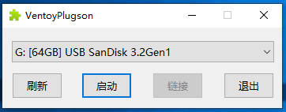

- 默认点击 启动 按钮之后会自动打开浏览器，如果没有打开，则可以点击 链接 按钮打开，或者手动访问 [http://127.0.0.1:24681](http://127.0.0.1:24681/)。

## WINDOWS 11 安卓子系统安装操作文档

Windows 11 正式版、Beta 版、Dev 版均已支持安装安卓子系统。

以下是在虚拟机（VMware 16.1.2 build-17966106）中演示安装流程，其中Windows 11为正式版。

1. 新建虚拟机，为避免中途遭遇Windows11对内存及硬盘的限制，设置为8G内存，及80G硬盘。
2. 加载并安装Windows 11专业版，等待系统安装完成。（在安装未完成之前可以先跳到下一步下载Android子系统）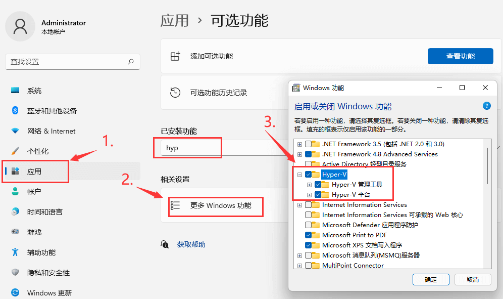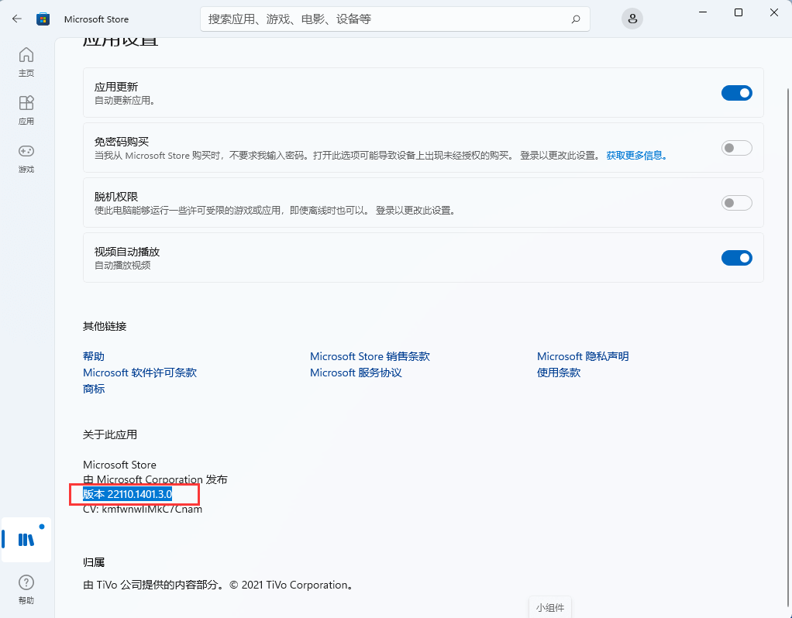

   1. 安装Hyper-V功能。

   1. 注1：家庭版默认没有Hyper-V功能，需要额外脚本开启：
   
      1. 打开记事本，粘贴以下代码，并另存为Hyper-V.cmd
      2. `pushd "%~dp0"dir /b %SystemRoot%\servicing\Packages\*Hyper-V*.mum >hyper-v.txtfor /f %%i in ('findstr /i . hyper-v.txt 2^>nul') do dism /online /norestart /add-package:"%SystemRoot%\servicing\Packages\%%i"del hyper-v.txtDism /online /enable-feature /featurename:Microsoft-Hyper-V-All /LimitAccess /ALL`
      3. 右键点击Hyper-V.cmd，以管理员身份运行，即开始安装Hyper-V。
      4. 批量命令处理完成后需要输入“Y”会自动重启，即完成安装。
      5. 
      6. 
   2. 注2：测试过家庭版，最终虽然能够正常安装安卓子系统，但是无法启动，原因不详。
   3. 更新 Windows商店。（当前商店最新版本号是22110.1401.3.0）

   1. 更新 应用安装程序
   2. 
3. 下载Android子系统，保存于"C:\Users\Administrator\Downloads\MicrosoftCorporationII.WindowsSubsystemForAndroid_1.7.32815.0_neutral\_\_\_8wekyb3d8bbwe.Msixbundle"。

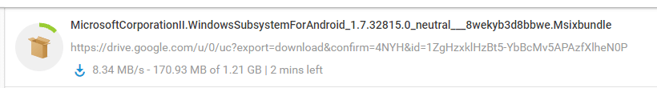

1. 使用PowerShell安装Android子系统。

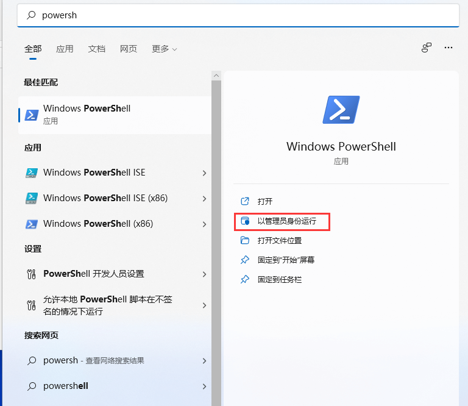

1. 命令行：`add-appxpackage -path "C:\Users\Administrator\Downloads\MicrosoftCorporationII.WindowsSubsystemForAndroid_1.7.32815.0_neutral___8wekyb3d8bbwe.Msixbundle"`

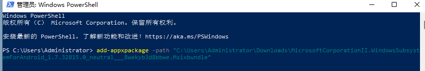

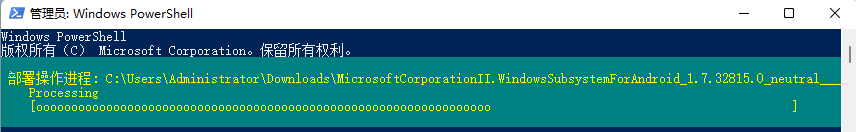

## 本地账户使用预览体验计划版本升级方法

**方法来自网络，针对22000.1测试有效（2021-06-29），其他版本理论同样。PS：升级后可能有更多的BUG。**

1. 安装22000.1版本镜像

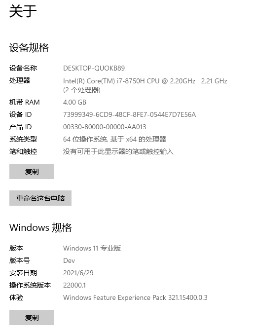

1. 下载 [DEVOFFLINE.zip](https://next.itellyou.cn/files/DEVOFFLINE.zip) 并解压。

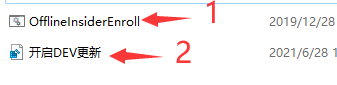

1. 使用管理员权限执行 OfflineInsiderEnroll.cmd，Choice：F，reboot your PC：N。

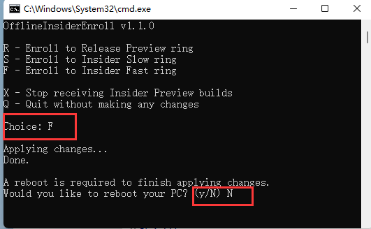

1. 右键打开 开启DEV更新.reg，选择合并。

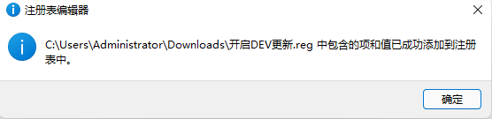

1. 重启计算机，打开Windows更新。（有时候安装会出现错误，重试几次）

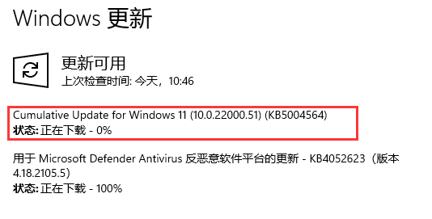

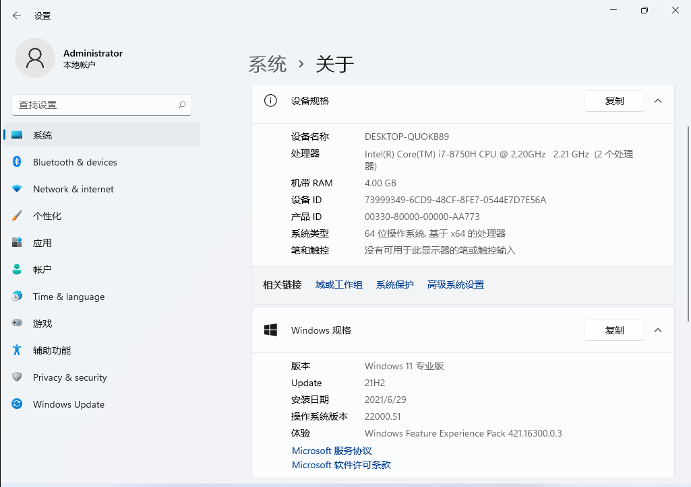

## 技巧小贴士

1. 当使用迅雷下载完成后出现SHA1与所选择版本不一致时，可以使用eMule或者BT客户端工具进行修复。#TODO 修复方法X
2. ISO制作U盘启动盘，推荐使用UltraISO、Rufus、Ventoy，保障纯净安装。#TODO 制作方法X
3. 在没有 TPM 和 SecureBoot 的设备上安装Windows 11：将下面的代码保存为.reg注册表文件，保存到U盘。进入Windows安装流程，遇到“此PC无法运行Windows 11”或类似提示时，返回到版本选择界面，插入包含注册表文件的U盘，按 Shift+F10 ，在命令提示行输入“Notepad”启动记事本，点击“文件”-“打开”，定位到注册表文件位置（如果无法显示文件，在文件名处输入“*.*”，回车），右键点击注册表文件，选择合并并确认，关闭记事本，退出命令行，继续选择版本并开始安装。正常情况下不会再出现提示，并显示许可证界面。
4. Windows Registry Editor Version 5.00
5. [HKEY_LOCAL_MACHINE\SYSTEM\Setup\LabConfig]  
"BypassTPMCheck"=dword:00000001  
"BypassSecureBootCheck"=dword:00000001
6. X

## 简要释义

- ED2K（电驴）
- 常用客户端：eMule一个开放源代码的Windows客户端，支持Unix的eMule客户端有\*xMule，Imule（停止开发）和aMule（支持Win32和Mac）。VeryCD EasyMule基于eMule的 Mod 版 客户端，同时也取掉了emule原有的很多很重要的功能。eMule Plus另一流行的Windows开源客户端。它的特色是比原版eMule占用更少的CPU资源。Shareaza一个开源多网络客户端（Windows），集合了eDonkey和BT等几种流行P2P网络类型。MLdonkey自由软件。可运行于许多平台并能够很好的支持许多文件共享协议。Hydranode开源。多网络。核心/界面 分离。MediaVAMP基于eMule的韩国专用客户端。Lphant运行于Microsoft .NET 平台。迅雷有些链接能用，有些链接不能用，有些人能用，有些人不能用。缺乏校验功能，有机率导致下载不正确。X
- BT（MAGNET）
- 常用客户端：BitComet基于BitTorrent协议的p2p免费软件。uTorrent用C++编写，支持Windows、Mac OS X和GNU/Linux 平台。BitTorrentPlusBitTorrent Shadow's Experimental的加强版。BitTorrent最早期最原始的BT客户端工具，一个多点下载且源码公开的P2P软件。Shareaza一个开源多网络客户端（Windows），集合了eDonkey和BT等几种流行P2P网络类型。百度云离线百度云网盘的重要功能之一。迅雷有些链接能用，有些链接不能用，有些人能用，有些人不能用。缺乏校验功能，有机率导致下载不正确。附：[最新Tracker清单](https://ngosang.github.io/trackerslist/trackers_all.txt)  通常，经常更新Tracker服务器可以为下载加速。X
- x64（amd64） / x86
- x64=64位，x86=32位。 一般情况下，小于4G内存安装32位，大于4G内存安装64位。 判断是否可以安装64位的系统，可以使用“SecurAble”软件查看。X
- Enterprise
- 供中大型企业使用 在专业版基础上增加了DirectAccess，AppLocker等高级企业功能。X
- Professional
- 供小型企业使用 在家庭版基础上增加了域账号加入、bitlocker、企业商店等功能。X
- Home
- 供家庭用户使用，无法加入Active Directory和Azure AD。X
- VOL
- 批量授权版，通常文件名中包含“vl”标识，和零售版只是授权方式的区别。X

## 【制作启动U盘】VENTOY使用说明

内容仅摘录供参考，详情以各产品官方网站发布为准，均来源于网络收集，如有侵权可联系删除。

下载地址：[**HTTP**](https://github.com/ventoy/Ventoy/releases/download/v1.0.46/ventoy-1.0.46-windows.zip)  
**BT下载**：magnet:?xt=urn:btih:737330E4BBC5369BC6AAF78AA26AF30B8FEC1E06

1. Windows系统安装 Ventoy

下载安装包，例如 ventoy-1.0.00-windows.zip 然后解压开。  
直接执行 `Ventoy2Disk.exe` 如下图所示，选择磁盘设备，然后点击 Install 按钮即可。

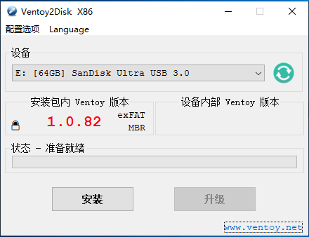

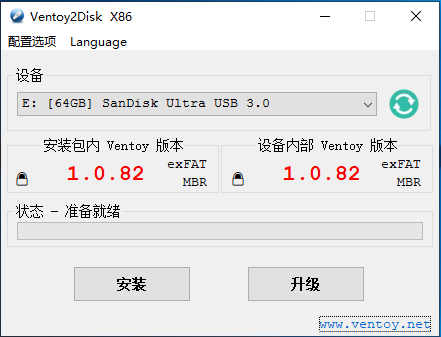

**安装包内 Ventoy 版本**：当前安装包中的Ventoy版本号  
**设备内部 Ventoy 版本**：U盘中已安装的Ventoy版本号，如果为空则表示U盘内没有安装Ventoy  
**左侧显示的 MBR/GPT**：用户当前选择的分区格式，可以在选项中修改，只对安装过程有效  
**右侧显示的 MBR/GPT**：设备当前使用的分区格式 （也就是当初安装Ventoy时选择的分区格式），如果U盘内没有安装Ventoy，则会显示空  
**安装**：把Ventoy安装到U盘，只有第一次的时候需要，其他情况就只需要Update升级即可  
**升级**：升级U盘中的Ventoy版本，升级不会影响已有的ISO文件

**注意：**

1. 如果Ventoy2Disk.exe安装或升级一直提示失败，也可以使用 VentoyLiveCD 的方式，参考 [说明](https://www.ventoy.net/cn/doc_livecd.html)
2. Ventoy可以安装在U盘上，也可以安装在本地硬盘上。为防止误操作，Ventoy2Disk.exe默认只列出U盘，你可以勾选 `配置选项-->显示所有设备` 这个选项。  
此时会列出包括系统盘在内的所有磁盘，但此时你自己务必要小心操作，不要选错盘。
3. MBR/GPT 分区格式选项只在安装时会用，升级的时候是不管的，也就是说升级是不会改变现有分区格式的，必须重新安装才可以。
4. 安装完之后，U盘存放镜像文件的第1个分区会被格式化为 exfat 系统，你也可以手动把它重新格式化为 FAT32/NTFS/UDF/XFS/Ext2/3/4 系统。  
对于普通U盘建议使用exFAT文件系统，对于大容量的移动硬盘、本地硬盘、SSD等建议使用NTFS文件系统。

   1. Linux系统安装 Ventoy —— 图形化模式

请参考 [Linux 图形化界面](https://www.ventoy.net/cn/doc_linux_webui.html)

1. Linux系统安装 Ventoy —— 命令行模式

下载安装包，例如 ventoy-1.0.00-linux.tar.gz, 然后解压开.  
在终端以root权限执行 `sudo sh Ventoy2Disk.sh -i /dev/XXX ` 其中 /dev/XXX 是U盘对应的设备名，比如 /dev/sdb

Ventoy2Disk.sh 命令 [选项] /dev/XXX

命令含义:

-i 安装ventoy到磁盘中 (如果对应磁盘已经安装了ventoy则会返回失败)

-I 强制安装ventoy到磁盘中，(不管原来有没有安装过)

-u 升级磁盘中的ventoy版本

-l 显示磁盘中的ventoy相关信息

选项含义: (可选)

-r SIZE_MB 在磁盘最后保留部分空间，单位 MB (只在安装时有效)

-s 启用安全启动支持 (默认是关闭的)

-g 使用GPT分区格式，默认是MBR格式 (只在安装时有效)

-L 第1个exfat分区（镜像分区）的卷标 (默认是 ventoy)

针对Linux系统有几点需要特殊说明一下：

1. 执行脚本时需要有root权限, 对一些系统比如ubuntu/deepin 执行的时候需要在前面加 sudo 比如 `sudo sh Ventoy2Disk.sh -i /dev/sdb`
2. 必须cd到ventoy解压之后的目录下执行此脚本
3. 请务必输入正确的设备名称，ventoy不会检查你输入的设备是U盘还是本地硬盘，如果输错了有可能会把你的系统盘格式化掉哦！

**请注意：选择安装的时候，磁盘将会被格式化，里面所有的数据都会丢失！**  
你只需要安装一次Ventoy即可，剩下的就只需要把各种ISO/WIM/VHD(x)/EFI文件拷贝到U盘中就可以了.  
你也可以把它当成普通U盘使用，保存普通文件、图片或视频等，不会影响Ventoy的功能。

1. 拷贝镜像文件

安装完成之后，U盘会被分成两个分区（参考 [说明](https://www.ventoy.net/cn/doc_disk_layout.html)）。  
其中第1个分区（就是容量大的那个分区，也可以称之为 镜像分区）将会被格式化为exFAT文件系统（你也可以再手动重新格式化成其他支持的文件系统，比如 NTFS/FAT32/UDF/XFS/Ext2/3/4 等，参考 [说明](https://www.ventoy.net/cn/doc_disk_layout.html)），你只需要把ISO/WIM等文件拷贝到这里面即可。你可以把文件放在任意目录以及子目录下。Ventoy默认会遍历所有的目录和子目录，找出所有的镜像文件，并按照字母排序之后显示在菜单中。  
你可以通过插件配置让Ventoy只搜索某一个固定的目录，或是跳过某些特殊目录等。详细的控制 Ventoy 搜索路径的方法请参考 [控制 Ventoy 搜索路径方法总结](https://www.ventoy.net/cn/doc_search_path.html)

1. 升级 Ventoy

如果Ventoy发布了新版本之后，你可以点击 `升级` 按钮进行升级，或者Linux系统中使用 -u 选项进行升级。  
**需要说明的是，升级操作是安全的，不会影响现有的镜像文件，也不会重新把镜像分区改成exFAT格式。**  
你可以认为升级只是把第二个分区（32MB的VTOYEFI分区）内的Ventoy启动文件覆盖了，不会动到镜像分区，因此镜像文件不会丢失。即使你当初安装完成之后，把镜像分区重新格式化为了NTFS，升级的时候也不会再改回exFAT。

## 硬件检测工具

内容仅摘录供参考，详情以各产品官方网站发布为准，均来源于网络收集，如有侵权可联系删除。

1、微软官方版本（2.3.210625001-s2）

下载地址：[HTTP下载](https://aka.ms/GetPCHealthCheckApp)  
BT下载：magnet:?xt=urn:btih:9EB34452EC2E2570274C49B7E8400B4EA36A8B37

校验信息：

- MD5: 10ACF8C2131CC1C40AA71FD823D4932F
- SHA-1: C72E0684AD2A988B8B703FE997EA772477893F3D
- SHA-256: 8C905BD1F1E50EAD3938BFA4D50C252E4739232A7452971FF1D4F9BE1FEA5E47

2、网友自制版本

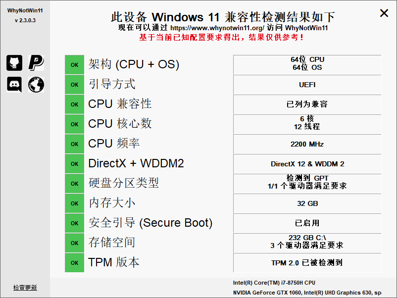

下载地址：[HTTP下载](https://github.com/rcmaehl/WhyNotWin11/releases/download/2.3.1/WhyNotWin11.exe)  
BT下载：magnet:?xt=urn:btih:86081274F7E1547576BD78EA83254DFCB94A1E35

校验信息：

- MD5: A5E46B4257861C1E08BA324FE5EFDAD3
- SHA-1: 2E23713F5B218057B0AB00DC8379441693D43DFE
- SHA-256: CDBD81F393207950C771BFDFFDADB77519F0A0AEED9D4F87BB2D27DCE0676458

## WINDOWS 11 最低硬件要求

内容仅摘录供参考，详情以各产品官方网站发布为准，均来源于网络收集，如有侵权可联系删除。

如果您的设备已经在运行 Windows 10，您可以使用电脑健康状况检查应用来查看您当前的电脑是否满足运行 Windows 11 的要求。如果满足，则可在 Windows 11 推出时进行免费升级。

\*\*升级推送计划目前仍在完善当中，计划于 2021 年底开始并持续到 2022 年。具体时间将因设备而异。升级推送一旦开始，您可以进入“设置"/“Windows 更新"中查看您的设备是否已经可以升级。

> 嵌入表格已整理为 [Windows 11 硬件要求](windows-11-requirements.md)。

随着时间推移，对于更新可能会有增加的要求，以及在操作系统内开启特定功能的要求。

## WINDOWS 11 功能特定的要求

内容仅摘录供参考，详情以各产品官方网站发布为准，均来源于网络收集，如有侵权可联系删除。

Windows 11 中的某些功能在上面列出的最低要求之外，又增加了一些要求。以下是对一些主要功能的额外要求：

- **5G 支持** 需要支持 5G 的调制解调器。
- **自动 HDR** 需要 HDR 监视器。
- **BitLocker to Go** 需要 U 盘（仅在 Windows 专业版及更高版本中可用）。
- **客户端 Hyper-V** 需要支持二级地址转换 (SLAT) 的处理器（仅在 Windows 专业版及更高版本中可用）。
- **Cortana** 需要麦克风和扬声器，目前在澳大利亚、巴西、加拿大、中国、法国、德国、印度、意大利、日本、墨西哥、西班牙、英国和美国的 Windows 11 中可用。
- **DirectStorage** 需要 1 TB 或更大的 NVMe SSD 来存储和运行使用“标准 NVM Express 控制器”驱动程序和 DirectX 12 Ultimate GPU 的游戏。
- **DirectX 12 Ultimate** 需要有支持的游戏和图形芯片。
- **状态** 需要有能够检测人与设备距离的传感器或用于与设备互动的传感器。
- **智能视频会议** 需要视频摄像头、麦克风和扬声器（音频输出）。
- **多语音助手 (MVA)** 需要麦克风和扬声器。
- **贴靠** 三列布局需要具备宽度上有 1920 或更高有效像素的屏幕。
- **从任务栏静音/取消静音** 需要视频摄像头、麦克风和扬声器（音频输出）。应用必须支持启用全局静音/取消静音的功能。
- **空间音效** 需要支持的硬件和软件。
- **Teams** 需要视频摄像头、麦克风和扬声器（音频输出）。
- **触控** 需要有支持多点触控的屏幕或显示器。
- **双因素身份验证** 需要使用 PIN、生物识别（指纹读取器或补光红外摄像头）或具有 Wi-Fi 或蓝牙功能的手机。
- **语音输入** 需要电脑具有麦克风。
- **语音唤醒** 需要具有现代待机电源模式和麦克风。
- **Wi-Fi 6E** 需要新的 WLAN IHV 硬件和驱动程序以及支持 Wi-Fi 6E 的 AP/路由器。
- **Windows Hello** 需要近红外 (IR) 成像摄像头或指纹读取器以用于生物识别身份验证。不具有生物传感器的设备可以使用 Windows Hello PIN 或 Microsoft 兼容的便携式安全密钥。
- **Windows 投影** 需要支持 Windows 显示驱动程序模型 (WDDM) 2.0 的显示屏适配器以及支持 Wi-Fi Direct 的 Wi-Fi 适配器。
- **Xbox（应用）** 需要 Xbox Live 帐户（并非在所有地区都提供）。有关可用性的最新信息，请参见 [Xbox Live 国家和地区](https://www.xbox.com/zh-CN/live/regions)。Xbox 应用中的某些功能需要具有有效的 Xbox Game Pass 订阅。[了解有关 Xbox Game Pass 的更多信息](https://www.xbox.com/zh-hk/xbox-game-pass)。

## 功能弃用及移除

内容仅摘录供参考，详情以各产品官方网站发布为准，均来源于网络收集，如有侵权可联系删除。

在从 Windows 10 升级到 Windows 11 或在安装 Windows 11 的更新时，某些功能可能会被弃用或移除。请查看下方与受影响的一些主要功能有关的信息：

- **Cortana** 将不再包含在首次启动体验中，也不再固定在任务栏中。
- 使用 Microsoft 帐户登录时**桌面壁纸**无法漫游到设备，也无法从设备漫游。
- [**Internet Explorer**](https://docs.microsoft.com/zh-CN/internet-explorer/internet-explorer) 将不再使用。[Microsoft Edge](https://www.microsoft.com/zh-cn/edge?r=1) 成为推荐的替代产品，其中含有 IE 模式，可能适用于某些情况。
- **数学输入面板**被移除。数学识别器将根据需要安装，包括数学输入控件和识别器。应用（例如 OneNote）中的数学墨迹书写不受此变更的影响。
- 任务栏中的**新闻和兴趣**被移除。小组件将提供替代功能。
- 锁屏界面上的**快速状态**及相关设置被移除
- [**S 模式**](https://docs.microsoft.com/zh-CN/windows/deployment/s-mode)现在仅对 Windows 11 家庭版可用。
- **Skype MeetNow** 由“聊天”替代。
- [**截图工具**](https://support.microsoft.com/zh-CN/windows/use-snipping-tool-to-capture-screenshots-00246869-1843-655f-f220-97299b865f6b)可继续使用，但 Windows 10 版本中的旧设计和功能由之前名为“截图和草图”应用中的设计和功能代替。
- [“开始](https://support.microsoft.com/zh-CN/windows/see-what-s-on-the-start-menu-a8ccb400-ad49-962b-d2b1-93f453785a13)”菜单 
- 在 Windows 11 中有较大改变，包括弃用和移除以下主要功能：

  - 不再支持已命名组和应用文件夹，取消了布局的调整大小功能。
  - 从 Windows 10 升级时，已固定的应用和网站将不会随之迁移。
  - 动态图块将不再可用。要快速预览动态内容，请查看新的小组件功能。
- [**平板模式**](https://docs.microsoft.com/zh-CN/windows-hardware/design/device-experiences/continuum)被移除，新功能将体现在键盘的连接和分离状态中。
- **任务栏**
-  
- 功能包括以下改变：

  - “人脉”不再存在于任务栏中。
  - 一些图标在设备升级后的系统托盘中可能不再显示，包括以前的自定义内容。
  - 任务栏位置仅允许对齐到屏幕底部。
  - 应用不再能够自定义任务栏区域。
- [时间线](https://docs.microsoft.com/zh-CN/windows/uwp/launch-resume/useractivities#user-activities-and-timeline)被移除。Microsoft Edge 中提供一些类似的功能。
- **触摸键盘**在 18 英寸或更大尺寸屏幕上将不再有固定和移动键盘布局的选项。
- **电子钱包**被移除。

以下应用在升级后不会被移除，但在新设备中或干净安装 Windows 11 时都不再安装。这些应用可从 Microsoft Store 下载：

- [**3D Viewer**](https://www.microsoft.com/zh-CN/p/3d-viewer/9nblggh42ths?rtc=1&activetab=pivot:overviewtab)
- [**OneNote for Windows 10**](https://www.microsoft.com/zh-CN/p/onenote-for-windows-10/9wzdncrfhvjl?rtc=1&activetab=pivot:overviewtab)
- [**画图 3D**](https://www.microsoft.com/zh-CN/p/paint-3d/9nblggh5fv99?rtc=1&activetab=pivot:overviewtab)
- [**Skype**](https://www.microsoft.com/zh-CN/p/skype/9wzdncrfj364?rtc=1&activetab=pivot:overviewtab)

 

## U盘启动快捷键

内容仅摘录供参考，详情以各产品官方网站发布为准，均来源于网络收集，如有侵权可联系删除。

**方法一、使用主板快捷键选择U盘启动：**

设备刚开机时，连续按快捷键会出现启动项菜单，从中选择任一介质启动，通常可供的选择有：光驱、硬盘、网络、可移动磁盘（一般是U盘或移动硬盘，带有USB字样和设备名称），如果确认之后出现异常或不能成功进入安装界面可以冷启动后变更其他选项。

注：不熟悉主板品牌的建议先用F12尝试，或者按下面表格提供的按键尝试。如果都无法使用，则考虑方法二。（有些品牌主板在刚开机时的屏幕下方也会显示启动快捷键）

 

**方法二、进入BIOS设置第一启动项：**

通常使用的菜单名称为：“Hard Disk Boot Priority” 或者 “First Boot Device”，进入选择 U盘启动（名称不固定，但通常都带有USB字样，如果有多个，优先考虑USB-HDD，多修改和尝试）。

建议：在系统安装完成后，将第一启动项改为硬盘启动（系统盘）。

 

附录：各品牌主板的快捷键按钮:

> 嵌入表格已整理为 [常见设备启动菜单按键](boot-menu-keys.md)。

## 嵌入表格导出

- [FxW1spEzShnlJ9tUBXScBdQ3n2d / Dy28v9](windows-11-requirements.md)
- [FxW1spEzShnlJ9tUBXScBdQ3n2d / VXRoR1](boot-menu-keys.md)
