## 下载

附上下载连接https://www.tbtool.cn/，不要跑到奇怪的网站去下载！

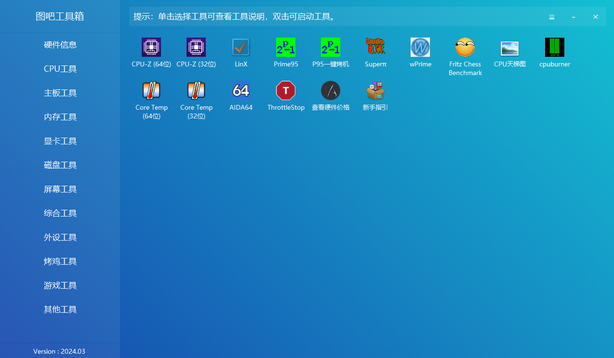

## 基础信息查看

### CPU-Z

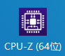

cpu-z一般用于查看cpu的一些基础性能

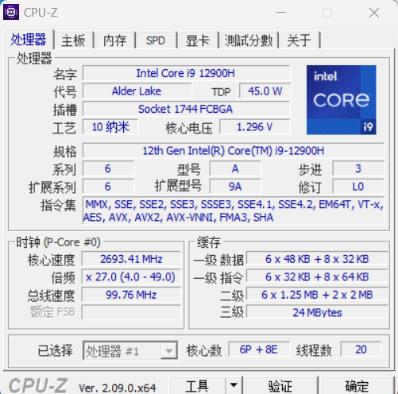

同时也可以对cpu进行跑分比较

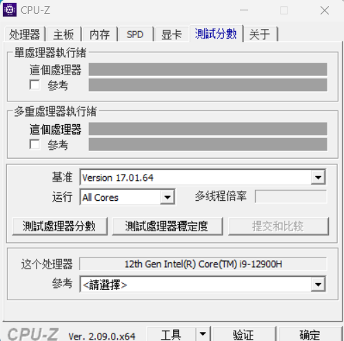

### GPU-Z

该软件可以看到GPU的一些基础信息。

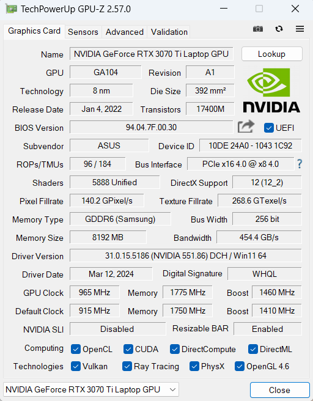

## 烤机工具

### Aida64

Aida64是我们常用的烤机测温软件，功能十分强大。

#### 查看核心温度

在计算机-传感器项目中可以看到电脑的温度信息如下

#### 查看温度墙

在主板-CPUID下的过热保护温度栏目可以看到设定的温度墙。

#### 查看电池状况

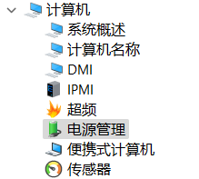

在计算机-电源管理下可以看到基础的电池信息

#### 稳定性测试（烤机）

在软件上方工具栏中点击下方按钮

可以进入稳定性测试界面：

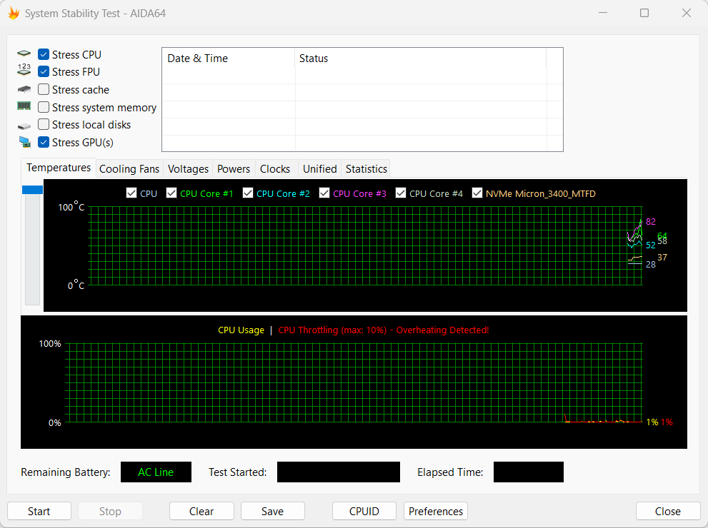

我们一般只需要对CPU、FPU、GPU三项进行测试，选择好后点击start即可开始烤机。

### CpuBurner

一键跑满cpu，常用于复现cpu降频的问题。

### FurMark

用于单烤显卡，用于检验温度是否过高，

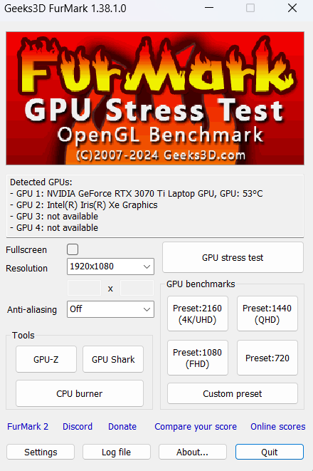

我们烤机的时候只需调整Resolutino项的分辨率即可，然后即可烤机。

但需要注意的是一般furmark会跑不满GPU。

## 磁盘工具

### DiskInfo

该软件可以看到硬盘的基础信息

### CrystalDiskMark

该软件可以一键对硬盘进行测速

测试项目按顺序分别为：

1.顺序读写，位深1024K，1线程8队列的测试速度

2.顺序读写，位深1024K，1线程1队列测试速度

3.随机读写，位深1024\*4K，1线程32队列的测试速度

4.随机读写，位深1024\*4K，一线程一队列的测试速度

一般只需要看第一项的测试速度即可，硬盘商家给的一般也是第一项的数据。

### HDTune

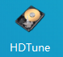

HDTune用来测试机械硬盘的速度。

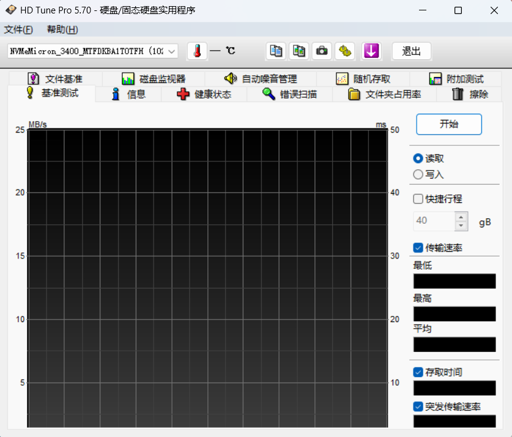

点击开始即可使用。

## 外设测试

### 键盘按键测试

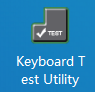

我们在外设工具中找到Keyboard Test Utillity，打开后将每个键都按一边即可知道键盘是否正常工作

### 屏幕测试

在屏幕工具中的在线屏幕测试栏目。点开后可以在网站上自行测试。

而UFO测试则可以测试屏幕的刷新率。

## 其他工具

### Geek Uninstaller

打开即可使用，用于删除软件，可以强制清理某些流氓小强软件。

> 同步块引用已在公开版中移除。
