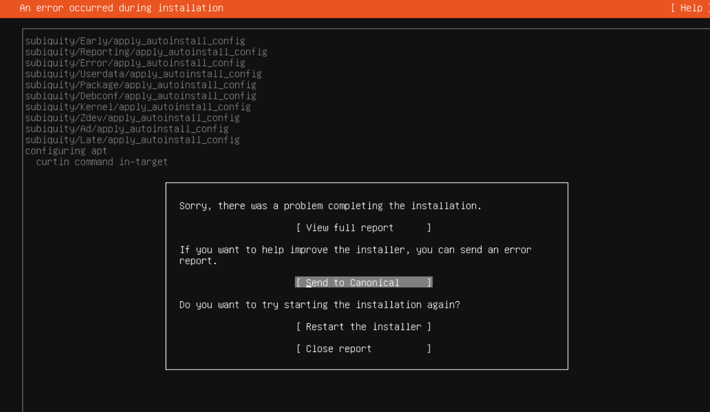

---
tags:
  - 软件
---

# Apt镜像服务器构建

# 概述

如果你同时有多台ubuntu服务器，而且你们学校又没有镜像站，同时觉得本地的镜像服务站网速比较慢，或者你是一个极端追求速度的玩家，那么需要使用一个本地的自建镜像站来提高`apt包`的下载速度

你可以参考这篇文章，尝试构建属于自己的镜像站（主要是Debian系的Ubuntu），内网的网速直冲千兆

还有例如锁定包版本、包投毒之类的玩法可以探索

# Tuna 

Tuna开源了他们的镜像服务器管理方案，使用一主多从（类似Nginx的思想）的方式构建镜像源服务器，你可以在 [这里](https://github.com/tuna/tunasync) 找到源码

但我们没有能力通过这个方案建立镜像服务器

如果你愿意续写这段教程，欢迎联系我们!

# debmirror

`debmirror` 可以很好的对镜像站进行同步，你可以选择性的同步部分源，这里展示如何构建一个本地的`Ubuntu 20 22` APT镜像站

## 同步之前

你需要知道`ubuntu` 镜像的组成，Ubuntu都有一个发布别名

| Codename | Version | Release Date | End of Life |
|-|-|-|-|
| trusty | 14 LTS | April 2014 | April 2019 |
| Xenial | 16 LTS | April 2016 | April 2021 |
| bionic | 18 LTS | April 2018 | April 2023 |
| focal | 20 LTS | April 2020 | April 2025 |
| jammy | 22 LTS | April 2022 | April 2027 |

- **trusty** Ubuntu 14 LTS
- **Xenial** Ubuntu 16 LTS
- **Bionic** Ubuntu 18 LTS
- **Focal** Ubuntu 20 LTS
- **Jammy** Ubuntu 22 LTS

以及仓库有不同的软件库

| 仓库 | 描述 | 支持 | 稳定性 |
|-|-|-|-|
| main | 免费开源软件 | 是 | 稳定 |
| restricted | 免费开源软件（受限） | 否 | 较低 |
| universe | 免费开源软件（社区维护） | 否 | 较低 |
| multiverse | 非自由软件 | 否 | 变化 |

另一个需要注意的是你的磁盘容量是否足以装下整个镜像源，同步到一半磁盘爆了可就坏事了

关于镜像容量，你可以在 [Tuna Server Status](https://mirrors.tuna.tsinghua.edu.cn/status/#server-status) 里通过`Ctrl+F` 搜索`Ubuntu` 来查看整个镜像库的大小

这里我们认为如果你想保存`ubuntu` 整个镜像库，至少得准备`3TB` 的磁盘，我们建议使用`4TB` 的磁盘，多余的容量是为了未来的软件包准备的。

另外，你可能还需要考虑**高可用**之类的问题，例如是否有必要组一个`RAID` 阵列来确保镜像仓库的可用性

## 开始同步

这里，我们以 `ubuntu 20 22 LTS` 的`main restricted` 两个软件库大约`550GB` 大小的镜像仓库作为演示。

> 20240421 Update ：尝试多同步了一个universe源，现在整个镜像站占用空间为`760GB`，我们现在建议你顺便同步这个源来增加兼容性

参考文章 [Ubuntu Offical Help](https://help.ubuntu.com/community/Debmirror)  主要参考文章 [louwrentius Blog](https://louwrentius.com/how-to-setup-a-local-or-private-ubuntu-mirror.html)

> 参考文章 [DebianGuide - LocalMirror](https://www.debian.org/mirror/ftpmirror)

操作方法有部分修改，最好理解参考文章和本文的内容再操作

**操作可能涉及磁盘，请注意数据安全**

### 预安装

首先安装`debmirror`

```Bash
apt install debmirror gnupg xz-utils -y
```

文件夹结构如下：

```Plain Text
/mirror/
├── debmirror
│   ├── dists
│   ├── pool
│   └── project
├── mirrorkeyring
└── script
```

> 修订：20240529
> 
> 在后续的实践中，我们发现：Ubuntu不会直接通报自己的系统架构，但是会通过文件如 dists/jammy/main/amd64 的路径来找到自己的架构的包，因此不再需要上一层的 amd64做区分

其中，`/mirror`、  `mirrorkeyring` 、`script` 、`debmirror` 三个文件夹的名字并不重要，也不一定在根目录下创建，你可以在配置文件中修改。但我们建议你保持默认。

使用你认为合适的账户（这里使用`root`）准备文件夹

```Bash
mkdir /mirror
mkdir /mirror/script
mkdir /mirror/debmirror
mkdir /mirror/mirrorkeyring
mkdir /mirror/debmirror/dists
mkdir /mirror/debmirror/pool
mkdir /mirror/debmirror/project
```

### GPG Key

生成GPG Key令牌环，进入文件夹

```Bash
cd /mirror/mirrorkeyring
```

执行指令

```Bash
gpg --no-default-keyring --keyring /mirror/mirrorkeyring/trustedkeys.gpg --import /usr/share/keyrings/ubuntu-archive-keyring.gpg
```

设置令牌环权限

```Bash
chown -R root:root /mirror/mirrorkeyring
chmod -R 571 /mirror/mirrorkeyring
```

### 同步脚本

下载镜像构建脚本，你可以在参考文档中额外找到另外两个版本的脚本，但他们或多或少有些问题，你需要自定义修改，或者使用我的版本。

我使用的脚本 `build.sh`

```Bash
#!/bin/bash
export GNUPGHOME=/mirror/mirrorkeyring
arch=amd64
# optional section: main restricted universe multiverse
section=main,restricted,universe,multiverse
release=focal,focal-updates,focal-backports,jammy,jammy-updates,jammy-backports
server=mirror.nju.edu.cn
inPath=/ubuntu
proto=rsync
mirrordir=/mirror/debmirror/
debmirror $mirrordir -a $arch -p -h $server -r $inPath -d $release -s $section --method $proto --nosource --disable-ssl-verification
```

> 修订:20240529
> 
> 在实践中我们发现ubuntu系统在安装时指定镜像站点可能会请求到 multiverse的包，如果你没有同步这个分支就会引发安装报错最终无法安装。
> 
> 截止更新前，`jammy focal` 两个版本的`amd64` 一共不到`800GB` 
> 
> 解决方案：
> 
> - 全部同步（已经修改了上方的示例文件，默认为全部同步）
> - 在安装时使用全部同步的源如清华源，之后手动修改apt source为你的源，遵从下方的指引，确保mutiverse有一个正确的源可用
> - 缺乏multiuniverse的包题会导致Ubuntu无法在安装时直接指定为你的镜像站
> 
> 

- `arch` ：同步的版本，这里使用x86
- `section` ： 同步的仓库
- `release` ：版本仓库，建议保持默认

  - 这里删去了`security` 
  - 控制你希望同步的ubuntu版本，这里为 `focal (20) 和 jammy(22)`
- `server` ：你希望同步的目标镜像源

  - 推荐使用就近的镜像源
  - 一些源会限速，遇到限速后建议重新拉取或者更换源
- `inPath` ：路由地址，务必保持默认
- `proto` ：同步协议，可选`http | https | rsync` ，建议保持默认
- `mirrordir` ：存放地址，根据你的需要修改
- `GNUPGHOME` ：GPG Key的存放地址，根据你的需要修改

### 自动同步

#### corntab

你可以设置自动同步指令

```Bash
crontab -e
```

然后编写，每天早上七点自动拉取同步

```JavaScript
0 7 * * * /mirror/scripts/build.sh
```

#### systemd service

我们也可以制作成一个系统服务，方便我们查看日志和管理

这是系统服务

```Bash
echo << EOF > /etc/systemd/system/aptmirror.service
[Unit]
Description="Rsyncing Apt Mirror"
After=network.target

[Service]
Type=simple
User=root
ExecStart=/mirror/script/build.sh
Restart=no

[Install]
WantedBy=multi-user.target
EOF
```

由于脚本没有实现自动触发，因此需要额外增加一个定时服务来管理这个同步服务，确保每天早上都会自动重启

```Bash
echo << EOF > /etc/systemd/system/aptmirror.timer
[Unit]
Description="Managing aptmirror.service Timer"

[Timer]
# 系统启动后延迟启动时间
OnBootSec=5min
# 如果定时器触发后服务再次启动则不会再次触发的时间限
OnUnitActiveSec=6h
# 月-日-年 时:分:秒
OnCalendar=*-*-* 7:00:*
# 管理的服务
Unit=aptmirror.service

[Install]
WantedBy=muti-user.target
EOF
```

然后启用服务

```Bash
systemctl daemon-reload
systemctl enbale aptmirror.timer
systemctl start aptmirror.timer
```

`aptmirror.service` 自行选择是否开机启动，反正多执行几次同步也没有坏处

### 第一次同步

同步时务必保持terminal在线，否则任务会终止

我们建议你使用一些办法保证任务在后台运行，第一次同步耗时较久（12小时甚至更久，你可以根据你的网速推算所需的时间，部分镜像站会在同步一段时间后对你进行限速或封锁）

直接执行脚本

```Bash
/mirror/script/build.sh
```

将直接开始同步，你可以看到初步检查后开始滚屏

而后你的自动任务会每次进行增量同步

## Nginx部署

# Apt-cache-ng

这个东西的效果不是很好，已经弃用，本质上是缓存apt的请求，然后保留一定的天数（可以自己设置，设置为36000天相当于永久缓存）

但是他有一些问题，例如包混乱，一些包在下载后有更新或者不同服务器使用不同版本的包，会导致混乱，当新的服务器请求这个包时容易找不到合适的版本，包获取失败

我曾经尝试安装 `gcc | g++` 时提示无法找到合适的版本，结果更换apt源后嘎嘎下载

因此不建议使用这个东西

## 客户端使用

### 配置路由

首先把机器部署在内网里，这里使用`nginx`反向代理（由于debmirror本身没有监听端口的服务，因此你必须额外添加`nginx | caddy | Apache` 这些东西）

然后添加配置文件：

```Nginx
server {
    listen 80;
    listen 443;
    server_name mirror.YourDomain.top mirrors.YourDomain.top;
    # 由于我们只提供Ubuntu镜像，因此将根目录重定向到 /ubuntu
    location / {
        rewrite ^ http://$host/ubuntu redirect;
        }
    # 这个是最重要的设置，见说明
    location /ubuntu {
        root /www;
        # 自动创建目录，不加这个会报错
        autoindex on;
        }
    }

# 这个server块将默认的Ubuntu源重定向到我们的镜像站，这样你可以不手动输入镜像站地址
server {
    listen 80;
    listen 443;
    server_name archive.ubuntu.com;
    location / {
        rewrite ^ http://$host/ubuntu redirect;
        }
    location /ubuntu {
        root /www;
        autoindex on;
        }
    }
```

注意：如果你不是amd或者需要进行多个架构的镜像访问，你可能需要访问参考文章的写法

对于 `/ubuntu` 块，是让地址 `mirrors.yourDomain.com/ubuntu` 可以访问 `/www/ubuntu`，因此你的`www` 下要准备一个`ubuntu`路径

如果你使用我的配置文件，只需要创建一个软连接

```Bash
ln -s /mirror/debmirror/amd64 /www/ubuntu
```

这样就可以直接让nginx访问到我们的路径，方便管理。

当然你也可以直接按照如下设置：

```Nginx
location /ubuntu {
    root /mirror/debmirror/amd64
    autoindex on;
    }
```

这样不需要创建软连接。

### 配置客户端

客户端的使用方法是直接修改`apt`文件，先备份旧的文件

```Bash
mv /etc/apt/source.list /etc/apt/source.list.bak
```

写入新的配置：

```Bash
nano /etc/apt/source.list
```

当然，记得替换`yourDomain`为你的域名，使用IP也可以

注意：这里依然使用文本更新前的配置，如果你新增了`universe` 记得将其添加到你的源中，并删除掉源cernet的`universe`

```Plain Text
# localMirror AND save main,restricted only
deb http://mirrors.yourDomain.com/ubuntu/ jammy main restricted
deb http://mirrors.yourDomain.com/ubuntu/ jammy-updates main restricted
deb http://mirrors.yourDomain.com/ubuntu/ jammy-backports main restricted

# online mirror multiverse
deb https://mirrors.cernet.edu.cn/ubuntu/ jammy universe multiverse
deb https://mirrors.cernet.edu.cn/ubuntu/ jammy-updates universe multiverse
deb https://mirrors.cernet.edu.cn/ubuntu/ jammy-backports universe multiverse

# security mirror with offical
deb http://security.ubuntu.com/ubuntu/ jammy-security main restricted universe multiverse
```

然后执行

```Bash
apt update
```

你就可以看到你的源正在飞速更新！
