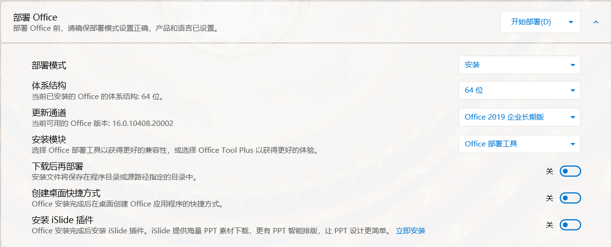
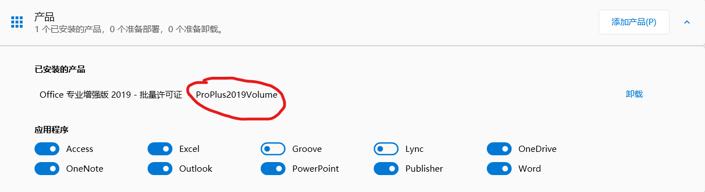
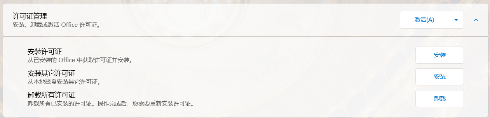
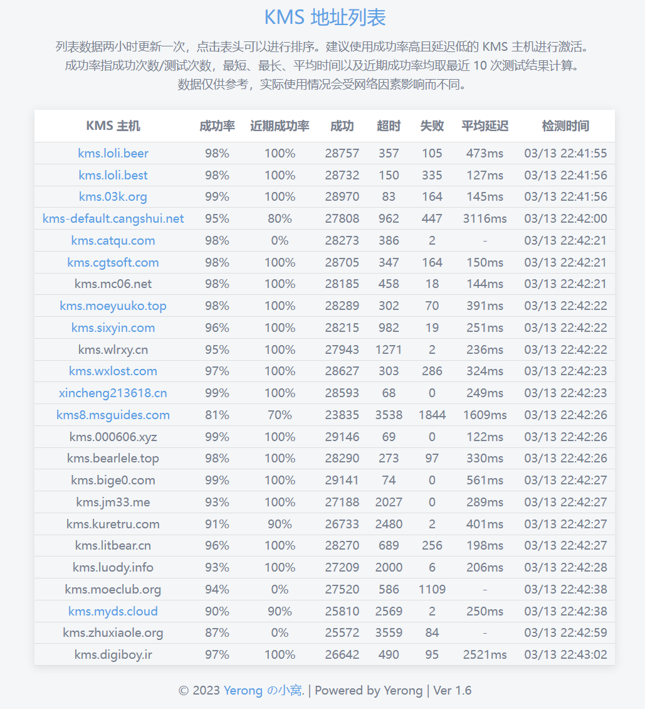
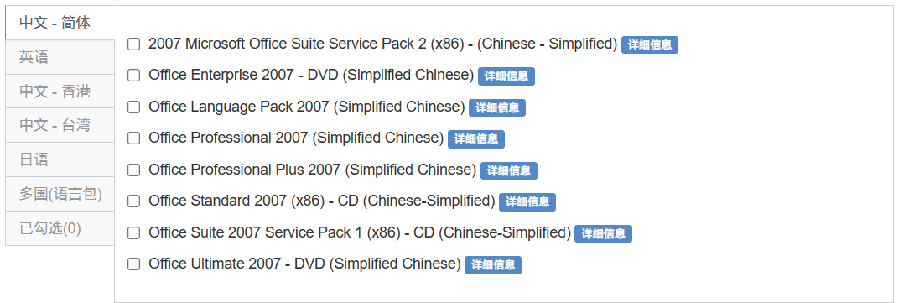

# office的安装

# 使用office tool plus安装

## 部署

首先使用[官网](https://otp.landian.vip/zh-cn/)下载office tool plus。

解压后打开exe文件，在部署界面，添加产品，推荐选择批量许可证版本。


然后选择需要的应用，根据需求去安装需要的应用，不需要每次都最大安装。


找到合适版本后再进行添加语言


随后修改部署的方式



推荐选择长期版通道。

## 激活

### 自动激活

按下快捷键 Ctrl + Shift + P，打开命令框，按需复制下面的命令，粘贴后回车以执行操作。

输入以下指令可以自动激活office

```Bash
ospp /inslicid <填版本号> /sethst:kms.loli.beer /setprt:1688 /act
```

版本号可以在产品界面的已安装处找到



### 手动kms激活

在激活页面首先打开许可证管理，并点击安装许可证，从许可证列表中找出适合当前部署版本的许可证。



随后设置kms主机，可以从[kms列表](https://www.coolhub.top/tech-articles/kms_list.html)中找到合适的kms网址输入，然后点击设置主机即可使用kms。




最后再点击许可证管理右边的激活按钮即可完成激活，然后进入word中查看激活情况，以2019为例，先新疆一个word文档后点击工具栏上的文件，随后点击账户，看到以下信息就算激活成功。


Office tool plus更详细激活方式参考[官方教程](https://www.coolhub.top/archives/14#:~:text=%E4%BD%BF%E7%94%A8%20Office%20Tool%20Plus%20%E8%87%AA%E5%8A%A8%E6%BF%80%E6%B4%BB%20Office)。

# 安装低版本office

老版本的office可以从[msdn](https://msdn.itellyou.cn/)上获取到。



点开详细信息后，找到以ed2k开头的一串连接。ed2k可以使用迅雷或者[emule](https://www.emulefans.com/news/emule/emule-official/)(需要魔法)下载

在安装完成后可以用[HEU_KMS_Activator](activation/heu-kms-activator.md)来一键激活。
