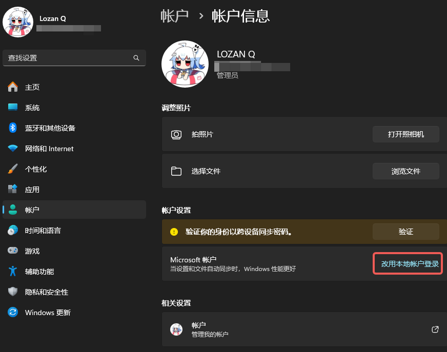
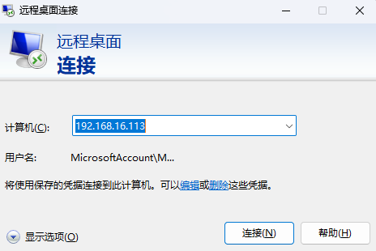
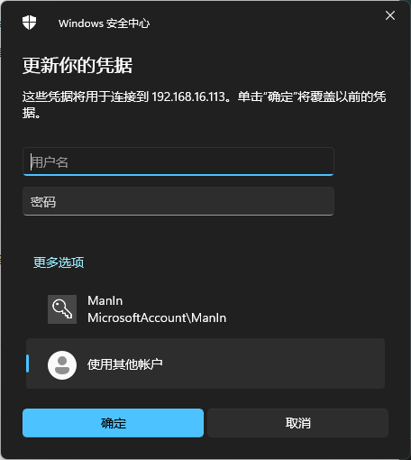

---
tags:
  - 软件
---

# 远程控制

# 概述

远程控制非常重要

这里没有什么好概述的

# Todesk

一个新兴企业，被爆出过漏洞，以前秉持免费，现在开始搞收费了，但是轻量使用也不是不行

如果你是个人使用，可以下载  [[直链]完整客户端](https://dl.todesk.com/windows/inst.exe)

如果你是分发给其他人使用，建议下载 [[直链] 被控端](https://dl.todesk.com/windows/ToDesk_Lite.exe)

使用起来没有什么难度

# 向日葵

老牌远控软件，也被爆出过漏洞，没什么好说的，堪堪可用，不少装机店都会使用向日葵作为远程协助工具。

有Linux版本。

[访问官网](https://sunlogin.oray.com/)

好消息：Todesk和向日葵可以同时远控一台电脑

# RDP

## RDP协议

微软为windows研发的远程控制协议和软件

几乎所有的近代windows都支持这个协议且内置了RDP工具

你可以使用搜索框搜索到电脑内的RDP工具

基于TCP协议，同时支持UDP加速，使用`3389`端口

依靠域名或IP地址进行连接

RDP会根据远控端的桌面大小自适应调整窗体的大小

也就是说，你不需要像Todesk或者向日葵一样用笔记本远控台式机的27吋大屏时盯着那个小小的窗体，非常方便！

一些奇怪的点：笔记本运行RDP大部分时候是相当省电的，如果你发现笔记本功耗比静息时多很多，不妨可以尝试一下用rdp替代，我挂ppt和ai网页时候笔记本要12w，使用rdp替代整机最低只有8w，续航实测提升大约在40%左右

## Windows RDP

### 调整配置

如果你的windows系统在安装后就一直使用在线的微软账号作为登录账号，你需要在连接前创建一个本地账户，否则无法连接（密码什么的都正确但就是拒绝连接）

打开`设置 —— 账户 —— Microsoft账户` 点击`改用本地账户登录` ，账户名跟你的微软账户名是一样的，然后输入一个密码，等待系统自动切换。切换完成后再回到相同的位置，执行`改用微软账户登录` 重新登录你的微软账户

2025/12/25：事实上RDP可以使用微软账户登录，控制主机时账户密码得填写被控制主机的微软账户和密码即可

### 打开软件

我们假设你有公网IP地址或者可以公网访问的域名，如果没有，可以在局域网内使用RDP登录

这里使用一个内网的IP地址如下

点击`编辑` 然后点击`使用其他账户` ，输入刚刚看到的`本地账户` 的名称和密码，默认显示的账户名是你的微软账户，这个账户是无法用于登录的。

之后点击`链接`即可

`RDP` 是独占的，因此你不能在远程时又去登录你的被控电脑

否则会将远控中断

### 写在后面

如果你没有公网IP或者需要在内网以外的地方使用，你需要借助一些网络办法，比如虚拟组网（V.P.N ，这个词的本意如此）或其他的什么方法

这里不能过多赘述

## Linux RDP

RDP协议也有在Linux上的实现

其中你可以使用`XRDP` 这个开源实现，不过，`XRDP` 不是一个足够安全的链接，确保你在安全的网络环境下使用

不过，这需要使用GUI桌面，由于我都使用Linux Server，因此这部分教程略过

# VNC

[参考文章](https://www.jianshu.com/p/f984bfdcd21e)

## RFB 协议

RFB 协议是一个通用的指令传输协议，当然也可以传输图像，但是成像效果没有那么好

但是这个协议的软件似乎都需要付费

# 硬件控制 | 旁路控制

这是一个概念设想，该方案仍然在调研中

源于日常使用Linux过程中。如果系统被玩坏了，就会失去控制，尤其是在配置网络并且没有亮机卡、远程控制时额外有用。

一个简单的实现就是在主服务器旁边加上一个费用较低的瘦终端服务器，然后额外在主服务器上配置一张控制网卡（console）直连瘦终端。

这样即使你把主服务器的出口网络设置玩爆炸了也可以通过远程连接到瘦终端最后跳板到主服务器上进行恢复

但这个有一个问题，如果你把系统玩爆炸了，需要进行恢复，旁路此时会因为网络服务根本没启动（ssh service也没启动）无法执行控制，即使你将显卡输出使用采集卡连接到瘦终端然后使用X11转发到远控端，也无济于事

因为你需要启动到BIOS界面或者Linux rescure界面进行远程救援

此时可以使用 `Teensy | Ardunio Zero/Leonado`（Teensy开发板很好的集成了`keybard emulation`功能） 等开发板的`HID` 功能模拟键盘输入，但这些板子大都昂贵（几百元）。这样在机器启动时可以被识别为键盘并通过瘦终端的远程控制将远程键盘的输入转换为虚拟键盘的输入，最终操控BIOS

在调研的过程中，部分工程师认为可以使用`ESP32` 的`HID` 功能实现

# Moonlight+Sunshine

## 地址与配置

在经过数年的发展之后，这对兄弟软件终于成为了远程控制中不可忽视的一员。

Moonlight：https://github.com/moonlight-stream

Sunshine：https://github.com/LizardByte/Sunshine

Sunshine的配置教程在b站已经有非常详细的讲解，此处忽略，请自行查看：【几乎无延迟的无线副屏？sunshine+moonlight最强串流！【保姆级教学】】 https://www.bilibili.com/video/BV13i421U7zf/?share_source=copy_web&vd_source=cd028e9fe29207f1d7c60b2a118a4365

（只需要看第三段 安装Sunshine篇目即可）

## 异地组网

正常情况下，对于普通人来说Sunshine+Moonlight和上文所述的微软Windows RDP更多只能在局域网下使用，一旦离开了同一局域网那该怎么办呢？解决方案有三：一是公网IP，二是内网穿透，三是P2P打洞。

### 公网IP

不多说，你现在能申请到的话也不用看教程了

### 内网穿透

Sakurafrp，请

### P2P打洞

这是目前我最常用的方案，接下来主要介绍Tailscale的使用。

- 原理：基于 WireGuard 的网状 VPN。设备自动打洞直连（UDP），失败时使用就近中继（DERP）。每台设备获得 100.x 虚拟内网 IP 与 MagicDNS 名称。
- 优点：无需端口映射；跨网络稳定；延迟低；安全性高；部署维护简洁。
- 使用步骤：

  1. 注册与创建 Tailnet：访问 tailscale.com，用 GitHub/Google/Microsoft 账号登录创建个人或团队 Tailnet。
  2. 安装 Tailscale：
  
     - 在“主机”和“客户端”设备上安装 Tailscale 应用并登录同一账号。
     - 成功后，管理后台可看到两台设备及其 100.x IP 与名称。
  3. 与 Sunshine + Moonlight 配合：
  
     - 在 Moonlight 中添加主机的 Tailscale 100.x 地址，按 PIN 配对即可远程串流。

注意事项：

1. 被控制的主机需要使用电信账户和有线。
2. Moonlight设置1080p60fps来测试网络连接情况，如果发现延迟超级高说明没有打通，走的是DERP中继模式，在这种情况下请更换别的方式或者购买云服务器用来中继。

中继教程：【Tailscale玩法之内网穿透、异地组网、全隧道模式、纯IP的双栈DERP搭建、Headscale协调服务器搭建，用一期搞定，看一看不亏吧？】 https://www.bilibili.com/video/BV1Wh411A73b/?share_source=copy_web&vd_source=cd028e9fe29207f1d7c60b2a118a4365

1. 跨省可能会导致延迟暴增，视情况使用中继服务器。

使用体验：

控制端：无锡 电信 无线

受控端：南京 电信 有线

设置：3072\*1920 120fps 84Mbps H.264(采用HEVC解码可能会导致解码时间暴增) 帧速调节关闭
