##### 参考资料

www.52pojie.cn/thread-1804571-1-1.html

## 概述

## 常见的虚拟机

## Windows Vmware Workstation

### 概述

系统要求
VM17：硬件要求高，Windows 10 或更高版64位
VM16：硬件要求高，Windows 10 或更高版64位
VM15：硬件要求中，Windows 7 或更高版64位
VM12：硬件要求低，Windows 7 或更高版64位
VM10：Windows XP 或更高版32位和64位旧版

**注意：**

> VM17
>
> 已经砍掉了虚拟磁盘映射功能，如果你要用这个功能的话千万别下载
>
> VM16.1.2
>
>  完美版，之后的版本，官方允许磁盘映射一次，再映射就报错了。
>
> VM14
>
> 版本开始不支持某些旧的电脑硬件，会提示不支持或安装失败, 如遇到请退回12版本。

本文使用Vmware 16.1.2演示，其他版本&注册码请前往参考资料

### 下载

使用直链进行下载（点击后将开始下载）

https://download3.vmware.com/software/WKST-1625-WIN/VMware-workstation-full-16.2.5-20904516.exe

### 安装

找到一个合适的位置进行安装，下面是许可证

注意：许可证资源收集自网络，与本机构无关

> 【VMware Workstation 16】
>
> VMware Workstation v16.x 许可证激活密钥：
>
>  ZF3R0-FHED2-M80TY-8QYGC-NPKYF
>
>  YF390-0HF8P-M81RQ-2DXQE-M2UT6
>
>  ZF71R-DMX85-08DQY-8YMNC-PPHV8
>
>  110L3-9135J-M807A-08ARK-84V7L
>
>  FF31K-AHZD1-H8ETZ-8WWEZ-WUUVA

而后你将进入欢迎页，如下（以黑色模式为例，你的大概是白色的）

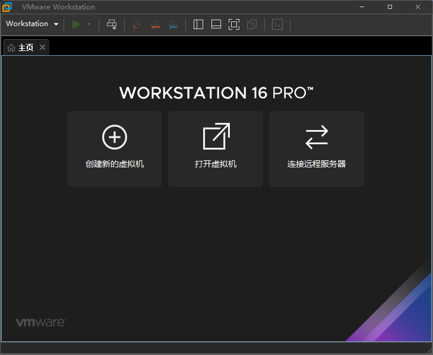

### 镜像安装

点击`创建新的虚拟机` 有两种安装模式，这里介绍简单的一种：`典型（推荐）` 进行安装

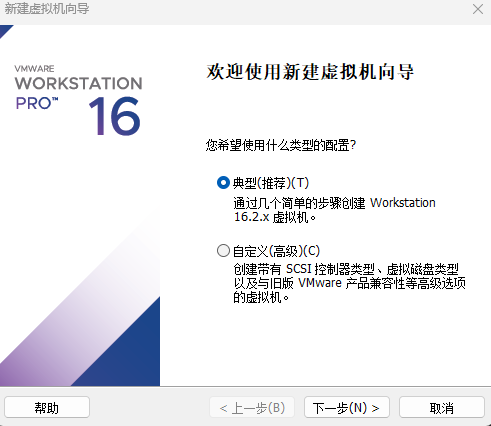

而后你可以有三个安装来源选项，使用经典模式安装时，我们大多使用 `安装程序光盘映射文件` 选项，然后选择你希望安装的系统镜像，系统镜像你需要自行下载。

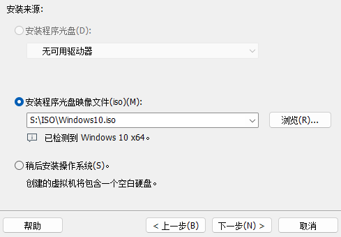

> 注意：
>
> 有时候你选择的镜像可能无法识别到系统，只要你确认镜像没有问题即可忽视他的提示，如果出现“将使用简易安装”，那么你的安装会更轻松一些

而后进行虚拟机命名，选择你认为合适的地址即可

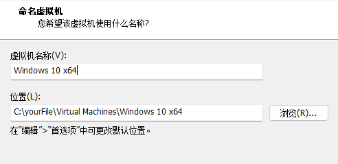

接下来，需要你指定最大磁盘大小和文件存储方式

- 最大磁盘大小：虚拟机的系统盘大小

  - 这个大小不会立即使用，你不必担心你的磁盘空间不足，但当你设置的大小大于磁盘剩余容量时，需要时刻注意在虚拟机使用过程中占用量逐渐增长的问题
  - 一般情况下，我们使用虚拟机并不需要太大的空间，因为不会长期、频繁的使用，那么推荐40GB\~120GB，或者选择默认的60GB即可
  - Linux系统需要的空间一般比Windows要小，不同的Windows/Linux版本所推荐的磁盘空间也不一样
- 文件存储

  - 他的说明写得很清楚，此处不赘述

最后在审视页面，你可以看到更多关于硬件的信息，不必纠结配置，你可以在虚拟机关闭时多次进行修改，因此这里选择默认也不错

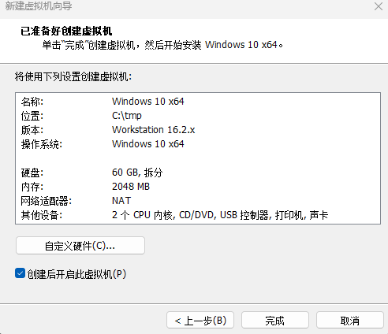

点击完成，你的虚拟机将开始运行，过程就像重装电脑一样（当然这取决于你使用的何种镜像文件）

> 注意：
>
> 你的鼠标点击屏幕时会映射进去，因此你可能会疑惑自己的鼠标找不到了，关注下方的黄色横幅，使用 `Ctrl+Alt` 来将你的鼠标脱出

这里我们已经看到了windows自己的安装程序，你只需要自行设置即可逐步安装，这里不再赘述

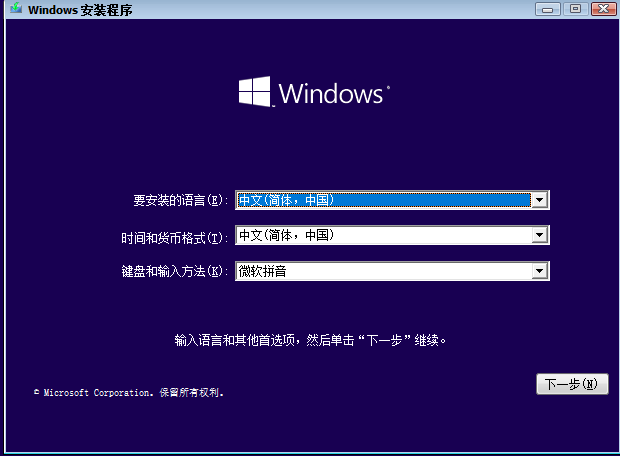

### Vmware Tools

### 自定义硬件（高级配置）

#### 进入编辑页

如果你在实际使用过程中觉得有必要升级/降级虚拟机的硬件配置，或者给他增加一块网卡/硬盘，可以将虚拟机关机后使用 `编辑虚拟机设置` 进入硬件编辑页

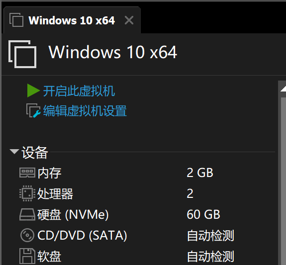

最简单的，你希望增加虚拟机的内存大小，那么可以手动输入或者点击右边的滑块来调整，他会有一些提示信息告诉你最小和最大的内存建议

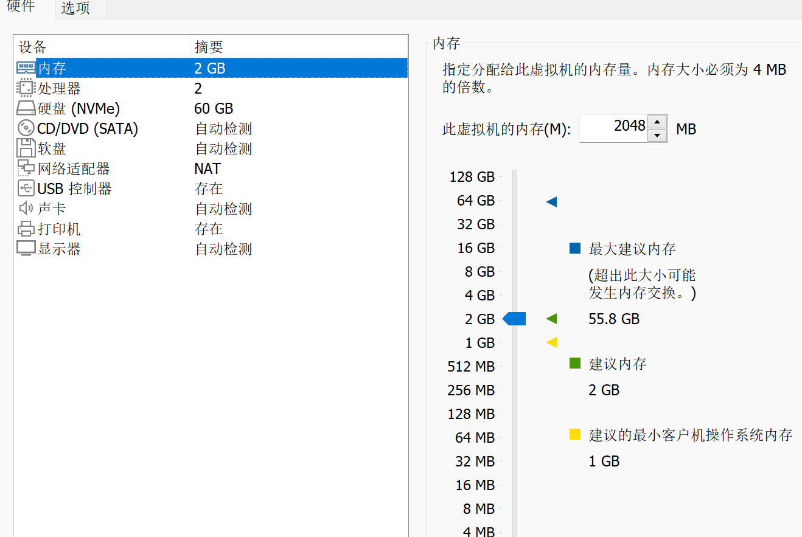

你也可以在这里进行虚拟机网卡的设置，可以切换网络模式及其一些高级选项，包括设置网络丢包率等模拟网络异常的设置，但是很少用到

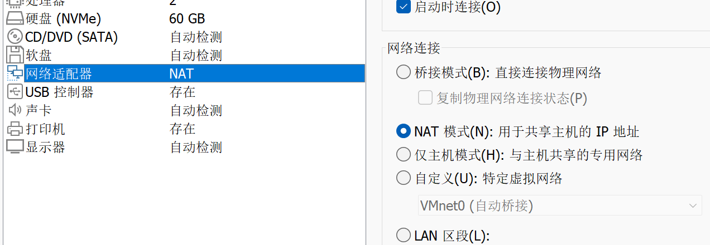

在这里，你可以设置CD/DVD驱动，包括设置镜像地址，这个设置在重装系统或者安装驱动时非常有用

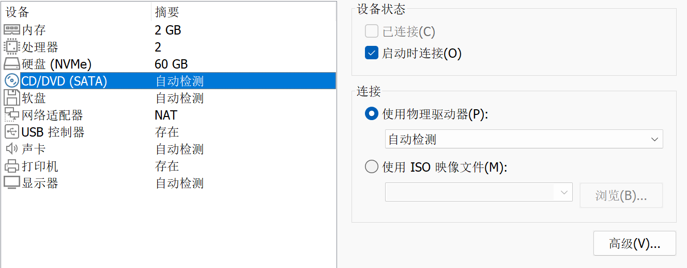

而有的时候你需要手动关闭甚至删除它来避免一些系统的报错

#### 添加设备

你可以通过下方的 `添加` 按钮来增加一个硬盘

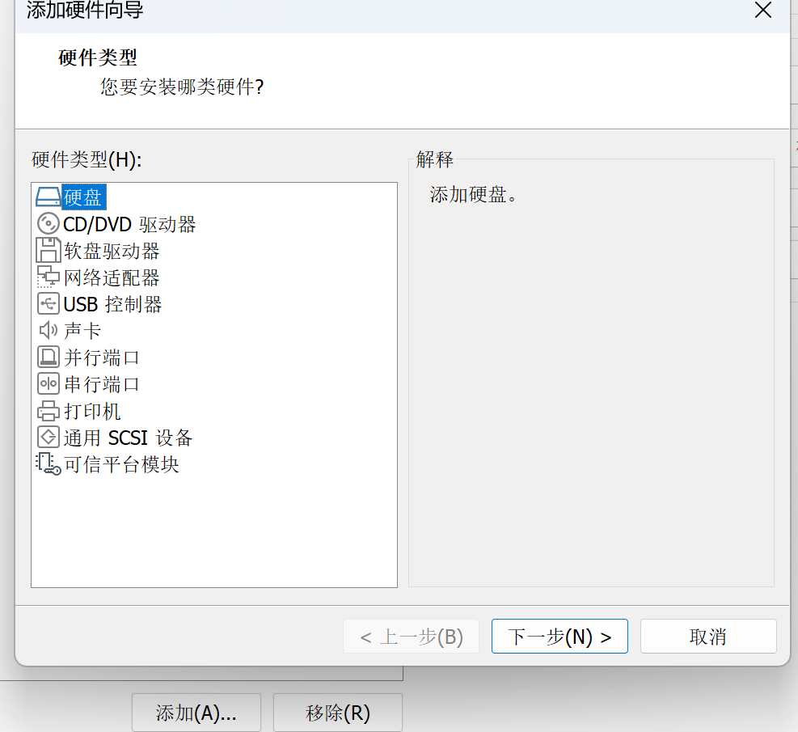

这里，我们使用`SCSI` 设备作为硬盘添加，你也可以自行关注其他的选项

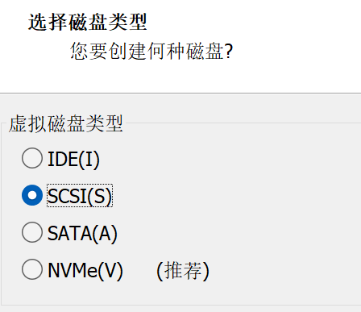

虽然他确实在推荐NVMe，但是我们接入的往往是外挂硬盘（U盘不使用硬件添加的方式）

#### 硬盘选择模式

你会看到3个硬盘增加模式

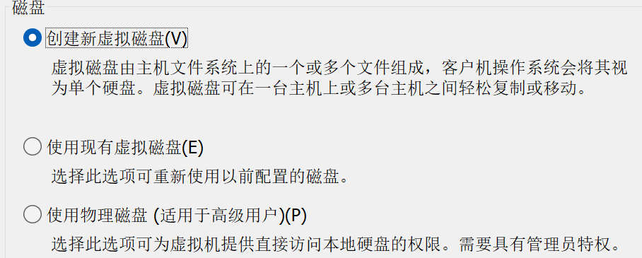

一般来说，我们使用第三个模式（这要求你的虚拟机必须以管理员身份启动），因为我们希望将我们的物理磁盘映射进去然后进行重装系统之类的操作

然后你可以看到一大堆物理磁盘和他们的序号，**如果你的硬盘是使用外挂设备接入的，选择最后一个序号**

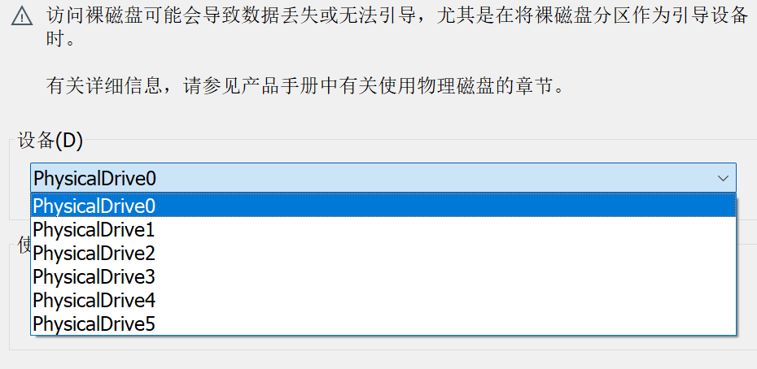

你将有机会确认磁盘容量是否符合你希望映射进去的磁盘的容量来确认，不必担心

或者，你可以使用诸如 `diskgenius` 的软件，里面展示的磁盘排列顺序就是他们的序号

### 网络配置

VMwarre内置了三种网络模式，你可以在上菜单栏的 `编辑->虚拟网络`编辑器 里找到总的控制台，这里给你介绍三种模式

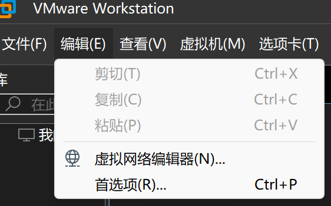

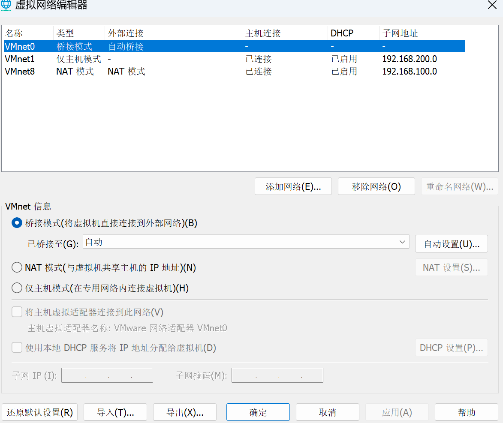

- 桥接模式

  - 将物理网络桥接到虚拟机上，相当于虚拟机自己直接入了网关，就好像一个独立的机器一样，并从网络获取IP地址，在网关上也将看到这个虚拟机（和他的MAC地址）
  - 在下方的桥接设置中你可以选择桥接到哪一块网卡（将这个网卡连接的网关作为虚拟机网关）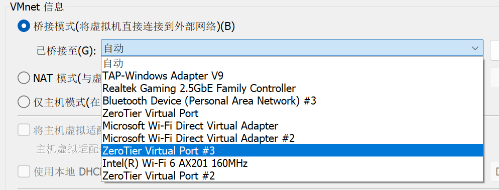

    - 例如你可以桥接到一个zerotier的虚拟网卡，那么相当于虚拟机也接入了虚拟网络

    - 默认直接桥接到本机的默认网关
- NAT模式

  - 将宿主机作为网关创建一层NAT，虚拟机从宿主机获取IP地址

    - 需要注意的是，宿主机和虚拟机都将共享宿主机从网关获取的IP地址（因为宿主机在这个Vmware Net中也会分配到自己的IP地址）
- 仅主机模式

  - 相当于用网线直接将宿主机和虚拟机链接起来，并设置了IP方便相互访问，没有网关这一说法，虚拟机此时应该无法联网（因为很少用到所以大概是这样）
- 自定义网络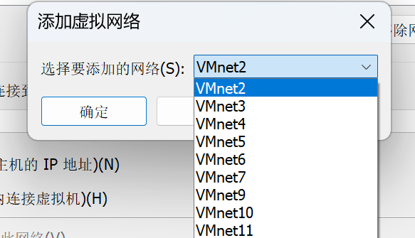

  - 很少使用的功能，你可以创建一个自己命名的网络，模式依然从上面三个基本模式中选择
  - 他可能用于你不希望多个虚拟机在同一个子网（NAT模式）下或者进行子网划分的模拟时使用

### 遇到问题？（障碍排除）

你可以联系我们协助，同时你的问题将在解决后存放在这

// 喵

## Windows VitrualBox

经常从事网络犯罪的人知道，在计算机取证比赛、CTF比赛中，我们经常能看到犯罪分子使用`VirtualBox` 虚拟化留有犯罪证据的机器，考虑到广大技术人员的`特殊` 需求，我们增设这一栏，介绍如何使用`VirtualBox` ~~谁是网络犯罪分子啊喂~~

> Not only is VirtualBox an extremely feature rich, high performance product for enterprise customers, it is also the only professional solution that is freely available as Open Source Software under the terms of the GNU General Public License (GPL) version 3.

官网如是说，所以用virtualbox不是因为他犯罪份子专用而是他GNU哇kora！

### 概述

[官方介绍](https://www.virtualbox.org/manual/ch01.html)

[用户手册](https://www.virtualbox.org/manual/)

系统要求：

win8以上，linux内核2.6以上,macOS10.15（需要intel的cpu）以上。

virtaulbox是开源软件，totally free，没有注册码，官网提供最新版以及已经停止支持的旧版下载。他有一个扩展包，支持磁盘加密PXE启动等功能，使用PUEL（允许个人或教育免费使用）授权

### 下载

https://www.virtualbox.org/wiki/Downloads（官网下载页面，请根据系统选择安装包）

### 安装

根据安装程序指引安装即可

### 新建虚拟机

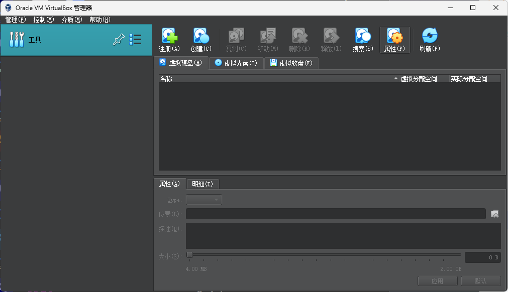

安装完成后看到如上界面

使用在控制菜单里选择新建，在向导模式下可以进行新虚拟机的创建

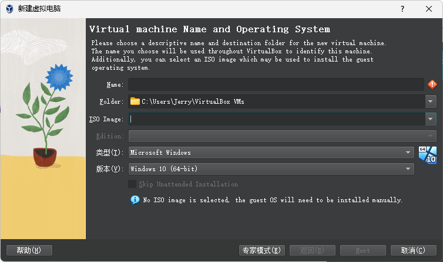

在此处设置虚拟机名称，虚拟机位置，镜像格式，以及镜像中的系统类型

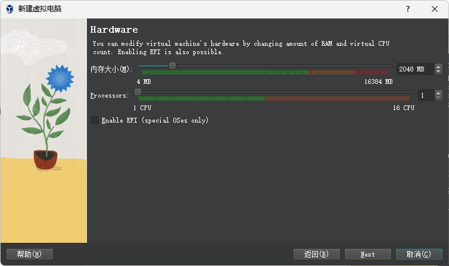

在此处分配核心数，内存，以及是否打开EFI启动方式

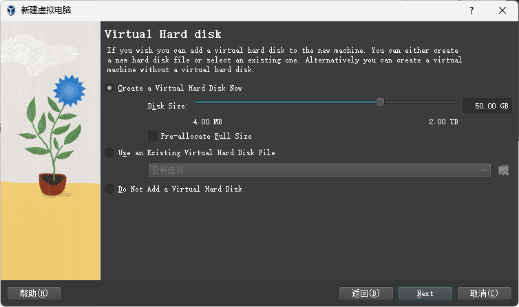

此处可以创建虚拟磁盘

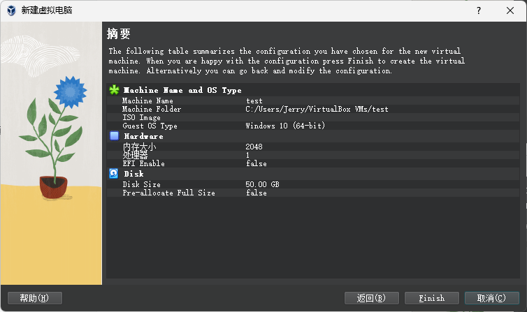

向导模式选项如上，安装方式与VMware大同小异

需要注意的是

- 你需要手动启用EFI
- 你需要自己指定系统（当然virtualbox也能识别）

### 配置

右键虚拟机点设置可以到设置界面

这里你可以修改一些硬件配置

#### 资源分配

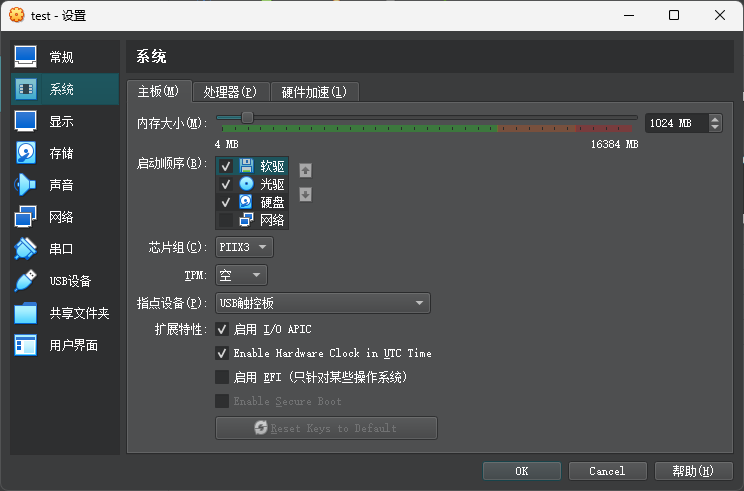

此处可以更改启动顺序，内存大小，处理器个数等系统相关参数

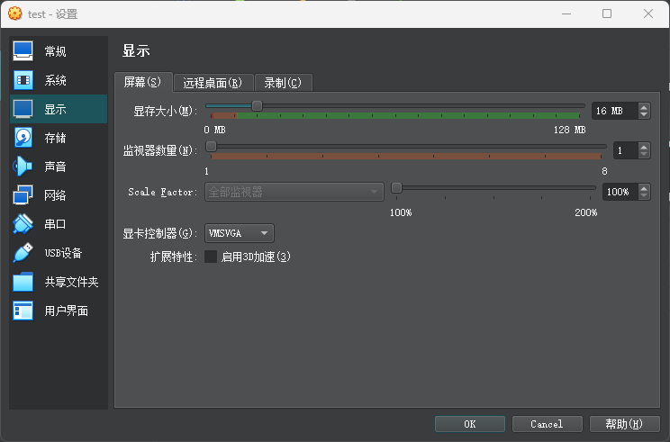

此处可以修改显示相关内容

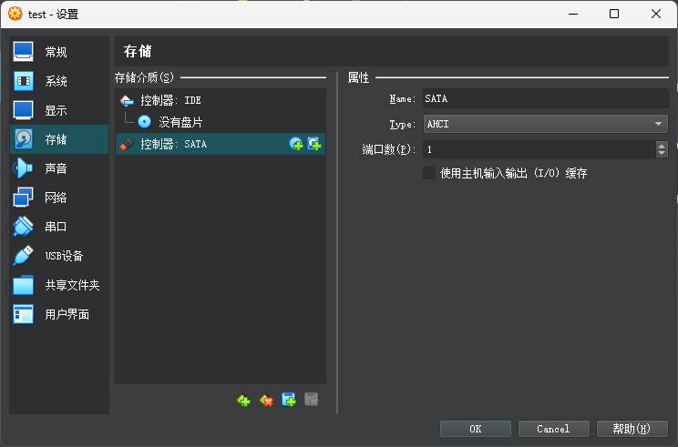

此处可以修改与存储相关的配置

- 控制器只是指定了虚拟机中识别到的存储器是通过什么协议接入的

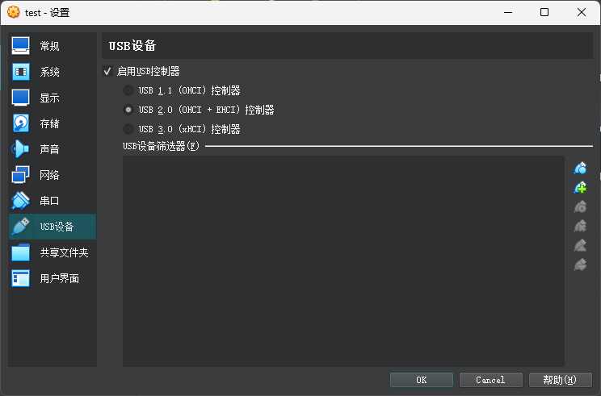

此处可以分配固定的USB接口，实现USB直通，注意，本功能属于扩展包

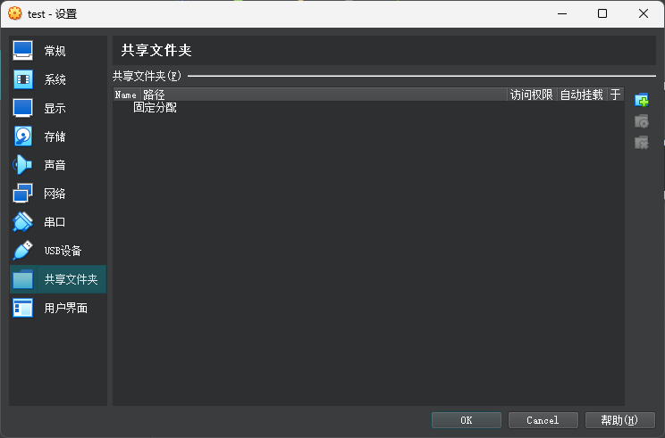

共享文件夹需要虚拟机安装有virtualbox支持

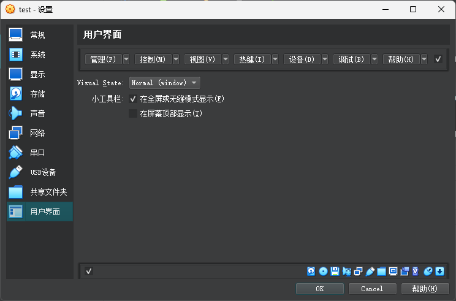

此处可以进行一些关于用户界面快捷键相关的操作

#### 网络

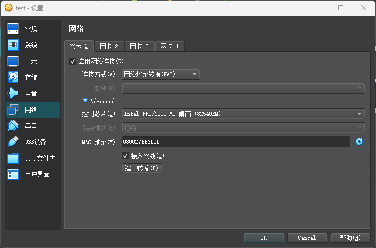

这是内部的网络配置界面

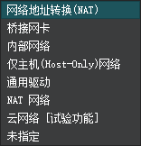

自带的网络格式包括以上几种

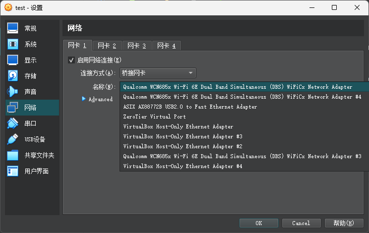

- 桥接网卡：直接使用物理网卡，使用的效果类似将和物理机器直接接入网络类似
- 地址转换（NAT）：默认的NAT网络，相当于创建了一个局域网，将宿主机作为网关使用
- NAT网络：可以定制的虚拟机局域网
- 仅主机：虚拟机只能和其他虚拟机以及宿主机通信
- 内部网络：也是NAT，但是只允许虚拟机之间通信，不能访问外部

如果需要自定义局域网或者使用云网络（好叭我不知道那个是干嘛的）功能可以到工具-网络下设置

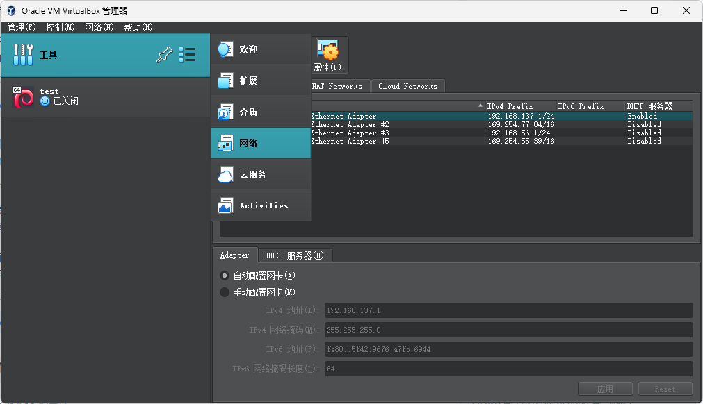

### 扩展包

扩展包可以到官网上去下，如果需要usb直通等功能的话，可以搞一个，装好之后是这个样子的。安装也很简单，你可以直接右击扩展包用virtualbox打开。

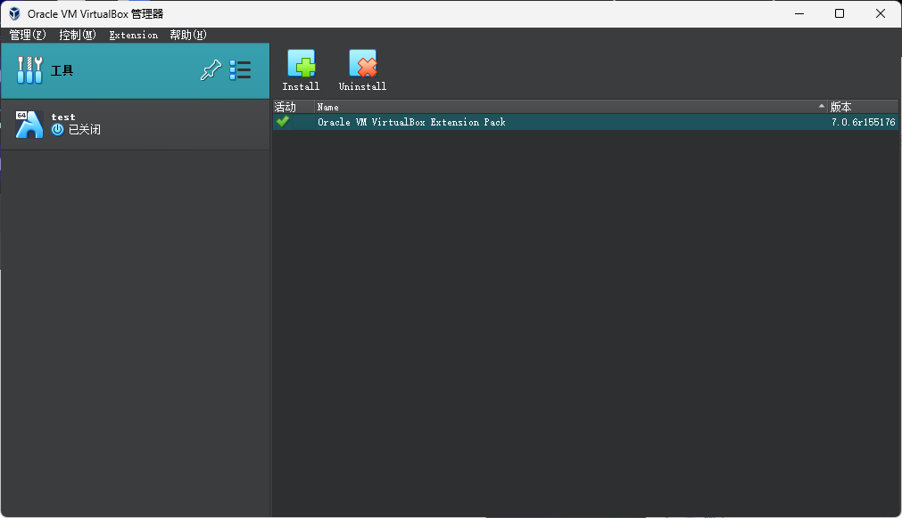

### 硬盘直通

virtualbox可以通过使用指向物理磁盘的虚拟盘来实现硬盘直通

PhysicalDrive的编号可以在win的磁盘管理器中看到

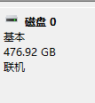

就比如上图的磁盘0

创建虚拟盘的命令如下，请根据具体路径名称和磁盘路径修改。

```PowerShell
cd "C:\Program Files\Oracle\VirtualBox"
.\VBoxManage internalcommands createrawvmdk -filename C:\VirtralMacine\disk1.vmdk -rawdisk \\.\PhysicalDrive0
```

注意，在使用该盘时需要先将其从win脱机。可以使用diskpart工具`select disk $number` 然后`offilne disk`。

使用该盘时只需要到virtualbox中注册并在虚拟机中添加即可。

### 问题排查

## Windows Linux

微软为数不多的做了一些好事，给windows引入了Linux子系统的概念，据说修改自某些开源软件，并且微软还在持续维护、改进这个功能，我觉得挺好用的。更多内容参见我们的 `WSL` 教程

## Linux Promox（PVE）

### 裸机选择

Promox可以安装在大多数的硬件上，只要不是非常老的硬件

一般来说，为了能启用多台虚拟机，我们建议：

- 多核CPU ： 越多越好，决定了你的虚拟机能分配到多少足额的虚拟CPU

  - 越多的CPU意味着核心频率下降，这也同时影响到性能，你需要取舍
  - 你可以在 https://www.cpu-monkey.com/zh-cn/ 以及 https://cpu-benchmark.org/上查询到一款CPU的更多信息以及他们的对比
- 大内存

  - 你想开多台虚拟机就必须将内存分配出去，足够大的内存是好的

除此之外，应该搭配的电源、显卡也是你需要考虑的事项，关于promox硬件，你可以参考 《捡垃圾指南X99篇》，也可以寻求我们的帮助

### 下载

Promox8.x 已经推出，我们建议你使用较新版

这里是 promox8.1的下载直链

https://enterprise.proxmox.com/iso/proxmox-ve_8.1-2.iso

你也可以使用该链接前往下载界面，名字是 `Promox VE xxxxx`

https://www.proxmox.com/en/downloads

### 安装

你可以参考基本的 Linux 安装指南，Promox提供UI界面进行安装

注意：

- 你设置的ROOT密码非常重要，这是你登录宿主机（promox）的唯一凭证
- 安装过程中要求输入的域名建议输入一个有意义的、容易记住的域名，如果你有属于自己的域名也可以，这在后期可以使用网关的DNS劫持来方便管理
- 安装过程中要求输入的IP地址非常重要，后期修改会比较麻烦，因此你要在一开始就决定promox的IP地址是什么，以及在网关将IP地址与MAC地址进行绑定

### 虚拟机安装

输入网址进入虚拟机后台，使用root密码进行登录，这是已经配置的PVE，跟你的初始页面可能有出入

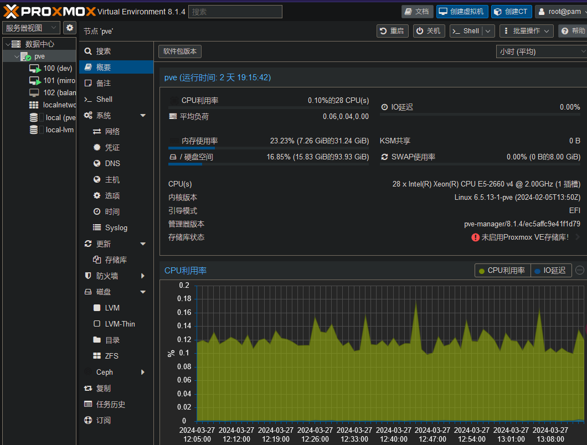

你可以通过这个看板检视系统整体的性能状态

在下方，有滚动日志，也可以检视最近的操作以及是否成功

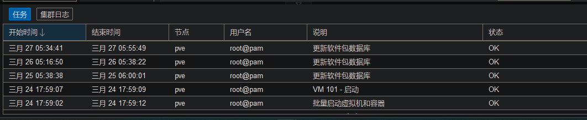

如果出现错误日志，你也许你要看看怎么个事

你首先需要点击左侧栏的 `local (pve) -> ISO镜像` 点击 `上传` 先行上传（或通过提供URL下载直链的方式）你的系统镜像

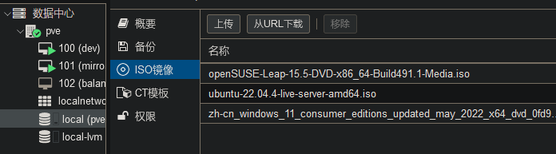

点击右上方的 `创建虚拟机` 进入虚拟机创建界面

输入你中意的虚拟机名称，其他的选项是高级选项，你不需要关注他们

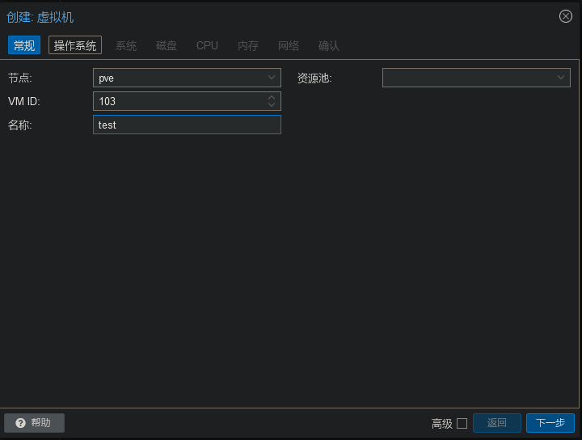

然后点击上方的 `操作系统` 进入下一个配置板块（当然点击 `下一步` 亦可）

而后你需要选择你的 `ISO镜像` ，此处你可以看到你已经上传的镜像文件

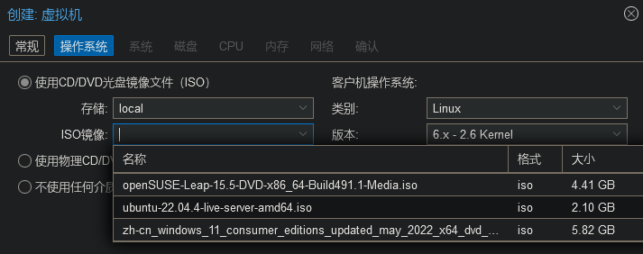

其他设置属于高级选项，如果你没有经验，保持默认即可，然后点击下一步，`系统` 界面也是高级选项，请直接进入 `磁盘界面`

在这里，你需要指定磁盘大小，Linux的磁盘大小需求一般不大，但是注意

> 你的系统磁盘必须审慎合理进行设置，后期这个大小调整会比较困难，且似乎是只能增加不能减少的！

然后点击下一步进入 `CPU` 界面

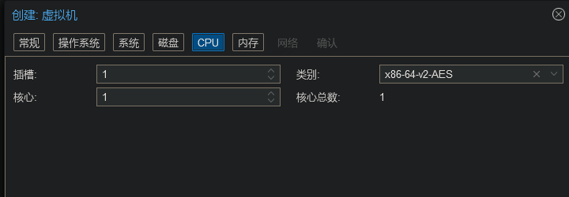

对于轻量化服务，你可以只使用 `1*1` 的配置，但性能非常堪忧，对于运行一些轻量静态网站是没问题的，如果你的CPU比较拮据，可以使用

复杂一些的业务使用 `2*2` 的配置，是很常见的低性能服务器配置

或者，使用 `4*2` 的八核配置，已经满足大部分需求

然后进入 `内存` 设置界面

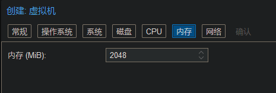

2048MB(2GB) : 常见的低性能服务器内存大小

- 4GB ： 入门级服务器内存大小
- 8GB ：常见服务器内存大小

你可以按照自己的需求进行设置

在`网络配置` 界面也是高级选项，不必关心，而后点击确认即可创建一个虚拟机，而后在左侧边栏点击 `<你的虚拟机名称> -> 控制台` 点击 `Star Now` 即可开机

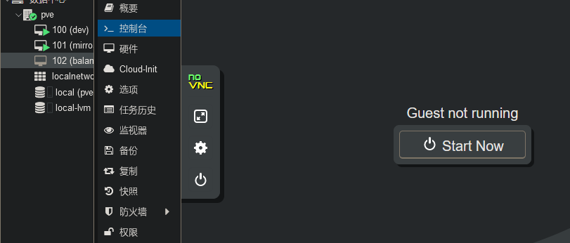

### VNC

一个奇怪的东西，你可以在这里使用你的虚拟机，即使你配置的SSH链接因为某些原因爆炸了可以向VNC求助，他就像接入了显示输出一样确保你时刻能跟你的虚拟机沟通（缺乏复制粘贴或者代码高亮功能）

### 网络设置

#### PCIe绑定MAC

这个非常重要，因为promox在PCIe设备变动时可能会导致你的网卡PCIe编号发生变化从而导致你的网络设置失效。因此你必须在你仍然能连接promox时进行设置（这会影响SSH连接和网络连接）

1. 确认当前网卡的MAC地址

   ```Shell
   ip addr show
   ```

   ```Shell
   ---
   Output
   ---
   1: lo: <LOOPBACK,UP,LOWER_UP> mtu 65536 qdisc noqueue state UNKNOWN mode DEFAULT group default qlen 1000
       link/loopback 00:00:00:00:00:00 brd 00:00:00:00:00:00
   2: enp6s0: <BROADCAST,MULTICAST,UP,LOWER_UP> mtu 1500 qdisc pfifo_fast master vmbr0 state UP mode DEFAULT group default qlen 1000
       link/ether 0a:e0:af:a1:01:b5 brd ff:ff:ff:ff:ff:ff
   3: vmbr0: <BROADCAST,MULTICAST,UP,LOWER_UP> mtu 1500 qdisc noqueue state UP mode DEFAULT group default qlen 1000
       link/ether 0a:e0:af:a1:01:b5 brd ff:ff:ff:ff:ff:ff
   ```

输出内容中 `enp***` 是你的有线网卡的PCIe编号 （此处为`enp6s` ），以`wls***` 开头是无线网卡的PCIe编号（本机没有无线网卡），请复制`link/ether` 后的十六进制串，此处为 `0a:e0:af:a1:01:b5`，即为你的网卡的MAC地址

1. 将当前编号与当前的地址绑定

   ```Shell
   ls /etc/systemd/network
   ```

如果没有任何输出，那么直接执行，如果已经有文件了，可以将文件名的数字修改/增加

```Shell
echo -e "[Match]\nMACAddress=0a:e0:af:a1:01:b5\n[Link]\nName=enp6s0" > /etc/systemd/network/10-persistent-net.link
```

务必将指令的MAC地址换成你自己的，且注意你的文件不要与已存在的文件冲突，否则会覆盖

1. 然后执行重载指令即可

   ```Shell
   /etc/init.d/udev force-reload
   ```

#### 网络获取方式修改

遵从基本的Linux网络修改，这里从简

```Shell
nano /etc/network/interfaces
```

主要修改 `vmbr0` 项目

```Plain Text
iface vmbr0 inet static
        address 192.168.1.224/24
        gateway 192.168.1.1
        bridge-ports enp6s0
        bridge-stp off
        bridge-fd 0
```

这样是Static地址，修改为下方的样式则是使用DHCP方式获取IP地址

```SQL
iface vmbr0 inet static
        address 192.168.1.224/24
        gateway 192.168.1.1
        bridge-ports enp6s0
        bridge-stp off
        bridge-fd 0
```

实际上我们更建议你根据静态地址去修改网关使用MAC与IP地址绑定的方式让promox持有这个IP地址

如果你需要修改为DHCP，请修改`static` 为`DHCP` 且注释掉第一第二行

#### 控制台地址修改

1. 修改通知显式的地址

   ```Shell
   nano /etc/issue
   ```
2. 修改Host文件指示的地址

   ```Shell
   nano /etc/hosts
   ```

#### 安装无线网卡

[参考文档](https://www.cnblogs.com/Boxiang-Zhang/p/15706482.html)

这里使用`华南金牌的X99-F8 DDR4` 主板，有一个用于网卡的PCIe插槽

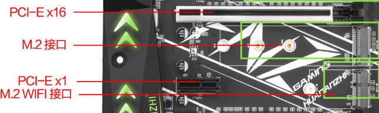

安装后，检查你的网卡是否已经插入PCIe插槽

```Bash
lspci | grep Wi
```

能找到类似的输出，说明已经安装完毕，如果没有，请检查

```Plain Text
06:00.0 Network controller: Intel Corporation Wi-Fi 6 AX210/AX211/AX411 160MHz (rev 1a)
```

然后检查网卡是否被识别

```Bash
ip link | grep wlp
```

如果有类似的输出，或者使用`ip link` 找到类似的输出，你的网卡可以使用，本教程终止

```SQL
3: wlp6s0: <BROADCAST,MULTICAST> mtu 1500 qdisc noop state DOWN mode DEFAULT group default qlen 1000
```

---

如果你发现找到PCIe设备，但是找不到网卡设备，继续↓

检查你的Linux内核版本（如果你是promox8，可以跳过）

```Bash
uname -r
```

输出序列前部分的数字大于`5.10+`即可

下载硬件驱动

[直链下载](https://wireless.wiki.kernel.org/_media/en/users/drivers/iwlwifi-ty-59.601f3a66.0.tgz) | [访问官网](https://www.intel.cn/content/www/cn/zh/support/articles/000005511/wireless.html)

解压后得到文件 `.ucode`，你可以忽略`readme license .ucode`

将一串名字很长的`ucode`文件上传到`/lib/firmware` 文件夹内

重启`rebot`机器即可

---

如果依然无法解决问题，继续↓

下载Linux固件，注意，这里以`uname -r`输出为`6.5.13-1-pve` 的系统

下载Linux固件

[直链下载](https://wireless.wiki.kernel.org/_media/en/users/drivers/iwlwifi-ty-59.601f3a66.0.tgz) 或使用指令下载

```SQL
wget -c https://wireless.wiki.kernel.org/_media/en/users/drivers/iwlwifi-ty-59.601f3a66.0.tgz
```

将压缩包内的`*.ucode`全部复制到`/lib/firmware` 文件夹下

然后执行

```Bash
rmmod btusb
modprobe btusb
```

删除临时文件

```Bash
rm -r /usr/lib/firmware/*.pnvm
```

然后重启系统`reboot` 应该能解决问题

#### 设置网卡热点

[参考文章](https://www.cnblogs.com/k4nz/p/14597185.html)

你是否因为乱改promox的网络配置或者因为更换了网络导致机器失联？

现在我们可以将这个网卡作为AP接入热点，这样就算你的有线网口设置崩坏，无法获取IP，你又没有亮机卡时，只需要链接这个热点即可恢复控制！

来看看怎么实现吧。

为了新手友好，我们使用`network manager` 来进行设置，这是Ubuntu发行版自带的包，如果你是debian或基于debian的promox，需要额外安装

```Bash
apt install network-manager
```

然后重启，使用指令查看状态

```Bash
systemctl status NetworkManager
```

假设你的WiFi网卡为`wlp6s0` 且你的`/etc/network/interfaces`内没有对WiFi网卡进行设置（如有设置请先删除）

- 查看网卡设备

  ```Bash
  nmcli device
  ```
- 如果能看到你的网卡`wlp6s0`属于unmanaged，已经在managed不需要执行指令

  ```Bash
  nmcli dev set wlp6s0 managed yes
  # 重启设置
  systemctl restart NetworkManager
  ```
- 创建接入点，使用安全协议`WPA` （弱安全性），网关为192.1687.2.1，特地选用了只有16个IP地址池的网段（192.168.2.2-192.168.2.16，广播地址为192.168.2.17，掩码为255.255.255.240）

  - 你可以在最后WiFi修改密码，在前部分修改你的WiFi名称

  ```Bash
  nmcli connection add type wifi con-name YourWIFI_Name ifname wlp6s0 autoconnect yes ssid zakoZako2 mode ap band bg ipv4.method shared ipv4.address 192.168.2.1/28 ipv4.gateway 192.168.2.1 wifi-sec.key-mgmt wpa-psk wifi-sec.psk "wifi_password"
  ```
- 检查热点状态

  ```Bash
  nmcli connection show YourWIFI_Name
  ```

  - 或检查所有链接状态，看到一个P2P WiFi direct是红色的，这是正常的，因为我们没有为热点配置WiFi direct

  ```Bash
  nmcli conn show
  ```
- 如果你注意到你的链接的`deivce` 栏没有内容，那么你没有为热点绑定一个网卡，如果你执行上方的网卡绑定后仍然无法绑定，尝试执行

  ```Bash
  # 移动默认配置文件
  # 注意你的配置文件可能不在这里，名字也不一定是NetworkManager.conf
  mv /etc/NetworkManager/conf.d/NetworkManager.conf NetworkManager.conf_bak

  # 新建一个空配置文件
  touch /etc/NetworkManager/conf.d/NetworkManager.conf

  # 重启/重启服务
  systemctl restart NetworkManager
  ```
- 最后，尝试使用电脑的无线网卡和手机连接网络

  - 如果你的WPA协议选择过于严苛（例如同时配置了WPA WPA2，那么需要网卡全部满足两个协议才可以连接），手机可能无法连接而电脑的网卡能正常连接
- 我们没有为接入点进行网络桥接，也就是说，这个WiFi是不提供网络的，如果你需要这个WiFi也提供网络，你需要额外增加桥接设置

### 存储空间设置

#### 添加硬盘

首先你需要将一块硬盘加入你的PVE，使用SATA或者LSI之类的什么方式。

不建议你在PVE Terminal里设置硬盘，使用GUI

在管理页面的`pve --- 磁盘` 可以看到你的虚拟机已经连接的磁盘。

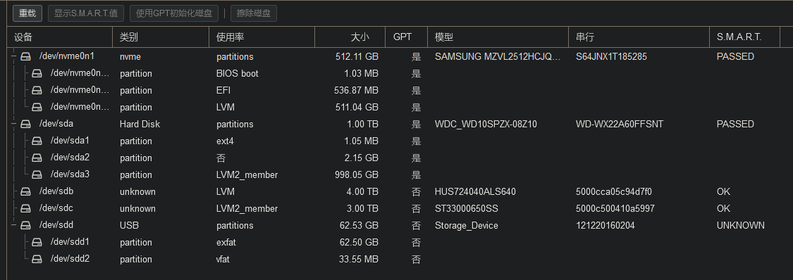

选择你需要添加的磁盘，点击上方的`擦除磁盘` 然后点击`使用GPT初始化磁盘`

最后在`磁盘 --> LVM` 点击`Add Volume Group` 选择你的磁盘，命名卷名称后点击确定

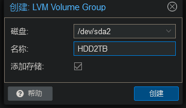

稍等一会后你可以在左侧看到多了一个存储桶，此时磁盘已经添加到promox内

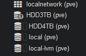

#### 分配磁盘空间

这个方式不是硬盘直通，而是划分一部分空间给虚拟机

如果你想划分整个磁盘空间到虚拟机建议使用直通

在任意一个虚拟机的`硬件--添加--硬盘`

然后选择你希望划分空间的硬盘

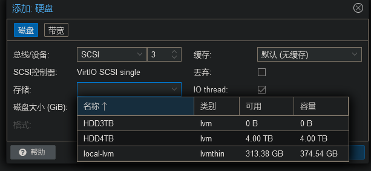

填入希望划分的磁盘大小（如 `1024GiB` ）后选择添加即可将磁盘的部分空间划入虚拟机

在虚拟机内被识别为一个单独的磁盘

然后进入虚拟机

使用

```Bash
lsblk
```

来查看硬盘设备，你可以看到你插入的硬盘（一般使用容量大小判断）

```Bash
NAME   MAJ:MIN RM   SIZE RO TYPE MOUNTPOINTS
sda      8:0    0    64G  0 disk
├─sda1   8:1    0     1M  0 part
└─sda2   8:2    0    64G  0 part /
sdb      8:16   0 931.5G  0 disk /mirror/debmirror
sdc      8:32   0     1T  0 disk
sr0     11:0    1  1024M  0 rom
```

你的新添加硬盘往往使用 `sdX (X是任意字母)` 标识，这里我们可以看到这个系统添加了`sdb(931.5GB) sdc(1TB)` 两块硬盘

同时你还可以看到他们的挂载点（`sdb` 挂载到了 `/mirror/debmirror` ）

你可以将划入的磁盘挂载到你希望的位置，享用空间

#### 调整磁盘空间

一般情况下，我们为虚拟机只配置了`64GB` 的系统盘大小，这对于轻量级服务是足够的，你可以检查自己的系统盘是否够用：

```Bash
df -h
```

```JavaScript
Filesystem      Size  Used Avail Use% Mounted on
tmpfs           794M 1016K  793M   1% /run
/dev/sda2        95G   62G   28G  70% /
tmpfs           3.9G     0  3.9G   0% /dev/shm
tmpfs           5.0M     0  5.0M   0% /run/lock
tmpfs           794M  4.0K  794M   1% /run/user/1000
```

天哪，注意到系统根目录挂载点已经使用了70%的容量，我们可能需要前瞻性的扩容。

来到`虚拟机--硬件` 选择`scsi0` 的磁盘（名称应该以`local-lvm` 开头），选中，并点击上方的`磁盘操作 -- 调整容量` 输入增量

注意：PVE的磁盘只允许增加不允许减少

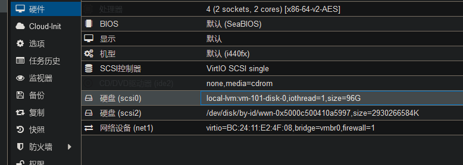

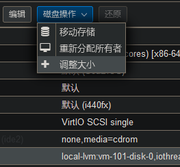

我们尝试增加`64GB`，然后重启主机，使用

```Bash
lsblk
```

来检查`/dev/sda` 的容量，此时增加了`64GB` 到`96GB`

但是你发现`/dev/sda2` 也就是更目录挂载点仍然是`64GB`

我们需要调整磁盘分区

```Bash
apt install fdisk
fdisk /dev/sda
```

注意：你即将调整磁盘分区表，数据无价谨慎操作，

本文不负责因此造成的任何数据损失

进入调整后，你可以看到欢迎页，你的任何更改都在内存中

因此一旦你发现修改错误，使用 `q` 直接退出而不保存，你的磁盘不会被更改

```SQL
Welcome to fdisk (util-linux 2.37.2).
Changes will remain in memory only, until you decide to write them.
Be careful before using the write command.

This disk is currently in use - repartitioning is probably a bad idea.
It's recommended to umount all file systems, and swapoff all swap
partitions on this disk.

Command (m for help):
```

输入 `p` 打印当前分区表

```SQL
Device     Start       End   Sectors Size Type
/dev/sda1   2048      4095      2048   1M BIOS boot
/dev/sda2   4096 201326558 201322463  96G Linux filesystem
```

记住`/dev/sda2` 的起始地址`START 4096`

然后打印空闲分区表 `F` ，记住终止地址。

（实际上他会默认帮你处理）

危险操作！

然后删除本分区，按 `d`，再按下新建分区`n`

他会询问你新分区的起始地址和终止地址，按照你记住的填写（他会有一个default值，一般就是你的起始地址和终止地址，你只需要确认后使用空格即可）

```SQL
Command (m for help): n
Partition number (2-128, default 2): 2
First sector (2048-201326591, default 4096):
Last sector, +/-sectors or +/-size{K,M,G,T,P} (4096-201326591, default 201326591):
```

然后可能会询问你检测到`ext4 signature` 你是否需要删除

我建议不删除

进行下一步后你的数据将无法挽回

然后按下 `w` 写入更改，然后退出`fidsk command` 模式

刷新文件系统大小

```Bash
resize2fs /dev/sda2
```

你再使用

```Bash
df -h
```

检查即可

### 硬件直通

实验性文章警告：本文尚未完成且未经过充分验证

硬件直通非常复杂，非专业人员请绕道，对于潜在的硬件损坏，本文不负任何责任
硬件直通非常复杂，非专业人员请绕道，对于潜在的硬件损坏，本文不负任何责任
硬件直通非常复杂，非专业人员请绕道，对于潜在的硬件损坏，本文不负任何责任

#### CPU支持

使用硬件直通必须要CPU本身支持，请检查你的CPU是否支持硬件直通

其中，Intel CPU 要求支持 `vtx-d` ，AMD CPU 要求支持 `AMD-Vi`

这里以 `Intel CPU` 为例，你可以直接使用bing搜索CPU型号获取信息

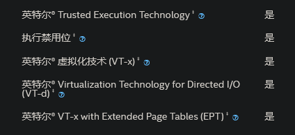

这是 `E5 2660V4` 的支持面板，显然支持`VT-d`

不过一般来说，Intel CPU 基本都支持 `vt-d` 了

#### 主板支持（BIOS）

危险！你即将修改BIOS设置，如果你不清楚你在干什么，立即关闭本教程

必须要在主板BIOS开启`vt-d` 虚拟化，否则CPU支持也没有用

一般叫做 `Intel Virtualization Technology(Intel虚拟化技术)` ，设置为 `Enable` 即可

注意：有的主板默认开启虚拟化因此没有该设置，也有的主板默认关闭虚拟化，也不现实设置

#### Linux内核修改

危险！你即将修改Linux kernel设置，如果你不清楚你在干什么，立即关闭本教程
                    造成无法开机等任何损坏本文不承担任何责任
危险！你即将修改Linux kernel设置，如果你不清楚你在干什么，立即关闭本教程
                    造成无法开机等任何损坏本文不承担任何责任
危险！你即将修改Linux kernel设置，如果你不清楚你在干什么，立即关闭本教程

1. 修改内核参数，启用IOMMU，并更新内核文件

   ```Shell
   nano /etc/default/grub
   ```

在第九行，修改`GRUB_CMDLINE_LINUX_DEFAULT` 参数

```Plain Text
# Intel CPU 使用 intel_iommu=on , AMD CPU 使用 amd_iommu=on
GRUB_CMDLINE_LINUX_DEFAULT="quiet intel_iommu=on iommu=pt"

# 如果你希望开启分组直通，额外加上 pcie_acs_override=downstream
# 如果你需要直通显卡，额外加上 video=efifb:off
```

保存后，执行指令更新内核文件并重启

      危险！你仍然有机会阻止灾难发生！
如果你不清楚这么做的后果，立即关闭本教程

```Shell
update-grub && reboot
```

1. 确认IOMMU已经启用

   ```Shell
   dmesg | grep -e DMAR -e IOMMU
   ```

   ```Plain Text
   ---output---
   [    0.012091] ACPI: Reserving DMAR table memory at [mem 0x7a25fae0-0x7a25fbb3]
   [    0.099401] DMAR: IOMMU enabled
   [    0.264629] DMAR: Host address width 46
   ...
   ```

如果你能够从一大堆输出中找到 `DMAR: IOMMU enabled` ，那么你的IOMMU已经成功开启

如果没有找到，你不能往下走，重新检查你的配置是否设置正确

如果你遇到无法启动/报错等问题，你可能遇到了紧急情况，本文无法为你提供任何帮助

1. 检查中断重映射(nterrupt remapping)是否启用如果你看到任意一行（取决于CPU）`AMD-Vi: Interrupt remapping enabled``DMAR-IR: Enabled IRQ remapping in x2apic mode` 那么你的中断重映射已经启用，`x2apic` 可能根据CPU的型号有变化如果你没有看到，或者直接没有输出，也许得去主板里的相关设置进行启用。不过即使这个选项没有启用也可以使用，但是性能会降低。或者，冒险启用不安全的中断重映射试试  危险！你正在执行破坏系统安全性的设置！
如果你不清楚这么做的后果，立即关闭本教程

   ```Shell
   dmesg | grep 'remapping'
   ```

   ```Plain Text
   ---output---
   [    0.265431] DMAR-IR: Enabled IRQ remapping in xapic mode
   [    0.265432] x2apic: IRQ remapping doesn't support X2APIC mode
   ```

   ```Shell
   echo "options vfio_iommu_type1 allow_unsafe_interrupts=1" > /etc/modprobe.d/iommu_unsafe_interrupts.conf
   ```

那么，最终的验收，在任意一台虚拟机尝试添加一个`PCIE` 设备，如果能如期添加，那么你的设置很完美。

如果你遇到了问题，那没办法，这个设置非常玄学

建议你直接购买服务器主板一劳永逸解决问题（例如`X99` 是默认开启虚拟化和直通的）

#### 设置直通

##### 硬盘直通

[参考资料](https://isay.me/2024/04/pve-harddisk-passthrough.html)

最简单的，我们希望给虚拟机增加硬盘

首先你需要按照本章节的`添加硬盘` 内容将硬盘格式化（擦除内容），但不创建卷（不执行`Add Volume Group`部分）

然后观察你希望直通的虚拟机ID号，他们的ID标注在名字左侧

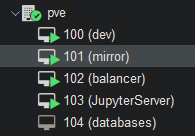

然后在宿主机找到这个磁盘，PVE的磁盘看板，确定你需要直通的磁盘名称，然后使用

```Bash
ls -l /dev/disk/by-id
```

找到这个名字对应的`id` ，复制下来

在本例中，我们希望直通`sdb` ，那么可以看到了他的ID

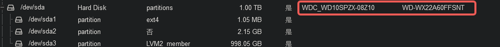

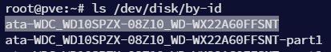

然后前往你的直通虚拟机的硬件，观察`scsi`标号，如果你没有进行任何磁盘添加，那么标号应该是`scsi0` ，在本例中，我们观察到标号已经到`scsi2`

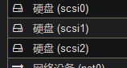

我们直通时使用的标号要避免重复，因此使用`scsi3`

然后使用指令进行直通

```Bash
qm set 101 -scsi3 /dev/disk/by-id/<YourDiskID>
```

记得将你的磁盘ID替换上去，然后你应该看到类似

`update VM 101 ....`

然后进入你的虚拟机使用`lsblk` 应该能看到直通进来的磁盘，建议使用

```Bash
mkfs.ext4 /dev/<sdX>
```

进行格式化后使用。

如果你想删除磁盘，使用`虚拟机 -- 硬件 -- 分离` 把磁盘分离掉或者使用

```Bash
qm set 101 -delete scsi3
```

## Linux Vmware Exsi

Exsi已经修改了许可证，因此我们建议你使用promox，这里没有配置EXSI的使用文档。

但是

如果你愿意续写这部分文档，请联系我们！

### 超开

超开简单说就是你的虚拟机总的核心数（一般是CPU核心超开）大于你实际宿主机拥有的所有核心数，这在EXSI上实现起来似乎比PVE容易一些

超开的实现机理类似于错峰使用，即我们的虚拟机不是时刻都在满载，能否使用这些“错峰”下的闲置资源？

- 好处

  - 能更极致的榨干硬件资源
  - 可以超售
- 坏处

  - 如果所有的/部分虚拟机（这取决于你的超开多严重）同时满载，那么宿主机超负荷工作会导致虚拟机性能大幅下降甚至损毁
