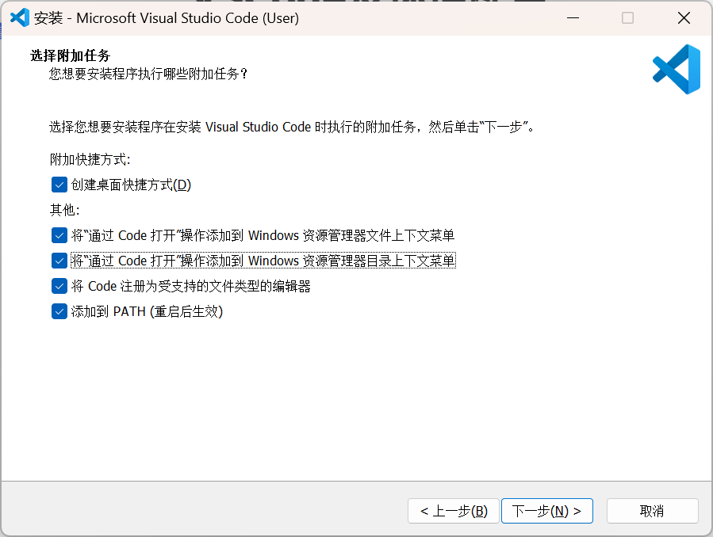
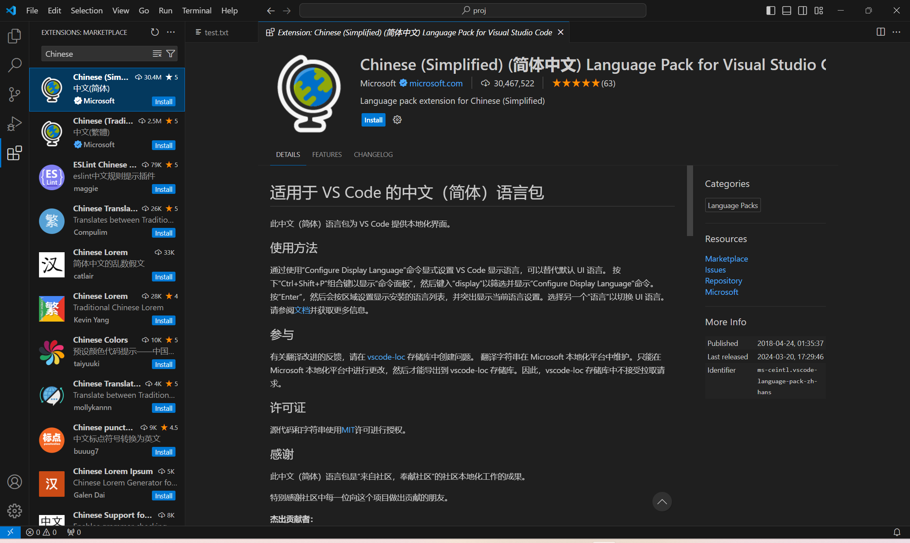
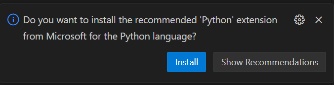
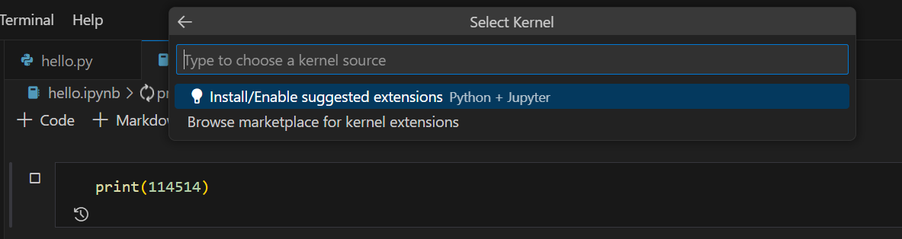
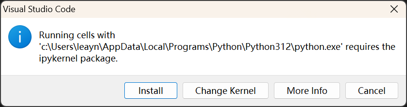
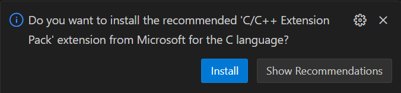
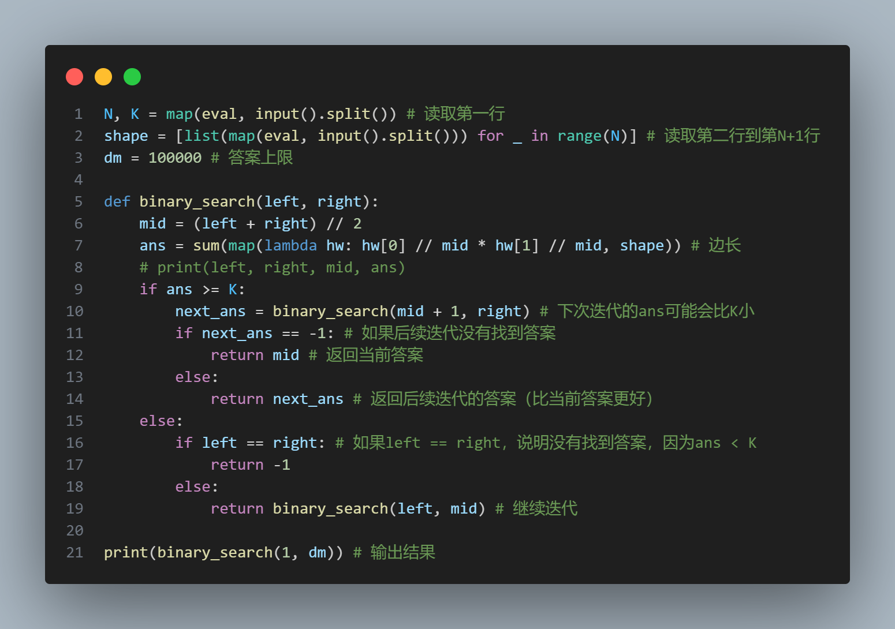

# VSCode及环境配置

本文暂时仅介绍Windows平台下的安装配置

# VSCode安装

1. 点击[code.visualstudio.com](https://code.visualstudio.com/docs/?dv=win64user)下载安装包
2. 启动安装程序，一路下一步，直到如图所示，建议全部勾选



1. **(可选)**安装**中文**语言包：按`Ctrl+Shift+X`，输入"Chinese"，点Install



# 环境配置

注：此部分建议自备**魔法**，如果机主没有，可以用手机临时给他共享个，此教程请看附录

## Python

1. 上官网[www.python.org](https://www.python.org/)下载安装包
2. 点击Install Now
3. 打开vsc，随便找个地方新建个.py文件，如"hello.py"文件，打开，**右下角**会弹出一个弹窗，点击Install



1. **(可选)**安装vsc的**jupyter notebook**支持：

   1. 打开vsc，随便找个地方新建个.ipynb文件，如"hello.ipynb"
   2. 输入**print(114514)**，按`Ctrl+Alt+Enter`运行
   3. **上方**会弹出一个弹窗，选择Install，并一路点Install





## C/C++

如果有魔法，则采用Scoop安装，会方便很多，否则需要手动下载MinGw64。下面介绍两种情况的配置。

**有魔法**的情况下，基于Scoop来安装环境

1. 安装Scoop，这是其官网：https://scoop.sh/

   1. 具体来说，就是复制官网首页的两行代码到Powershell中执行

   ```PowerShell
   Set-ExecutionPolicy -ExecutionPolicy RemoteSigned -Scope CurrentUser
   Invoke-RestMethod -Uri https://get.scoop.sh | Invoke-Expression
   ```

   1. 安装好后，再执行这两行命令，用于安装git和更新scoop软件索引

   ```PowerShell
   scoop install git
   scoop update
   ```
2. 安装C/C++编译环境、gdb调试器

   ```PowerShell
   scoop install gcc gdb
   ```
3. 重新打开vsc，随便找个地方新建个.c或.cpp文件，如"hello.cpp"，打开，**右下角**会弹出一个弹窗，点击Install



1. 大功告成，点击**右上角**的**▷**按钮**运行**即可，可以在▷右边的下拉列表里选择**运行**或**调试**

   1. 注意：**源文件**的**名称不能包含中文**，**源文件**所在的**完整路径名称**中也**不能出现中文**，否则用vsc官方的C++插件编译运行会报错。
   2. 如果机主需要中文路径，则需要额外安装【Code Runner】插件

如果没有**魔法**，教程后两个步骤不需要变动。前两个步骤则需要手动下载gcc编译器。

注：我知道网上的教程都要你写什么【tasks.json】和【launch.json】，因为我一开始也是看的这些教程。但老实说，我没搞懂，而且每新建一个项目都要写这玩意，太麻烦了。所以我摸索出了这种免配置的方法，原理就是vsc的C++插件会自动扫描PATH路径下的编译器，自动生成那两个json文件。

至于为什么每个编程语言的vsc配置，我都用随便新建一个hello文件的方式呢。一方面，这确实会触发vsc的recommand弹窗，这样你只要记得那门语言的源文件后缀名就行了，而不需要知道具体的vsc插件是什么；另一方面，新建一个hello文件输出hello world，也是检验配置是否成功的方式。属于是一举两得了。

## Java

待补充.....（因为我也不用）（而且大多数都用JetBrain的**IntelliJ IDEA**了）

## NodeJs

可以采用上文提到的Scoop一键安装NodeJs：`scoop install nodejs`，也可以到官网https://nodejs.org/下载安装包

# 推荐的vsc插件

## CodeSnap



## Live Server

快捷、轻量、热重载的Server，用于预览静态网站

## WakaTime

记录VSCode使用情况（时长、编程语言占比、项目开发占比）

## VS Code Counter

代码量统计

## VSC Netease Music

在vsc里听歌
