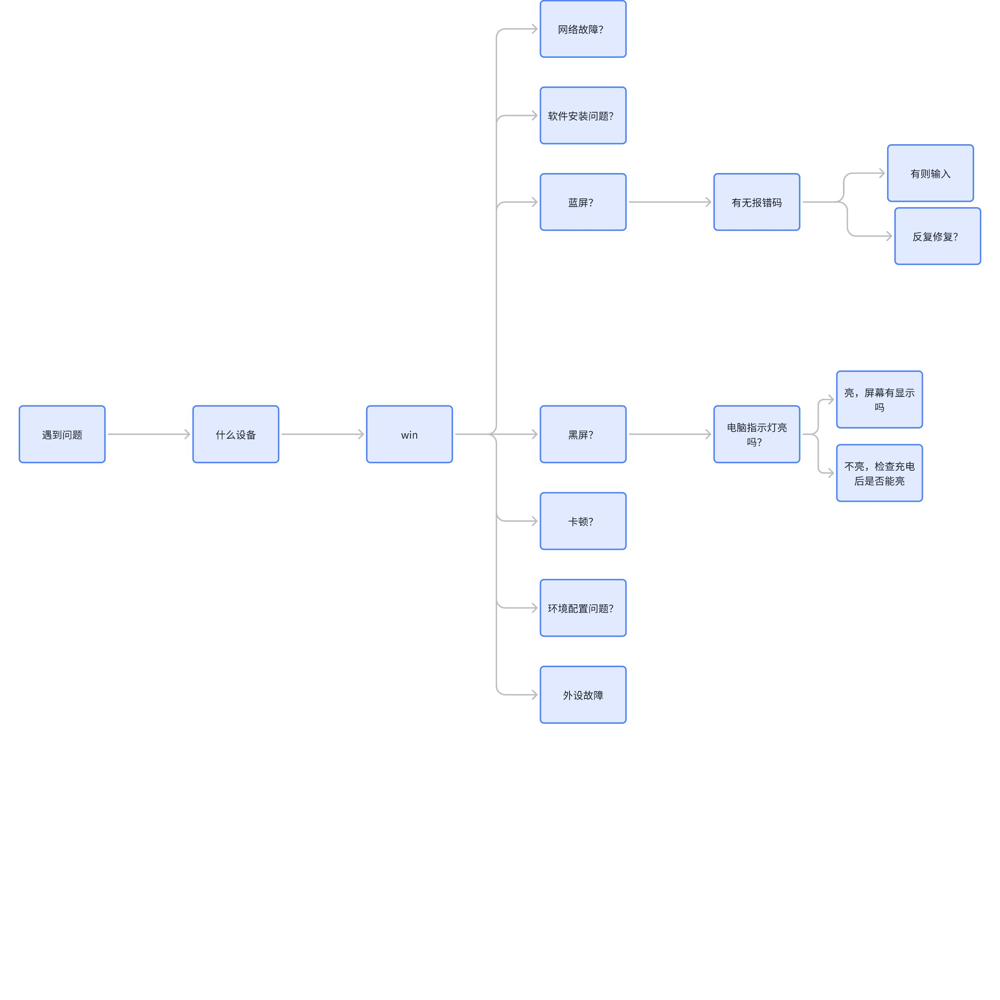

# 如何提问

[如何提问（技术类问题）](https://github.com/tvvocold/How-To-Ask-Questions-The-Smart-Way)

## 尝试给一个提问模板

需要包括的内容：

- 问题环境

  - 问题发生前他正常吗？
  - 问题发生在什么设备，系统上？
  - 发生问题前做过相关操作吗？
- 问题现象/报错信息

  - 报错，错误代码，错误日志...

## 白板素材导出

